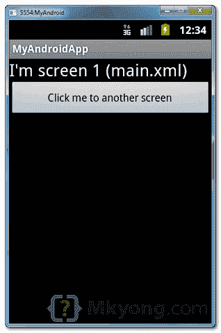
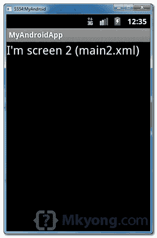

# Android 活动–从一个屏幕到另一个屏幕

> 原文：<http://web.archive.org/web/20230101150211/http://www.mkyong.com/android/android-activity-from-one-screen-to-another-screen/>

在 Android 中，一个活动代表一个屏幕。大多数应用程序都有多个活动来表示不同的屏幕，例如，一个活动显示应用程序设置列表，另一个活动显示应用程序状态。

**Note**
Refer to this official [Android activity article](http://web.archive.org/web/20210416084859/https://developer.android.com/guide/topics/fundamentals/activities.html) to understand more about Android activity.

在本教程中，我们将向您展示如何与活动交互，当单击一个按钮时，从当前屏幕(当前活动)导航到另一个屏幕(另一个活动)。

*P.S 这个项目是在 Eclipse 3.7 中开发的，用 Android 2.3.3 测试过。*

## 1.XML 布局

在“res/layout/”文件夹中创建以下两个 XML 布局文件:

1.  `res/layout/main.xml`–代表屏幕 1
2.  `res/layout/main2.xml`–代表屏幕 2

*文件:res/layout/main.xml*

```java
 <?xml version="1.0" encoding="utf-8"?>
<LinearLayout xmlns:android="http://schemas.android.com/apk/res/android"
    android:id="@+id/linearLayout1"
    android:layout_width="fill_parent"
    android:layout_height="fill_parent"
    android:orientation="vertical" >

    <TextView
        android:id="@+id/textView1"
        android:layout_width="wrap_content"
        android:layout_height="wrap_content"
        android:text="I&apos;m screen 1 (main.xml)"
        android:textAppearance="?android:attr/textAppearanceLarge" />

    <Button
        android:id="@+id/button1"
        android:layout_width="fill_parent"
        android:layout_height="wrap_content"
        android:text="Click me to another screen" />

</LinearLayout> 
```

*文件:res/layout/main2.xml*

```java
 <?xml version="1.0" encoding="utf-8"?>
<LinearLayout xmlns:android="http://schemas.android.com/apk/res/android"
    android:id="@+id/linearLayout1"
    android:layout_width="fill_parent"
    android:layout_height="fill_parent" >

    <TextView
        android:id="@+id/textView1"
        android:layout_width="wrap_content"
        android:layout_height="wrap_content"
        android:text="I&apos;m screen 2 (main2.xml)"
        android:textAppearance="?android:attr/textAppearanceLarge" />

</LinearLayout> 
```

## 2.活动

创建两个活动类别:

1.  AppActivity.java –> main . XML
2.  App2Activity.java –> main 2 . XML

要从一个屏幕导航到另一个屏幕，请使用以下代码:

```java
 Intent intent = new Intent(context, anotherActivity.class);
    startActivity(intent); 
```

*文件:AppActivity.java*

```java
 package com.mkyong.android;

import android.app.Activity;
import android.content.Context;
import android.content.Intent;
import android.os.Bundle;
import android.widget.Button;
import android.view.View;
import android.view.View.OnClickListener;

public class AppActivity extends Activity {

	Button button;

	@Override
	public void onCreate(Bundle savedInstanceState) {
		super.onCreate(savedInstanceState);
		setContentView(R.layout.main);
		addListenerOnButton();
	}

	public void addListenerOnButton() {

		final Context context = this;

		button = (Button) findViewById(R.id.button1);

		button.setOnClickListener(new OnClickListener() {

			@Override
			public void onClick(View arg0) {

			    Intent intent = new Intent(context, App2Activity.class);
                            startActivity(intent);   

			}

		});

	}

} 
```

*文件:App2Activity.java*

```java
 package com.mkyong.android;

import android.app.Activity;
import android.os.Bundle;
import android.widget.Button;

public class App2Activity extends Activity {

	Button button;

	@Override
	public void onCreate(Bundle savedInstanceState) {
		super.onCreate(savedInstanceState);
		setContentView(R.layout.main2);
	}

} 
```

## 3.AndroidManifest.xml

在`AndroidManifest.xml`中声明以上两个活动类。

*文件:AndroidManifest.xml*

```java
 <?xml version="1.0" encoding="utf-8"?>
<manifest xmlns:android="http://schemas.android.com/apk/res/android"
    package="com.mkyong.android"
    android:versionCode="1"
    android:versionName="1.0" >

    <uses-sdk android:minSdkVersion="10" />

    <application
        android:icon="@drawable/ic_launcher"
        android:label="@string/app_name" >
        <activity
            android:label="@string/app_name"
            android:name=".AppActivity" >
            <intent-filter >
                <action android:name="android.intent.action.MAIN" />
                <category android:name="android.intent.category.LAUNCHER" />
            </intent-filter>
        </activity>
        <activity
            android:label="@string/app_name"
            android:name=".App2Activity" >
        </activity>
    </application>

</manifest> 
```

## 4.演示

运行应用程序。

显示`AppActivity.java` (main.xml)画面。



当点击上述按钮时，它将导航到另一个屏幕`App2Activity.java` (main2.xml)。



## 下载源代码

Download it – [Android-From-Screen-To-Screen-Acticity-Example.zip](http://web.archive.org/web/20210416084859/http://www.mkyong.com/wp-content/uploads/2011/12/Android-From-Screen-To-Screen-Acticity-Example.zip) (16 KB)

## 参考

1.  [安卓活动示例](http://web.archive.org/web/20210416084859/https://developer.android.com/guide/topics/fundamentals/activities.html)

Tags : [android](http://web.archive.org/web/20210416084859/https://mkyong.com/tag/android/) [android activity](http://web.archive.org/web/20210416084859/https://mkyong.com/tag/android-activity/)<input type="hidden" id="mkyong-current-postId" value="10395">