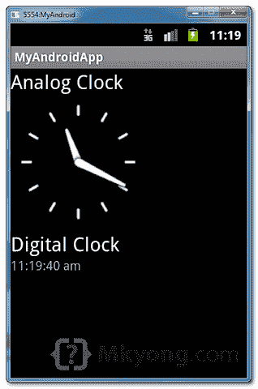

# Android 模拟时钟和数字时钟示例

> 原文：<http://web.archive.org/web/20230101150211/http://www.mkyong.com/android/android-analogclock-and-digitalclock-example/>

在安卓系统中， [AnalogClock](http://web.archive.org/web/20190214223612/http://developer.android.com/reference/android/widget/AnalogClock.html) 是一个双手时钟，一个用于小时指示器，另一个用于分钟指示器。[数字时钟](http://web.archive.org/web/20190214223612/http://developer.android.com/reference/android/widget/DigitalClock.html)看起来就像你手上的普通数字手表，以数字格式显示小时、分钟和秒。

`AnalogClock`和`DigitalClock`都不能修改时间，如果要修改时间，请使用“[时间选择器](http://web.archive.org/web/20190214223612/http://www.mkyong.com/android/android-time-picker-example/)”。

*P.S 这个项目是在 Eclipse 3.7 中开发的，用 Android 2.3.3 测试过。*

## 1.模拟时钟和数字时钟

打开“ **res/layout/main.xml** 文件，在 xml 中添加`AnalogClock`和`DigitalClock`。

*文件:res/layout/main.xml*

```java
 <?xml version="1.0" encoding="utf-8"?>
<LinearLayout xmlns:android="http://schemas.android.com/apk/res/android"
    android:layout_width="fill_parent"
    android:layout_height="fill_parent"
    android:orientation="vertical" >

    <TextView
        android:id="@+id/textView1"
        android:layout_width="wrap_content"
        android:layout_height="wrap_content"
        android:text="Analog Clock"
        android:textAppearance="?android:attr/textAppearanceLarge" />

    <AnalogClock
        android:id="@+id/analogClock1"
        android:layout_width="wrap_content"
        android:layout_height="wrap_content" />

    <TextView
        android:id="@+id/textView2"
        android:layout_width="wrap_content"
        android:layout_height="wrap_content"
        android:text="Digital Clock"
        android:textAppearance="?android:attr/textAppearanceLarge" />

    <DigitalClock
        android:id="@+id/digitalClock1"
        android:layout_width="wrap_content"
        android:layout_height="wrap_content"
        android:text="DigitalClock" />

</LinearLayout> 
```

 <ins class="adsbygoogle" style="display:block; text-align:center;" data-ad-format="fluid" data-ad-layout="in-article" data-ad-client="ca-pub-2836379775501347" data-ad-slot="6894224149">## 2.代码代码

不知道我能用`AnalogClock`或`DigitalClock`做什么。

*文件:MyAndroidAppActivity.java*

```java
 package com.mkyong.android;

import android.app.Activity;
import android.os.Bundle;
import android.widget.AnalogClock;
import android.widget.DigitalClock;

public class MyAndroidAppActivity extends Activity {

	@Override
	public void onCreate(Bundle savedInstanceState) {
		super.onCreate(savedInstanceState);
		setContentView(R.layout.main);

		AnalogClock ac = (AnalogClock) findViewById(R.id.analogClock1);
		//what can i do with AnalogClock?

		DigitalClock dc = (DigitalClock) findViewById(R.id.digitalClock1);
		//what can i do with DigitalClock also? for display only

	}

} 
```

 <ins class="adsbygoogle" style="display:block" data-ad-client="ca-pub-2836379775501347" data-ad-slot="8821506761" data-ad-format="auto" data-ad-region="mkyongregion">## 3.演示

运行应用程序。

1.这是模拟时钟和数字时钟的样子:



## 下载源代码

Download it – [Android-AnalogClock-DigitalClock-Example.zip](http://web.archive.org/web/20190214223612/http://www.mkyong.com/wp-content/uploads/2011/11/Android-AnalogClock-DigitalClock-Example.zip) (15 KB)

## 参考

1.  [Android digital clock JavaDoc](http://web.archive.org/web/20190214223612/http://developer.android.com/reference/android/widget/DigitalClock.html)
2.  [Android analog clock JavaDoc](http://web.archive.org/web/20190214223612/http://developer.android.com/reference/android/widget/AnalogClock.html)

[android](http://web.archive.org/web/20190214223612/http://www.mkyong.com/tag/android/) [clock](http://web.archive.org/web/20190214223612/http://www.mkyong.com/tag/clock/)


