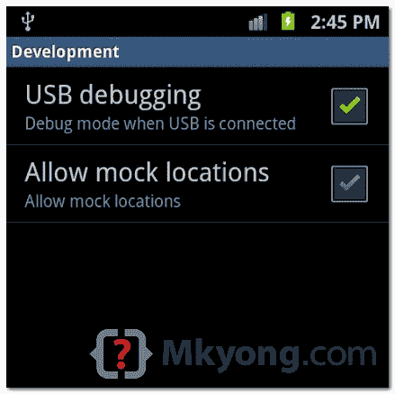
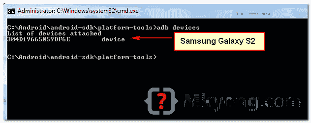
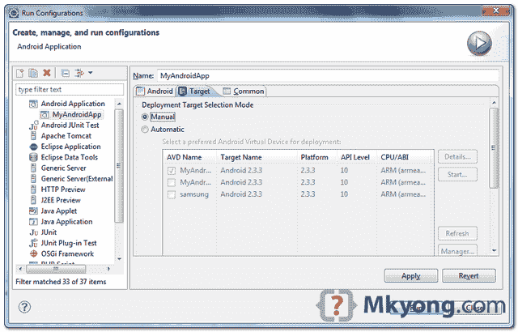
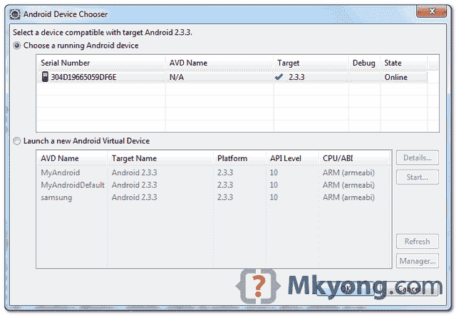
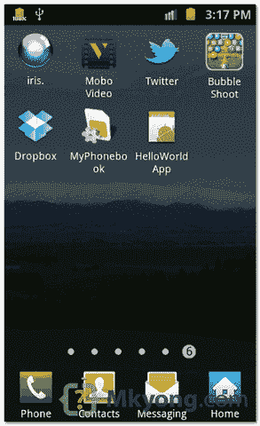

# Android 在真实设备上的调试

> 原文：<http://web.archive.org/web/20230101150211/http://www.mkyong.com/android/android-debugging-on-real-device/>

本教程将向你展示如何在一个真正的 Android 设备(手机)上调试 Android 应用程序。

本教程中的工具和环境:

1.  Eclipse IDE 3.7 + ADT 插件
2.  三星银河 S2
3.  Windows 7

在设备上调试的总结步骤:

1.  下载 Google USB 驱动程序(如果使用 Android 开发者手机(ADP))
2.  下载 OEM USB 驱动程序(如果使用其他 Android 驱动的设备，三星、宏基、HTC…)
3.  在您的设备中，打开 USB 调试。
4.  将您的设备连接到 PC。
5.  使用“adb 设备”验证您的设备是否连接成功。
6.  将 Eclipse 的“部署目标选择模式”改为“手动”，在运行时选择设备。
7.  完成了。

在这个例子中，我们将使用前面的“ [Hello World Android 示例](http://web.archive.org/web/20190304000832/http://www.mkyong.com/android/android-hello-world-example/)”，并在一个真正的 Android 驱动的设备上调试或运行，**三星 Galaxy S2** 。

## 1.下载 OEM USB 驱动程序

参考这个[安卓 USB 驱动指南](http://web.archive.org/web/20190304000832/http://developer.android.com/sdk/oem-usb.html)。如果你正在使用像 Nexus One 或 Nexus S 这样的 Android 开发者手机(ADP)，你应该通过“ **Android SDK 管理器**安装谷歌 USB 驱动程序。

使用三星 Galaxy S2，您需要安装 OEM USB 驱动程序，或三星 USB 驱动程序，它包含在**三星 Kies** 软件中。

请参阅此“[何处下载三星 Galaxy S2 USB 驱动程序](http://web.archive.org/web/20190304000832/http://www.mkyong.com/android/where-to-download-samsung-galaxy-s2-usb-driver/)”指南，在您的电脑上安装 USB 驱动程序。

 ## 2.启用 USB 调试

在您的设备中，要打开 USB 调试:“设置”->“应用程序”->“开发”->“USB 调试”。

见下图:

 ## 3.将设备连接到 PC

将三星 Galaxy S2 连接到 PC，并通过命令“`adb devices`”进行验证。

在命令提示符下，将路径更改为“**Android SDK/platform-tools**，输入命令“`adb devices`”，如果看到类似“*某个号码奇怪的设备*”的东西，说明你的设备已经成功连接到 PC。

*图——“304d 19665059 df6e 设备”是三星 Galaxy S2。*

## 4.Eclipse -> Android

**Note**
Most people are stuck in this stage, beware.

之前，您可能创建了几个“ **Android 虚拟设备(AVD)** 用于测试，并将“**部署目标选择模式**”设置为“**自动**”，但是，这将导致应用程序无法在您连接的设备上调试，并继续启动 AVD 仿真器。

2 个解决方案:

1.  在 Eclipse 中右击 Android 项目，选择"**运行** " - > " **运行配置** " - > " **Android 应用** " - > " **目标** " tab - > " **部署目标选择模式** " - >设置为"**手动**"，就可以在运行时选择设备了。
2.  或者，在**部署目标选择模式**中，取消选择所有选中的 AVD 即可。

*图:部署目标选择模式*

*图:运行时选择您的设备*

## 5.启动它

在 Eclipse 中，将您的项目作为 Android 项目运行或调试，在运行时选择您的设备，项目将复制到您的三星 Galaxy S2 并自动启动。

*图:HelloWorldApp 在三星 galaxy S2 上调试。*

## 参考

1.  [在真实设备上开发 Android】](http://web.archive.org/web/20190304000832/http://developer.android.com/guide/developing/device.html)
2.  [安卓 OEM USB 驱动](http://web.archive.org/web/20190304000832/http://developer.android.com/sdk/oem-usb.html)
3.  [Android 在三星 Galaxy S2 上的调试](http://web.archive.org/web/20190304000832/http://stackoverflow.com/questions/8046111/androiduse-debugmode-in-galaxy-s2)
4.  [安卓 hello world 示例](http://web.archive.org/web/20190304000832/http://www.mkyong.com/android/android-hello-world-example/)

[android](http://web.archive.org/web/20190304000832/http://www.mkyong.com/tag/android/) [debug](http://web.archive.org/web/20190304000832/http://www.mkyong.com/tag/debug/)

