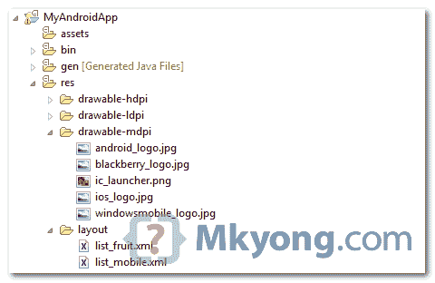
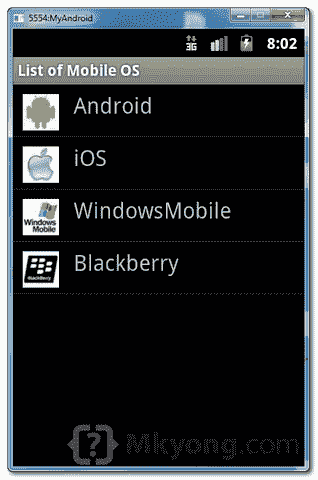

> 原文：<http://web.archive.org/web/20230101150211/http://www.mkyong.com/android/android-listview-example/>

# Android ListView 示例

在 Android 中， [ListView](http://web.archive.org/web/20190305142211/http://developer.android.com/reference/android/widget/ListView.html) 允许你在一个垂直的可滚动列表中排列组件。

在本教程中，我们将向您展示 2 个`ListView`示例:

1.  在`ListView`中显示组件的正常方式。
2.  自定义数组适配器，用于自定义`ListView`中的项目显示。

*P.S 这个项目是在 Eclipse 3.7 中开发的，用 Android 2.3.3 测试过。*

## 1.普通 ListView 示例

在这个例子中，我们向你展示了如何通过`ListView`来显示水果名称的列表，这应该是简单明了的。

*1.1 Android 布局文件*

文件:res/layout/list_fruit.xml

```java
 <?xml version="1.0" encoding="utf-8"?>
<TextView xmlns:android="http://schemas.android.com/apk/res/android"
    android:layout_width="fill_parent"
    android:layout_height="fill_parent"
    android:padding="10dp"
    android:textSize="20sp" >
</TextView> 
```

*1.2 ListView*

```java
 package com.mkyong.android;

import android.app.ListActivity;
import android.os.Bundle;
import android.view.View;
import android.widget.AdapterView;
import android.widget.ArrayAdapter;
import android.widget.ListView;
import android.widget.TextView;
import android.widget.Toast;
import android.widget.AdapterView.OnItemClickListener;

public class ListFruitActivity extends ListActivity {

	static final String[] FRUITS = new String[] { "Apple", "Avocado", "Banana",
			"Blueberry", "Coconut", "Durian", "Guava", "Kiwifruit",
			"Jackfruit", "Mango", "Olive", "Pear", "Sugar-apple" };

	@Override
	public void onCreate(Bundle savedInstanceState) {
		super.onCreate(savedInstanceState);

		// no more this
		// setContentView(R.layout.list_fruit);

		setListAdapter(new ArrayAdapter<String>(this, R.layout.list_fruit,FRUITS));

		ListView listView = getListView();
		listView.setTextFilterEnabled(true);

		listView.setOnItemClickListener(new OnItemClickListener() {
			public void onItemClick(AdapterView<?> parent, View view,
					int position, long id) {
			    // When clicked, show a toast with the TextView text
			    Toast.makeText(getApplicationContext(),
				((TextView) view).getText(), Toast.LENGTH_SHORT).show();
			}
		});

	}

} 
```

*1.3 演示*

 <ins class="adsbygoogle" style="display:block; text-align:center;" data-ad-format="fluid" data-ad-layout="in-article" data-ad-client="ca-pub-2836379775501347" data-ad-slot="6894224149">## 2.自定义数组适配器示例

在这个例子中，我们展示了如何在`ListView`中创建 4 个项目，并使用一个自定义的`ArrayAdapter`来根据列表中的“项目名称”显示不同的图像。

*2.1 图像*
获取 4 幅图像进行演示。



*2.2 Android 布局文件*
文件:res/layout/list_mobile.xml

```java
 <?xml version="1.0" encoding="utf-8"?>
<LinearLayout xmlns:android="http://schemas.android.com/apk/res/android"
    android:layout_width="wrap_content"
    android:layout_height="wrap_content"
    android:padding="5dp" >

    <ImageView
        android:id="@+id/logo"
        android:layout_width="50px"
        android:layout_height="50px"
        android:layout_marginLeft="5px"
        android:layout_marginRight="20px"
        android:layout_marginTop="5px"
        android:src="@drawable/windowsmobile_logo" >
    </ImageView>

    <TextView
        android:id="@+id/label"
        android:layout_width="wrap_content"
        android:layout_height="wrap_content"
        android:text="@+id/label"
        android:textSize="30px" >
    </TextView>

</LinearLayout> 
```

*2.3 自定义 ArrayAdapter*
创建一个类扩展`ArrayAdapter`并在`getView()`方法中自定义项目显示。

```java
 package com.mkyong.android.adaptor;

import com.mkyong.android.R;

import android.content.Context;
import android.view.LayoutInflater;
import android.view.View;
import android.view.ViewGroup;
import android.widget.ArrayAdapter;
import android.widget.ImageView;
import android.widget.TextView;

public class MobileArrayAdapter extends ArrayAdapter<String> {
	private final Context context;
	private final String[] values;

	public MobileArrayAdapter(Context context, String[] values) {
		super(context, R.layout.list_mobile, values);
		this.context = context;
		this.values = values;
	}

	@Override
	public View getView(int position, View convertView, ViewGroup parent) {
		LayoutInflater inflater = (LayoutInflater) context
			.getSystemService(Context.LAYOUT_INFLATER_SERVICE);

		View rowView = inflater.inflate(R.layout.list_mobile, parent, false);
		TextView textView = (TextView) rowView.findViewById(R.id.label);
		ImageView imageView = (ImageView) rowView.findViewById(R.id.logo);
		textView.setText(values[position]);

		// Change icon based on name
		String s = values[position];

		System.out.println(s);

		if (s.equals("WindowsMobile")) {
			imageView.setImageResource(R.drawable.windowsmobile_logo);
		} else if (s.equals("iOS")) {
			imageView.setImageResource(R.drawable.ios_logo);
		} else if (s.equals("Blackberry")) {
			imageView.setImageResource(R.drawable.blackberry_logo);
		} else {
			imageView.setImageResource(R.drawable.android_logo);
		}

		return rowView;
	}
} 
```

*2.4 ListView*
`ListView`，但是使用上面的自定义适配器来显示列表。

```java
 package com.mkyong.android;

import com.mkyong.android.adaptor.MobileArrayAdapter;
import android.app.ListActivity;
import android.os.Bundle;
import android.widget.ListView;
import android.widget.Toast;
import android.view.View;

public class ListMobileActivity extends ListActivity {

	static final String[] MOBILE_OS = 
               new String[] { "Android", "iOS", "WindowsMobile", "Blackberry"};

	@Override
	public void onCreate(Bundle savedInstanceState) {
		super.onCreate(savedInstanceState);

		setListAdapter(new MobileArrayAdapter(this, MOBILE_OS));

	}

	@Override
	protected void onListItemClick(ListView l, View v, int position, long id) {

		//get selected items
		String selectedValue = (String) getListAdapter().getItem(position);
		Toast.makeText(this, selectedValue, Toast.LENGTH_SHORT).show();

	}

} 
```

*2.5 演示*

 <ins class="adsbygoogle" style="display:block" data-ad-client="ca-pub-2836379775501347" data-ad-slot="8821506761" data-ad-format="auto" data-ad-region="mkyongregion">## 下载源代码

Download both examples – [Android-ListView-Example.zip](http://web.archive.org/web/20190305142211/http://www.mkyong.com/wp-content/uploads/2012/01/Android-ListView-Example.zip) (21 KB)

## 参考

1.  [Android ListView 示例](http://web.archive.org/web/20190305142211/http://developer.android.com/resources/tutorials/views/hello-listview.html)
2.  [Android ListView JavaDoc](http://web.archive.org/web/20190305142211/http://developer.android.com/reference/android/widget/ListView.html)

[android](http://web.archive.org/web/20190305142211/http://www.mkyong.com/tag/android/) [listview](http://web.archive.org/web/20190305142211/http://www.mkyong.com/tag/listview/)


