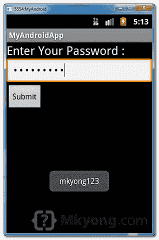

# Android 密码字段示例

> 原文：<http://web.archive.org/web/20230101150211/http://www.mkyong.com/android/android-password-field-example/>

在 Android 中，可以使用“ [android.widget.EditText](http://web.archive.org/web/20221007005658/https://developer.android.com/reference/android/widget/EditText.html) ”，配合`inputType="textPassword"`渲染一个密码组件。

在本教程中，我们将向您展示如何使用 XML 来创建密码字段、标签字段和普通按钮。当您点击按钮时，密码值将显示为浮动消息(toast 消息)。

*P.S 这个项目是在 Eclipse 3.7 中开发的，用 Android 2.3.3 测试过。*

## 1.自定义字符串

打开" **res/values/strings.xml** 文件，添加一些自定义字符串进行演示。

*文件:res/values/strings.xml*

```java
 <?xml version="1.0" encoding="utf-8"?>
<resources>
    <string name="app_name">MyAndroidApp
    <string name="lblPassword">Enter Your Password :
    <string name="btn_submit">Submit
</resources> 
```

## 2.密码

打开“ **res/layout/main.xml** 文件，添加密码组件，`EditText` + `inputType="textPassword"`。

*文件:res/layout/main.xml*

```java
 <?xml version="1.0" encoding="utf-8"?>
<LinearLayout xmlns:android="http://schemas.android.com/apk/res/android"
    android:layout_width="fill_parent"
    android:layout_height="fill_parent"
    android:orientation="vertical" >

    <TextView
        android:id="@+id/lblPassword"
        android:layout_width="wrap_content"
        android:layout_height="wrap_content"
        android:text="@string/lblPassword"
        android:textAppearance="?android:attr/textAppearanceLarge" />

    <EditText
        android:id="@+id/txtPassword"
        android:layout_width="match_parent"
        android:layout_height="wrap_content"
        android:inputType="textPassword" >

        <requestFocus />
    </EditText>

    <Button
        android:id="@+id/btnSubmit"
        android:layout_width="wrap_content"
        android:layout_height="wrap_content"
        android:text="@string/btn_submit" />

</LinearLayout> 
```

## 3.代码代码

在 activity " `onCreate()`"方法中，附加一个 click listener on 按钮，以显示密码值。

*文件:MyAndroidAppActivity.java*

```java
 package com.mkyong.android;

import android.app.Activity;
import android.os.Bundle;
import android.view.View;
import android.view.View.OnClickListener;
import android.widget.Button;
import android.widget.EditText;
import android.widget.Toast;

public class MyAndroidAppActivity extends Activity {

  private EditText password;
  private Button btnSubmit;

  @Override
  public void onCreate(Bundle savedInstanceState) {
	super.onCreate(savedInstanceState);
	setContentView(R.layout.main);

	addListenerOnButton();

  }

  public void addListenerOnButton() {

	password = (EditText) findViewById(R.id.txtPassword);	
	btnSubmit = (Button) findViewById(R.id.btnSubmit);

	btnSubmit.setOnClickListener(new OnClickListener() {

		@Override
		public void onClick(View v) {

		  Toast.makeText(MyAndroidAppActivity.this, password.getText(),
			Toast.LENGTH_SHORT).show();

		}

	});

  }
} 
```

## 4.演示

运行应用程序。

1.结果，显示密码字段。


2.键入密码“mkyong123 ”,然后单击提交按钮。



## 下载源代码

Download it – [Android-Password-Example.zip](http://web.archive.org/web/20221007005658/http://www.mkyong.com/wp-content/uploads/2011/11/Android-Password-Example.zip) (15 KB)

## 参考

1.  [Android EditText JavaDoc](http://web.archive.org/web/20221007005658/https://developer.android.com/reference/android/widget/EditText.html)

<input type="hidden" id="mkyong-current-postId" value="10227">