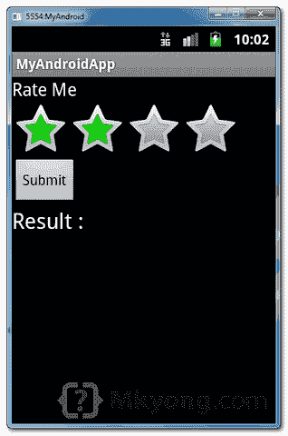
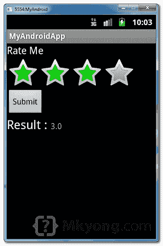

# Android 评级栏示例

> 原文：<http://web.archive.org/web/20230101150211/http://www.mkyong.com/android/android-rating-bar-example/>

在 Android 中，您可以使用“ [android.widget.RatingBar](http://web.archive.org/web/20190227085858/http://developer.android.com/reference/android/widget/RatingBar.html) ”在星星图标中显示评级栏组件。用户可以触摸、拖动或点击星星来轻松设置评级值。

在本教程中，我们向您展示了如何使用 XML 来显示一个评级栏，几个文本视图和一个按钮。当用户点击评级栏的星号时，所选的评级值将显示在文本视图中。并且，如果用户点击该按钮，所选择的评级值将显示为浮动消息(toast 消息)。

*P.S 这个项目是在 Eclipse 3.7 中开发的，用 Android 2.3.3 测试过。*

## 1.分级栏

打开" **res/layout/main.xml** "文件，添加一个评级栏组件，几个 textviews 和一个按钮。

**Note**
The rating bar contains many configurable values. In this case, the rating bar contains 4 stars, each increase 1.0 value, so, it contains the minimum of 1.0 (1 star) and maximum value of 4.0 (4 stars). In addition, it made the 2nd star (2.0) selected by default.

*文件:res/layout/main.xml*

```java
 <?xml version="1.0" encoding="utf-8"?>
<?xml version="1.0" encoding="utf-8"?>
<LinearLayout xmlns:android="http://schemas.android.com/apk/res/android"
    android:layout_width="fill_parent"
    android:layout_height="fill_parent"
    android:orientation="vertical" >

    <TextView
        android:id="@+id/lblRateMe"
        android:layout_width="wrap_content"
        android:layout_height="wrap_content"
        android:text="Rate Me"
        android:textAppearance="?android:attr/textAppearanceMedium" />

    <RatingBar
        android:id="@+id/ratingBar"
        android:layout_width="wrap_content"
        android:layout_height="wrap_content"
        android:numStars="4"
        android:stepSize="1.0"
        android:rating="2.0" />

    <Button
        android:id="@+id/btnSubmit"
        android:layout_width="wrap_content"
        android:layout_height="wrap_content"
        android:text="Submit" />

    <LinearLayout
        android:id="@+id/linearLayout1"
        android:layout_width="match_parent"
        android:layout_height="wrap_content" >

        <TextView
            android:id="@+id/lblResult"
            android:layout_width="wrap_content"
            android:layout_height="wrap_content"
            android:text="Result : "
            android:textAppearance="?android:attr/textAppearanceLarge" />

        <TextView
            android:id="@+id/txtRatingValue"
            android:layout_width="wrap_content"
            android:layout_height="wrap_content"
            android:text=""
            android:textAppearance="?android:attr/textAppearanceSmall" />

    </LinearLayout>

</LinearLayout> 
```

 ## 2.代码代码

在 activity " `onCreate()`"方法中，在评级栏上附加一个监听器，当评级值改变时触发。按钮上的另一个侦听器，在按钮被单击时触发。阅读代码的注释，应该是不言自明的。

*文件:MyAndroidAppActivity.java*

```java
 package com.mkyong.android;

import android.app.Activity;
import android.os.Bundle;
import android.view.View;
import android.view.View.OnClickListener;
import android.widget.Button;
import android.widget.RatingBar;
import android.widget.RatingBar.OnRatingBarChangeListener;
import android.widget.TextView;
import android.widget.Toast;

public class MyAndroidAppActivity extends Activity {

  private RatingBar ratingBar;
  private TextView txtRatingValue;
  private Button btnSubmit;

  @Override
  public void onCreate(Bundle savedInstanceState) {
	super.onCreate(savedInstanceState);
	setContentView(R.layout.main);

	addListenerOnRatingBar();
	addListenerOnButton();

  }

  public void addListenerOnRatingBar() {

	ratingBar = (RatingBar) findViewById(R.id.ratingBar);
	txtRatingValue = (TextView) findViewById(R.id.txtRatingValue);

	//if rating value is changed,
	//display the current rating value in the result (textview) automatically
	ratingBar.setOnRatingBarChangeListener(new OnRatingBarChangeListener() {
		public void onRatingChanged(RatingBar ratingBar, float rating,
			boolean fromUser) {

			txtRatingValue.setText(String.valueOf(rating));

		}
	});
  }

  public void addListenerOnButton() {

	ratingBar = (RatingBar) findViewById(R.id.ratingBar);
	btnSubmit = (Button) findViewById(R.id.btnSubmit);

	//if click on me, then display the current rating value.
	btnSubmit.setOnClickListener(new OnClickListener() {

		@Override
		public void onClick(View v) {

			Toast.makeText(MyAndroidAppActivity.this,
				String.valueOf(ratingBar.getRating()),
					Toast.LENGTH_SHORT).show();

		}

	});

  }
} 
```

 ## 3.演示

运行应用程序。

1.结果，默认选择第二颗星。



2.触摸第三颗星，**额定值改变**，在结果中显示当前选择的值(textview)。



3.触摸第一个星号，**点击提交按钮**，当前选择值显示为浮动信息。


## 下载源代码

Download it – [Android-RatingBar-Example.zip](http://web.archive.org/web/20190227085858/http://www.mkyong.com/wp-content/uploads/2011/11/Android-RatingBar-Example.zip) (15 KB)

## 参考

1.  [Android RatingBar JavaDoc](http://web.archive.org/web/20190227085858/http://developer.android.com/reference/android/widget/RatingBar.html)
2.  [安卓分级栏示例](http://web.archive.org/web/20190227085858/http://developer.android.com/resources/tutorials/views/hello-formstuff.html#RatingBar)

[android](http://web.archive.org/web/20190227085858/http://www.mkyong.com/tag/android/) [rating](http://web.archive.org/web/20190227085858/http://www.mkyong.com/tag/rating/)


