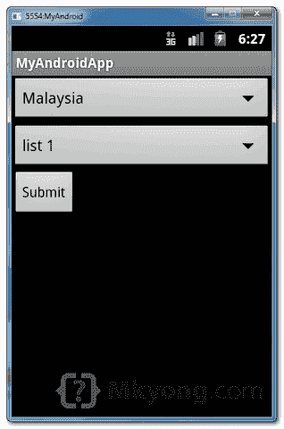
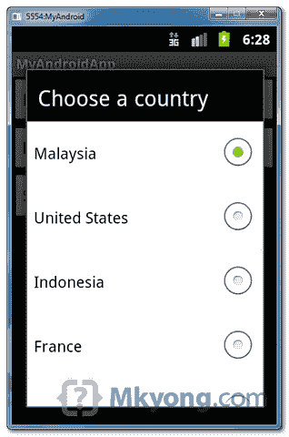
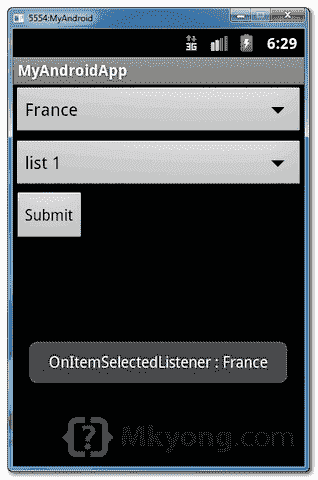
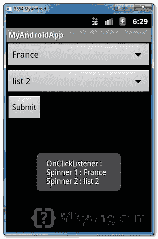

# Android 旋转器(下拉列表)示例

> 原文：<http://web.archive.org/web/20230101150211/http://www.mkyong.com/android/android-spinner-drop-down-list-example/>

在 Android 中，可以使用“ [android.widget.Spinner](http://web.archive.org/web/20220121215439/https://developer.android.com/reference/android/widget/Spinner.html) ”类来呈现下拉框选择列表。

**Note**
Spinner is a widget similar to a drop-down list for selecting items.

在本教程中，我们将向您展示如何执行以下任务:

1.  用 XML 呈现一个微调器，并通过 XML 文件加载选择项。
2.  用 XML 呈现另一个 Spinner，并通过代码动态加载选择项。
3.  在 Spinner 上附加一个监听器，当用户在 Spinner 中选择一个值时触发。
4.  在一个普通按钮上渲染并附加一个监听器，当用户点击它时触发，它将显示微调器的选定值。

*P.S 这个项目是在 Eclipse 3.7 中开发的，用 Android 2.3.3 测试过。*

## 1.微调器中的项目列表

打开" **res/values/strings.xml** "文件，定义将在微调器中显示的项目列表(下拉列表)。

*文件:res/values/strings.xml*

```java
 <?xml version="1.0" encoding="utf-8"?>
<resources>

    <string name="app_name">MyAndroidApp</string>
    <string name="country_prompt">Choose a country</string>

    <string-array name="country_arrays">
        <item>Malaysia</item>
        <item>United States</item>
        <item>Indonesia</item>
        <item>France</item>
        <item>Italy</item>
        <item>Singapore</item>
        <item>New Zealand</item>
        <item>India</item>
    </string-array>

</resources> 
```

## 2.微调器(下拉列表)

打开" **res/layout/main.xml** "文件，添加两个微调器组件和一个按钮。

1.  在“spinner1”中，“`android:entries`”代表微调器中的选择项。
2.  在“spinner2”中，选择项将在后面的代码中定义。

*文件:res/layout/main.xml*

```java
 <?xml version="1.0" encoding="utf-8"?>
<LinearLayout xmlns:android="http://schemas.android.com/apk/res/android"
    android:layout_width="fill_parent"
    android:layout_height="fill_parent"
    android:orientation="vertical" >

    <Spinner
        android:id="@+id/spinner1"
        android:layout_width="match_parent"
        android:layout_height="wrap_content"
        android:entries="@array/country_arrays"
        android:prompt="@string/country_prompt" />

    <Spinner
        android:id="@+id/spinner2"
        android:layout_width="match_parent"
        android:layout_height="wrap_content" />

    <Button
        android:id="@+id/btnSubmit"
        android:layout_width="wrap_content"
        android:layout_height="wrap_content"
        android:text="Submit" />

</LinearLayout> 
```

## 3.代码代码

阅读代码和代码的注释，它应该是不言自明的。

*文件:MyAndroidAppActivity.java*

```java
 package com.mkyong.android;

import java.util.ArrayList;
import java.util.List;
import android.app.Activity;
import android.os.Bundle;
import android.view.View;
import android.view.View.OnClickListener;
import android.widget.ArrayAdapter;
import android.widget.Button;
import android.widget.Spinner;
import android.widget.Toast;

public class MyAndroidAppActivity extends Activity {

  private Spinner spinner1, spinner2;
  private Button btnSubmit;

  @Override
  public void onCreate(Bundle savedInstanceState) {
	super.onCreate(savedInstanceState);
	setContentView(R.layout.main);

	addItemsOnSpinner2();
	addListenerOnButton();
	addListenerOnSpinnerItemSelection();
  }

  // add items into spinner dynamically
  public void addItemsOnSpinner2() {

	spinner2 = (Spinner) findViewById(R.id.spinner2);
	List<String> list = new ArrayList<String>();
	list.add("list 1");
	list.add("list 2");
	list.add("list 3");
	ArrayAdapter<String> dataAdapter = new ArrayAdapter<String>(this,
		android.R.layout.simple_spinner_item, list);
	dataAdapter.setDropDownViewResource(android.R.layout.simple_spinner_dropdown_item);
	spinner2.setAdapter(dataAdapter);
  }

  public void addListenerOnSpinnerItemSelection() {
	spinner1 = (Spinner) findViewById(R.id.spinner1);
	spinner1.setOnItemSelectedListener(new CustomOnItemSelectedListener());
  }

  // get the selected dropdown list value
  public void addListenerOnButton() {

	spinner1 = (Spinner) findViewById(R.id.spinner1);
	spinner2 = (Spinner) findViewById(R.id.spinner2);
	btnSubmit = (Button) findViewById(R.id.btnSubmit);

	btnSubmit.setOnClickListener(new OnClickListener() {

	  @Override
	  public void onClick(View v) {

	    Toast.makeText(MyAndroidAppActivity.this,
		"OnClickListener : " + 
                "\nSpinner 1 : "+ String.valueOf(spinner1.getSelectedItem()) + 
                "\nSpinner 2 : "+ String.valueOf(spinner2.getSelectedItem()),
			Toast.LENGTH_SHORT).show();
	  }

	});
  }
} 
```

*文件:CustomOnItemSelectedListener.java*

```java
 package com.mkyong.android;

import android.view.View;
import android.widget.AdapterView;
import android.widget.AdapterView.OnItemSelectedListener;
import android.widget.Toast;

public class CustomOnItemSelectedListener implements OnItemSelectedListener {

  public void onItemSelected(AdapterView<?> parent, View view, int pos,long id) {
	Toast.makeText(parent.getContext(), 
		"OnItemSelectedListener : " + parent.getItemAtPosition(pos).toString(),
		Toast.LENGTH_SHORT).show();
  }

  @Override
  public void onNothingSelected(AdapterView<?> arg0) {
	// TODO Auto-generated method stub
  }

} 
```

## 4.演示

运行应用程序。

1.结果，显示两个微调器:



2.从 spinner1 中选择“法国”,项目选择监听器被触发:



3.从微调器 2 中选择“list2 ”,然后单击提交按钮:



## 下载源代码

Download it – [Android-Spinner-DropDownList-Example.zip](http://web.archive.org/web/20220121215439/http://www.mkyong.com/wp-content/uploads/2011/11/Android-Spinner-DropDownList-Example.zip) (16 KB)

## 参考

1.  [Android Spinner JavaDoc](http://web.archive.org/web/20220121215439/https://developer.android.com/reference/android/widget/Spinner.html)
2.  [安卓旋转器示例](http://web.archive.org/web/20220121215439/https://developer.android.com/resources/tutorials/views/hello-spinner.html)

<input type="hidden" id="mkyong-current-postId" value="10242">