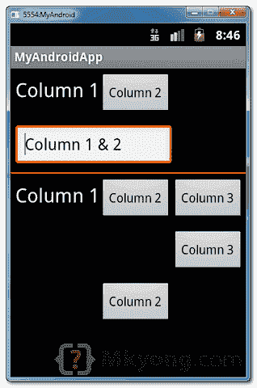

> 原文：<http://web.archive.org/web/20230101150211/http://www.mkyong.com/android/android-tablelayout-example/>

# Android 表格布局示例

在 Android 中， [TableLayout](http://web.archive.org/web/20190224164510/http://developer.android.com/reference/android/widget/TableLayout.html) 让你按行和列排列组件，就像 HTML 中的标准表格布局，`<tr>`和`<td>`。

在本教程中，我们将向您展示如何使用`TableLayout`来排列按钮、文本视图和以行和列的格式编辑文本，还将演示如何使用`android:layout_span`在两个单元格中显示视图，以及使用`android:layout_column`在指定的列中显示视图。

**Note**
In Eclipse 3.7, XML code assist will not prompts the attribute “`android:layout_span`“, “`android:layout_column`” and many other useful `TableLayout` attributes, no idea why, may be bug. Just put the attribute inside, it’s still compile and run.

*P.S 这个项目是在 Eclipse 3.7 中开发的，用 Android 2.3.3 测试过。*

## 1.表格布局

打开" **res/layout/main.xml** "文件，添加以下视图进行演示。阅读 XML 注释，它应该是不言自明的。

*文件:res/layout/main.xml*

```java
 <?xml version="1.0" encoding="utf-8"?>
<TableLayout xmlns:android="http://schemas.android.com/apk/res/android"
    android:id="@+id/tableLayout1"
    android:layout_width="fill_parent"
    android:layout_height="fill_parent" >

    <!-- 2 columns -->
    <TableRow
        android:id="@+id/tableRow1"
        android:layout_width="wrap_content"
        android:layout_height="wrap_content"
        android:padding="5dip" >

        <TextView
            android:id="@+id/textView1"
            android:text="Column 1"
            android:textAppearance="?android:attr/textAppearanceLarge" />

        <Button
            android:id="@+id/button1"
            android:text="Column 2" />
    </TableRow>

    <!-- edittext span 2 column -->
    <TableRow
        android:id="@+id/tableRow2"
        android:layout_width="wrap_content"
        android:layout_height="wrap_content"
        android:padding="5dip" >

        <EditText
            android:id="@+id/editText1"
            android:layout_span="2"
            android:text="Column 1 & 2" />
    </TableRow>

    <!-- just draw a red line -->
    <View
        android:layout_height="2dip"
        android:background="#FF0000" />

    <!-- 3 columns -->
    <TableRow
        android:id="@+id/tableRow3"
        android:layout_width="wrap_content"
        android:layout_height="wrap_content"
        android:padding="5dip" >

        <TextView
            android:id="@+id/textView2"
            android:text="Column 1"
            android:textAppearance="?android:attr/textAppearanceLarge" />

        <Button
            android:id="@+id/button2"
            android:text="Column 2" />

        <Button
            android:id="@+id/button3"
            android:text="Column 3" />
    </TableRow>

    <!-- display this button in 3rd column via layout_column(zero based) -->
    <TableRow
        android:id="@+id/tableRow4"
        android:layout_width="wrap_content"
        android:layout_height="wrap_content"
        android:padding="5dip" >

        <Button
            android:id="@+id/button4"
            android:layout_column="2"
            android:text="Column 3" />
    </TableRow>

    <!-- display this button in 2nd column via layout_column(zero based) -->
    <TableRow
        android:id="@+id/tableRow5"
        android:layout_width="wrap_content"
        android:layout_height="wrap_content"
        android:padding="5dip" >

        <Button
            android:id="@+id/button5"
            android:layout_column="1"
            android:text="Column 2" />
    </TableRow>

</TableLayout> 
```

 <ins class="adsbygoogle" style="display:block; text-align:center;" data-ad-format="fluid" data-ad-layout="in-article" data-ad-client="ca-pub-2836379775501347" data-ad-slot="6894224149">## 2.演示

见结果。

 <ins class="adsbygoogle" style="display:block" data-ad-client="ca-pub-2836379775501347" data-ad-slot="8821506761" data-ad-format="auto" data-ad-region="mkyongregion">## 下载源代码

Download it – [Android-TableLayout-Example.zip](http://web.archive.org/web/20190224164510/http://www.mkyong.com/wp-content/uploads/2011/12/Android-TableLayout-Example.zip) (15 KB)

## 参考

1.  [Android 表格布局示例](http://web.archive.org/web/20190224164510/http://developer.android.com/resources/tutorials/views/hello-tablelayout.html)
2.  [Android table layout JavaDoc](http://web.archive.org/web/20190224164510/http://developer.android.com/reference/android/widget/TableLayout.html)
3.  [另一个很棒的 Android 表格布局示例](http://web.archive.org/web/20190224164510/http://android-pro.blogspot.com/2010/02/table-layout.html)
4.  [通过代码](http://web.archive.org/web/20190224164510/http://stackoverflow.com/questions/4637233/how-to-set-layout-span-through-code)设置布局跨度

[android](http://web.archive.org/web/20190224164510/http://www.mkyong.com/tag/android/) [layout](http://web.archive.org/web/20190224164510/http://www.mkyong.com/tag/layout/) [tablelayout](http://web.archive.org/web/20190224164510/http://www.mkyong.com/tag/tablelayout/)


