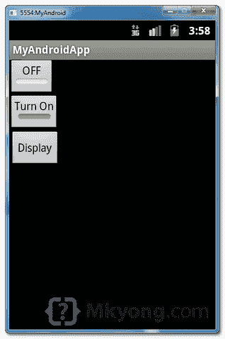
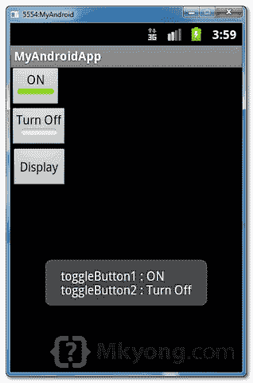

# Android ToggleButton 示例

> 原文：<http://web.archive.org/web/20230101150211/http://www.mkyong.com/android/android-togglebutton-example/>

在 Android 中，“[Android . widget . toggle button](http://web.archive.org/web/20190306165030/http://developer.android.com/reference/android/widget/ToggleButton.html)是一个特殊的类，用于呈现只有两种状态的按钮，例如“开”和“关”。它是单选按钮打开或关闭功能的最佳选择。

在本教程中，我们将向您展示如何使用 XML 创建两个切换按钮和一个普通按钮，当用户单击普通按钮时，它将显示两个切换按钮的当前状态。

*P.S 这个项目是在 Eclipse 3.7 中开发的，用 Android 2.3.3 测试过。*

## 1.自定义字符串

打开" **res/values/strings.xml** "文件，为切换按钮添加一些自定义字符串。

*文件:res/values/strings.xml*

```java
 <?xml version="1.0" encoding="utf-8"?>
<resources>
    <string name="app_name">MyAndroidApp</string>
    <string name="toggle_turn_on">Turn On</string>
    <string name="toggle_turn_off">Turn Off</string>
    <string name="btn_display">Display</string>
</resources> 
```

 <ins class="adsbygoogle" style="display:block; text-align:center;" data-ad-format="fluid" data-ad-layout="in-article" data-ad-client="ca-pub-2836379775501347" data-ad-slot="6894224149">## 2.切换按钮

打开“ **res/layout/main.xml** 文件，在`LinearLayout`里面添加两个“ **ToggleButton** 和一个普通按钮。

*文件:res/layout/main.xml*

```java
 <?xml version="1.0" encoding="utf-8"?>
<LinearLayout xmlns:android="http://schemas.android.com/apk/res/android"
    android:layout_width="fill_parent"
    android:layout_height="fill_parent"
    android:orientation="vertical" >

    <ToggleButton
        android:id="@+id/toggleButton1"
        android:layout_width="wrap_content"
        android:layout_height="wrap_content"
        android:text="ToggleButton" />

    <ToggleButton
        android:id="@+id/toggleButton2"
        android:layout_width="wrap_content"
        android:layout_height="wrap_content"
        android:textOn="@string/toggle_turn_on"
        android:textOff="@string/toggle_turn_off"
        android:checked="true" />

    <Button
        android:id="@+id/btnDisplay"
        android:layout_width="wrap_content"
        android:layout_height="wrap_content"
        android:text="@string/btn_display" />

</LinearLayout> 
```

**Note**
Review the “togglebutton2”, we did customized the togglebutton2’s display text on and off and made it checked by default. <ins class="adsbygoogle" style="display:block" data-ad-client="ca-pub-2836379775501347" data-ad-slot="8821506761" data-ad-format="auto" data-ad-region="mkyongregion">## 3.代码代码

在 activity " `onCreate()`"方法内部，在一个普通按钮上附加一个 click 监听器，以显示切换按钮的当前状态。

*文件:MyAndroidAppActivity.java*

```java
 package com.mkyong.android;

import android.app.Activity;
import android.os.Bundle;
import android.view.View;
import android.view.View.OnClickListener;
import android.widget.Button;
import android.widget.Toast;
import android.widget.ToggleButton;

public class MyAndroidAppActivity extends Activity {

  private ToggleButton toggleButton1, toggleButton2;
  private Button btnDisplay;

  @Override
  public void onCreate(Bundle savedInstanceState) {
	super.onCreate(savedInstanceState);
	setContentView(R.layout.main);

	addListenerOnButton();

  }

  public void addListenerOnButton() {

	toggleButton1 = (ToggleButton) findViewById(R.id.toggleButton1);
	toggleButton2 = (ToggleButton) findViewById(R.id.toggleButton2);
	btnDisplay = (Button) findViewById(R.id.btnDisplay);

	btnDisplay.setOnClickListener(new OnClickListener() {

		@Override
		public void onClick(View v) {

		   StringBuffer result = new StringBuffer();
		   result.append("toggleButton1 : ").append(toggleButton1.getText());
		   result.append("\ntoggleButton2 : ").append(toggleButton2.getText());

		   Toast.makeText(MyAndroidAppActivity.this, result.toString(),
			Toast.LENGTH_SHORT).show();

		}

	});

  }
} 
```

## 4.演示

运行应用程序。

1.结果，toggleButton2 使用自定义字符串，并且默认选中。



2.选中 toggleButton1 和未选中的 toggleButton2，并单击显示按钮，将显示两个切换按钮的当前状态。



## 下载源代码

Download it – [Android-ToggleButton-Example.zip](http://web.archive.org/web/20190306165030/http://www.mkyong.com/wp-content/uploads/2011/11/Android-ToggleButton-Example.zip) (15 KB)

## 参考

1.  [Android toggle button JavaDoc](http://web.archive.org/web/20190306165030/http://developer.android.com/reference/android/widget/ToggleButton.html)
2.  [Android ToggleButton 示例](http://web.archive.org/web/20190306165030/http://developer.android.com/resources/tutorials/views/hello-formstuff.html#ToggleButton)

[android](http://web.archive.org/web/20190306165030/http://www.mkyong.com/tag/android/) [button](http://web.archive.org/web/20190306165030/http://www.mkyong.com/tag/button/)


