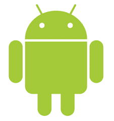

# Android 教程

> 原文：<http://web.archive.org/web/20230101150211/https://mkyong.com/tutorials/android-tutorial/>

[Android](http://web.archive.org/web/20210421044322/https://www.android.com/) ，移动设备(智能手机和平板电脑)开源操作系统，由谷歌领衔。Android SDK 提供了一套使用 Java 开发 Android 应用程序的工具和 API。所以，如果你懂 Java，Android 编程很容易🙂

在这一系列教程中，我们向你展示了基础教程的列表，让你轻松地开始 Android 程序。

**Note**
All Android tutorials are developed in *Eclipse 3.7*, and tested with *Android 2.3.3*.

这只是 Android 教程的初始版本，以后会继续发布更多。

## 1.快速启动

让您开始 Android 编程。

*   [Android hello world 示例](http://web.archive.org/web/20210421044322/http://www.mkyong.com/android/android-hello-world-example/)
    开发 Android 应用的工具和 SDK。

## 2.基本原则

一些安卓基础的东西。

*   [Android 活动示例](http://web.archive.org/web/20210421044322/http://www.mkyong.com/android/android-activity-from-one-screen-to-another-screen/)
    了解 Android 的活动，从一个屏幕(活动)导航到另一个屏幕(活动)的简单示例。
*   [Android wrap_content 和 fill_parent 示例](http://web.archive.org/web/20210421044322/http://www.mkyong.com/android/android-wrap_content-and-fill_parent-example/)
    wrap _ content 和 fill_parent 的不同之处在于控制组件的宽度和高度。
*   [将 Android 源代码附加到 Eclipse IDE](http://web.archive.org/web/20210421044322/http://www.mkyong.com/android/attach-android-source-code-to-eclipse-ide/)
    Android 源代码对于理解 Android 如何工作很重要，一本将 Android 源代码附加到 Eclipse IDE 的指南。

## 3.用户界面控件

玩 Android UI 控件。

*   [Android 按钮示例](http://web.archive.org/web/20210421044322/http://www.mkyong.com/android/android-button-example/)
    使用“按钮”来显示一个简单的按钮。
*   [Android textbox 示例](http://web.archive.org/web/20210421044322/http://www.mkyong.com/android/android-textbox-example/)
    使用“EditText”呈现一个可编辑的 textbox 组件。
*   [安卓密码示例](http://web.archive.org/web/20210421044322/http://www.mkyong.com/android/android-password-field-example/)
    使用“EditText”+input type = " text password "渲染一个密码组件。
*   [Android checkbox 示例](http://web.archive.org/web/20210421044322/http://www.mkyong.com/android/android-checkbox-example/)
    使用“checkbox”呈现 CheckBox 组件。
*   [Android 单选按钮示例](http://web.archive.org/web/20210421044322/http://www.mkyong.com/android/android-radio-buttons-example/)
    使用“RadioButton”和“RadioGroup”在组中呈现单选按钮组件。
*   [Android 切换按钮示例](http://web.archive.org/web/20210421044322/http://www.mkyong.com/android/android-togglebutton-example/)
    使用“toggle button”呈现一个只有两种状态(开和关)的按钮。
*   [Android 评级栏示例](http://web.archive.org/web/20210421044322/http://www.mkyong.com/android/android-rating-bar-example/)
    使用“评级栏”在星星图标中呈现一个评级栏。
*   [Android spinner(下拉列表)示例](http://web.archive.org/web/20210421044322/http://www.mkyong.com/android/android-spinner-drop-down-list-example/)
    使用“spinner”呈现一个下拉框，用于选择项目。
*   [Android 日期选择器示例](http://web.archive.org/web/20210421044322/http://www.mkyong.com/android/android-date-picker-example/)
    使用“date picker”和“DatePickerDialog”呈现一个日期选择器组件。
*   [Android 时间选择器示例](http://web.archive.org/web/20210421044322/http://www.mkyong.com/android/android-time-picker-example/)
    使用“time picker”和“TimePickerDialog”呈现一个时间选择器组件。
*   [Android analogclock 和 digitalclock 示例](http://web.archive.org/web/20210421044322/http://www.mkyong.com/android/android-analogclock-and-digitalclock-example/)
    使用“analogclock”和“DigitalClock”渲染一个类似时钟的组件，支持时、分、秒。
*   [Android 进度条示例](http://web.archive.org/web/20210421044322/http://www.mkyong.com/android/android-progress-bar-example/)
    使用“ProgressDialog”在对话框中显示一个进度条，告诉我们你的任务需要时间来完成。
*   [Android 警告对话框示例](http://web.archive.org/web/20210421044322/http://www.mkyong.com/android/android-alert-dialog-example/)
    如何显示警告框。
*   [Android 提示对话框示例](http://web.archive.org/web/20210421044322/http://www.mkyong.com/android/android-prompt-user-input-dialog-example/)
    自定义 AlertDialog 示例。
*   [Android 自定义对话框示例](http://web.archive.org/web/20210421044322/http://www.mkyong.com/android/android-custom-dialog-example/)
    自定义对话框示例。
*   [安卓吐司示例](http://web.archive.org/web/20210421044322/http://www.mkyong.com/android/android-toast-example/)
    自定义吐司查看示例。
*   [Android ImageView 示例](http://web.archive.org/web/20210421044322/http://www.mkyong.com/android/android-imageview-example/)
    使用“ImageView”显示一个图像文件。
*   [Android ImageButton 示例](http://web.archive.org/web/20210421044322/http://www.mkyong.com/android/android-imagebutton-example/)
    使用“ImageButton”显示带有自定义背景图像的按钮。
*   [Android ImageButton 选择器示例](http://web.archive.org/web/20210421044322/http://www.mkyong.com/android/android-imagebutton-selector-example/)
    根据按钮状态，使用“按钮”和“选择器”标签显示按钮的图像。

## 4.布局

玩 Android 布局控件。

*   [Android LinearLayout 示例](http://web.archive.org/web/20210421044322/http://www.mkyong.com/android/android-linearlayout-example/)
    最常见的布局，以水平或垂直顺序排列组件。
*   [Android RelativeLayout 示例](http://web.archive.org/web/20210421044322/http://www.mkyong.com/android/android-relativelayout-example/)
    最灵活的布局，基于“相对”或兄弟组件排列组件。
*   [Android TableLayout 示例](http://web.archive.org/web/20210421044322/http://www.mkyong.com/android/android-tablelayout-example/)
    最灵活的布局，以行列格式排列组件，就像 HTML 表格，< tr >和< td >一样。
*   [Android ListView 示例](http://web.archive.org/web/20210421044322/http://www.mkyong.com/android/android-listview-example/)
    在垂直可滚动列表中显示组件。
*   Android GridView 示例
    在二维滚动网格中显示组件。
*   [Android WebView 示例](http://web.archive.org/web/20210421044322/http://www.mkyong.com/android/android-webview-example/)
    允许你打开一个自己的窗口来查看 URL 或自定义 html 标记页面。

## 5.常见问题

Android 中的一些常见问题。

*   [如何在安卓网络浏览器中打开网址](http://web.archive.org/web/20210421044322/http://www.mkyong.com/android/how-to-open-an-url-in-androids-web-browser/)
*   [如何设置安卓应用的默认活动](http://web.archive.org/web/20210421044322/http://www.mkyong.com/android/how-to-set-default-activity-for-android-application/)
*   [如何在 Android 中打电话](http://web.archive.org/web/20210421044322/http://www.mkyong.com/android/how-to-make-a-phone-call-in-android/)
*   [三星 Galaxy S2 USB 驱动哪里下载？](http://web.archive.org/web/20210421044322/http://www.mkyong.com/android/where-to-download-samsung-galaxy-s2-usb-driver/)
*   [Android 在真实设备上调试](http://web.archive.org/web/20210421044322/http://www.mkyong.com/android/android-debugging-on-real-device/)
*   [Android–如何将按钮置于屏幕中央](http://web.archive.org/web/20210421044322/http://www.mkyong.com/android/android-how-to-center-button-on-screen/)
*   [如何在 Android 中打开/关闭相机 LED/闪光灯](http://web.archive.org/web/20210421044322/http://www.mkyong.com/android/how-to-turn-onoff-camera-ledflashlight-in-android/)
*   [Android:如何检查设备是否有摄像头](http://web.archive.org/web/20210421044322/http://www.mkyong.com/android/android-how-to-check-if-device-has-camera/)
*   [如何在安卓系统中发送短信](http://web.archive.org/web/20210421044322/http://www.mkyong.com/android/how-to-send-sms-message-in-android/)
*   [如何在 Android 中发送电子邮件](http://web.archive.org/web/20210421044322/http://www.mkyong.com/android/how-to-send-email-in-android/)
*   Android:与 adb 的连接中断，出现严重错误。

## 参考

1.  [安卓开发者](http://web.archive.org/web/20210421044322/https://developer.android.com/)
2.  [安卓基础](http://web.archive.org/web/20210421044322/https://developer.android.com/guide/topics/fundamentals.html)
3.  [安卓在维基百科](http://web.archive.org/web/20210421044322/https://en.wikipedia.org/wiki/Android_(operating_system))

Tags : [android](http://web.archive.org/web/20210421044322/https://mkyong.com/tag/android/) [tutorials](http://web.archive.org/web/20210421044322/https://mkyong.com/tag/tutorials/)<input type="hidden" id="mkyong-current-postId" value="10725">