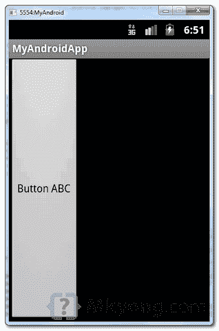

# Android wrap_content 和 fill_parent 示例

> 原文：<http://web.archive.org/web/20230101150211/http://www.mkyong.com/android/android-wrap_content-and-fill_parent-example/>

在 Android 中，你总是在组件的属性“`layout_width`”和“【T3””上加上“`wrap_content`”或“`fill_parent`”，你不知道这有什么不同吗？

参见以下定义:

1.  **wrap _ content**–组件只想显示足够大的内容。
2.  **fill _ parent**–组件想要显示得和它的父组件一样大，并填充剩余的空间。(在 API 级别 8 中重命名为 match_parent)

以上术语现在可能没有意义，让我们看看下面的演示:

## 1.包装内容

一个按钮组件，在宽度和高度属性上都设置了“`wrap_content`”。它告诉 Android 只显示足够大的按钮来包含它的内容“*按钮 ABC* ”。

```java
 <?xml version="1.0" encoding="utf-8"?>
<RelativeLayout xmlns:android="http://schemas.android.com/apk/res/android"
    android:layout_width="fill_parent"
    android:layout_height="fill_parent" >

    <Button
        android:id="@+id/btnButton1"
        android:layout_width="wrap_content"
        android:layout_height="wrap_content"
        android:text="Button ABC"/>

</RelativeLayout> 
```


## 2.填充 _ 父级–宽度

将“`layout_width`”改为“【T1”)，现在，按钮的宽度将填充剩余的空间，就像它的父“T2”一样大，但按钮的高度仍然足够大，只能包含它的内容。

```java
 <?xml version="1.0" encoding="utf-8"?>
<RelativeLayout xmlns:android="http://schemas.android.com/apk/res/android"
    android:layout_width="fill_parent"
    android:layout_height="fill_parent" >

    <Button
        android:id="@+id/btnButton1"
        android:layout_width="fill_parent"
        android:layout_height="wrap_content"
        android:text="Button ABC"/>

</RelativeLayout> 
```


## 3.填充 _ 父级–高度

将“`layout_height`”改为“【T1”)，现在，按钮的高度将填充剩余的空间，就像它的父“【T2”一样大，但按钮的宽度仍然足够大，只能包含它的内容。

```java
 <?xml version="1.0" encoding="utf-8"?>
<RelativeLayout xmlns:android="http://schemas.android.com/apk/res/android"
    android:layout_width="fill_parent"
    android:layout_height="fill_parent" >

    <Button
        android:id="@+id/btnButton1"
        android:layout_width="wrap_content"
        android:layout_height="fill_parent"
        android:text="Button ABC"/>

</RelativeLayout> 
```



## 4.fill _ parent–宽度、高度

将“`layout_width`”和“`layout_height`”都改为“【T2”，按钮将显示为整个设备屏幕那么大，正好填满整个屏幕空间。

```java
 <?xml version="1.0" encoding="utf-8"?>
<RelativeLayout xmlns:android="http://schemas.android.com/apk/res/android"
    android:layout_width="fill_parent"
    android:layout_height="fill_parent" >

    <Button
        android:id="@+id/btnButton1"
        android:layout_width="fill_parent"
        android:layout_height="fill_parent"
        android:text="Button ABC"/>

</RelativeLayout> 
```

**Note**
Actually, you can specifying an exact width and height, but it’s not recommended, due to Android variety of devices screen size. You just do not know what size of Android device is running your fantasy application.

## 参考

1.  [Android XML 布局文档](http://web.archive.org/web/20211130065346/https://developer.android.com/guide/topics/ui/declaring-layout.html)
2.  [安卓视图组。LayoutParams 文档](http://web.archive.org/web/20211130065346/https://developer.android.com/reference/android/view/ViewGroup.LayoutParams.html)

<input type="hidden" id="mkyong-current-postId" value="10368">