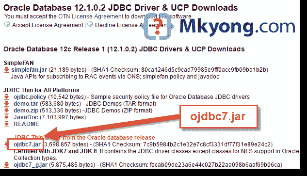

> 原文：<http://web.archive.org/web/20230101150211/https://mkyong.com/jdbc/connect-to-oracle-db-via-jdbc-driver-java/>

# 通过 JDBC 驱动程序连接到 Oracle 数据库

下面的示例向您展示了如何通过 JDBC 驱动程序连接到 Oracle 数据库。

## 1.下载 Oracle JDBC 驱动程序

访问[甲骨文网站](http://web.archive.org/web/20190223081505/http://www.oracle.com/technetwork/database/features/jdbc/index-091264.html)获取甲骨文 JDBC 驱动`ojdbc6.jar`或`ojdbc7.jar`



*另外，您需要创建一个 Oracle 帐户(免费)来下载 JDBC 驱动程序。*

 <ins class="adsbygoogle" style="display:block; text-align:center;" data-ad-format="fluid" data-ad-layout="in-article" data-ad-client="ca-pub-2836379775501347" data-ad-slot="6894224149">## 2.Java JDBC 连接示例

通过 JDBC 驱动程序连接 Oracle 数据库的代码片段。

```java
 Class.forName("oracle.jdbc.driver.OracleDriver");
Connection connection = null;
connection = DriverManager.getConnection("jdbc:oracle:thin:@localhost:1521:SID","username","password");
connection.close(); 
```

请参见下面的完整示例:

OracleJDBCExample.java

```java
 package com.mkyong;

import java.sql.DriverManager;
import java.sql.Connection;
import java.sql.SQLException;

public class OracleJDBCExample {

    public static void main(String[] argv) {

        System.out.println("-------- Oracle JDBC Connection Testing ------");

        try {

            Class.forName("oracle.jdbc.driver.OracleDriver");

        } catch (ClassNotFoundException e) {

            System.out.println("Where is your Oracle JDBC Driver?");
            e.printStackTrace();
            return;

        }

        System.out.println("Oracle JDBC Driver Registered!");

        Connection connection = null;

        try {

            connection = DriverManager.getConnection(
                    "jdbc:oracle:thin:@localhost:1521:xe", "system", "password");

        } catch (SQLException e) {

            System.out.println("Connection Failed! Check output console");
            e.printStackTrace();
            return;

        }

        if (connection != null) {
            System.out.println("You made it, take control your database now!");
        } else {
            System.out.println("Failed to make connection!");
        }
    }

} 
```

 <ins class="adsbygoogle" style="display:block" data-ad-client="ca-pub-2836379775501347" data-ad-slot="8821506761" data-ad-format="auto" data-ad-region="mkyongregion">## 3.运行它

假设`OracleJDBCExample.java`与 Oracle JDBC 驱动程序`ojdbc7.jar`一起存储在`C:\jdbc-test`文件夹中

Terminal

```java
 C:\jdbc-test>javac OracleJDBCExample.java

C:\jdbc-test>java -cp c:\jdbc-test\ojdbc7.jar;c:\jdbc-test OracleJDBCExample
-------- Oracle JDBC Connection Testing ------------
Oracle JDBC Driver Registered!
You made it, take control your database now! 
```

完成了。

## 参考

1.  [如何在您的 Maven 本地存储库中添加 Oracle JDBC 驱动程序](http://web.archive.org/web/20190223081505/https://www.mkyong.com/maven/how-to-add-oracle-jdbc-driver-in-your-maven-local-repository/)
2.  [OracleDriver 文档](http://web.archive.org/web/20190223081505/http://docs.oracle.com/cd/E11882_01/appdev.112/e13995/oracle/jdbc/OracleDriver.html)

[jdbc](http://web.archive.org/web/20190223081505/http://www.mkyong.com/tag/jdbc/) [oracle](http://web.archive.org/web/20190223081505/http://www.mkyong.com/tag/oracle/)


