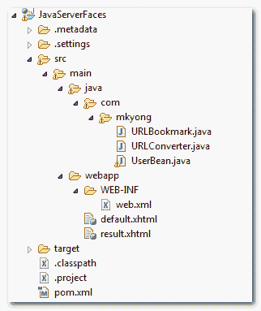
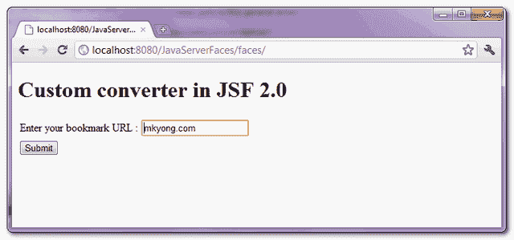
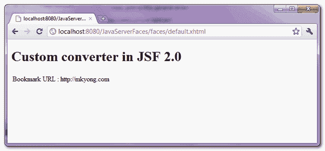
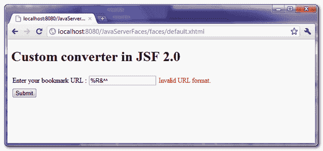

# JSF 2.0 中的自定义转换器

> 原文：<http://web.archive.org/web/20230101150211/http://www.mkyong.com/jsf2/custom-converter-in-jsf-2-0/>

在本文中，我们将向您展示如何在 JSF 2.0 中创建自定义转换器。

*步骤*
1。通过实现**javax . faces . convert . converter**接口创建一个转换器类。
2。重写 **getAsObject()** 和 **getAsString()** 方法。
3。使用 **@FacesConverter** 注释分配唯一的转换器 ID。
4。通过 **f:converter** 标签将您的自定义转换器类链接到 JSF 组件。

## 自定义转换器示例

创建一个名为“URLConverter”的 JSF 2 自定义转换器的详细指南，该转换器用于将字符串转换为 URL 格式(仅在前面添加 HTTP 协议:)，并将其存储到一个对象中。

freestar.config.enabled_slots.push({ placementName: "mkyong_incontent_1", slotId: "mkyong_incontent_1" });

## 1.文件夹结构

这个例子的文件夹结构。

<noscript></noscript>



## 2.转换器类别

通过实现**javax . faces . convert . converter**接口创建一个自定义转换器类。

```java
 package com.mkyong;

import javax.faces.convert.Converter;
public class URLConverter implements Converter{
	//...
} 
```

覆盖以下两种方法:
**1。**，将给定的字符串值转换成一个对象。
**2。getAsString()** ，将给定对象转换成字符串。

```java
 public class URLConverter implements Converter{

	@Override
	public Object getAsObject(FacesContext context, UIComponent component,
			String value) {

		//...
	}
	@Override
	public String getAsString(FacesContext context, UIComponent component,
			Object value) {

		//...

	} 
```

使用 **@FacesConverter** 注释分配转换器 ID。

```java
 package com.mkyong;

import javax.faces.convert.Converter;
@FacesConverter("com.mkyong.URLConverter")
public class URLConverter implements Converter{
	//...
} 
```

查看完整的自定义转换器源代码:

**URLConverter.java**

```java
 package com.mkyong;

import javax.faces.application.FacesMessage;
import javax.faces.component.UIComponent;
import javax.faces.context.FacesContext;
import javax.faces.convert.Converter;
import javax.faces.convert.ConverterException;
import javax.faces.convert.FacesConverter;
import org.apache.commons.validator.UrlValidator;

@FacesConverter("com.mkyong.URLConverter")
public class URLConverter implements Converter{

	@Override
	public Object getAsObject(FacesContext context, UIComponent component,
		String value) {

		String HTTP = "http://";
		StringBuilder url = new StringBuilder();

		//if not start with http://, then add it
		if(!value.startsWith(HTTP, 0)){
			url.append(HTTP);
		}
		url.append(value);

		//use Apache common URL validator to validate URL
		UrlValidator urlValidator = new UrlValidator();
		//if URL is invalid
		if(!urlValidator.isValid(url.toString())){

			FacesMessage msg = 
				new FacesMessage("URL Conversion error.", 
						"Invalid URL format.");
			msg.setSeverity(FacesMessage.SEVERITY_ERROR);
			throw new ConverterException(msg);
		}

		URLBookmark urlBookmark = new URLBookmark(url.toString());

		return urlBookmark;
	}

	@Override
	public String getAsString(FacesContext context, UIComponent component,
			Object value) {

		return value.toString();

	}	
} 
```

在这个自定义的转换器类中，它被赋予一个转换器 id 作为“ **com.mkyong.URLConverter** ”，并将任何给定的字符串(通过在前面添加“http”)转换成“ **URLBookmark** 对象。

此外，如果 URL 验证失败，返回一个带有声明的错误消息的 **FacesMessage** 对象。

**URLBookmark.java**

```java
 package com.mkyong;

public class URLBookmark{

	String fullURL;

	public URLBookmark(String fullURL) {
		this.fullURL = fullURL;
	}

	public String getFullURL() {
		return fullURL;
	}

	public void setFullURL(String fullURL) {
		this.fullURL = fullURL;
	}

	public String toString(){
		return fullURL;
	}

} 
```

## 3.受管 Bean

一个名为“user”的普通托管 bean，这里没什么特别的。

```java
 package com.mkyong;

import java.io.Serializable;
import javax.faces.bean.ManagedBean;
import javax.faces.bean.SessionScoped;

@ManagedBean(name="user")
@SessionScoped
public class UserBean implements Serializable{

	String bookmarkURL;

	public String getBookmarkURL() {
		return bookmarkURL;
	}

	public void setBookmarkURL(String bookmarkURL) {
		this.bookmarkURL = bookmarkURL;
	}

} 
```

## 4.JSF·佩奇

通过“ **f:converter** ”标记中的“ **converterId** ”属性将上述自定义转换器链接到 JSF 组件。

**default.xhtml**

```java
 <?xml version="1.0" encoding="UTF-8"?>
<!DOCTYPE html PUBLIC "-//W3C//DTD XHTML 1.0 Transitional//EN" 
"http://www.w3.org/TR/xhtml1/DTD/xhtml1-transitional.dtd">
<html    
      xmlns:h="http://java.sun.com/jsf/html"
      xmlns:f="http://java.sun.com/jsf/core"
      >
    <h:body>

    	<h1>Custom converter in JSF 2.0</h1>

	<h:form>

	  <h:panelGrid columns="3">

		Enter your bookmark URL :

		<h:inputText id="bookmarkURL" value="#{user.bookmarkURL}" 
			size="20" required="true" label="Bookmark URL">
			<f:converter converterId="com.mkyong.URLConverter" />
		</h:inputText>

		<h:message for="bookmarkURL" style="color:red" />

	  </h:panelGrid>

	  <h:commandButton value="Submit" action="result" />

	</h:form>	
    </h:body>
</html> 
```

**result.xhtml**

```java
 <?xml version="1.0" encoding="UTF-8"?>
<!DOCTYPE html PUBLIC "-//W3C//DTD XHTML 1.0 Transitional//EN" 
"http://www.w3.org/TR/xhtml1/DTD/xhtml1-transitional.dtd">
<html    
      xmlns:h="http://java.sun.com/jsf/html"
      xmlns:f="http://java.sun.com/jsf/core"
      xmlns:c="http://java.sun.com/jsp/jstl/core"
      >
    <h:body>

    	<h1>Custom converter in JSF 2.0</h1>

	  <h:panelGrid columns="2">

		Bookmark URL :  
		<h:outputText value="#{user.bookmarkURL}" />

	  </h:panelGrid>

    </h:body>
</html> 
```

## 5.演示

输入一个有效的 URL，不带“http”。

<noscript></noscript>



在有效的 URL 前面添加一个“http”并显示它。

<noscript></noscript>



如果提供了无效的 URL，则返回声明的错误消息。

<noscript></noscript>



## 下载源代码

Download It – [JSF-2-Custom-Converter-Example.zip](http://web.archive.org/web/20210305084858/http://www.mkyong.com/wp-content/uploads/2010/11/JSF-2-Custom-Converter-Example.zip) (11KB)

## 参考

1.  [J2EE 文档–创建自定义转换器](http://web.archive.org/web/20210305084858/https://download.oracle.com/javaee/1.4/tutorial/doc/JSFDevelop4.html)

Tags : [jsf2](http://web.archive.org/web/20210305084858/https://mkyong.com/tag/jsf2/)freestar.config.enabled_slots.push({ placementName: "mkyong_leaderboard_btf", slotId: "mkyong_leaderboard_btf" });<input type="hidden" id="mkyong-current-postId" value="7563">