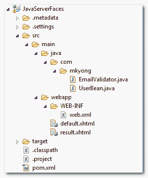

# JSF 2.0 中的自定义验证程序

> 原文：<http://web.archive.org/web/20230101150211/http://www.mkyong.com/jsf2/custom-validator-in-jsf-2-0/>

在本文中，我们将向您展示如何在 JSF 2.0 中创建一个定制的验证器

**步骤**

1.  通过实现`javax.faces.validator.Validator`接口创建一个验证器类。
2.  覆盖`validate()`方法。
3.  通过`@FacesValidator`注释分配一个唯一的验证器 ID。
4.  通过`f:validator`标签引用自定义验证器类到 JSF 组件。

创建自定义验证器名称“EmailValidator”的详细指南——通过 Java 正则表达式验证电子邮件地址。

## 1.文件夹结构

该项目的目录结构。


freestar.config.enabled_slots.push({ placementName: "mkyong_incontent_1", slotId: "mkyong_incontent_1" });

## 2.验证程序类

创建一个自定义验证器类并实现`javax.faces.validator.Validator`接口。

```java
 package com.mkyong;

import javax.faces.validator.Validator;
public class EmailValidator implements Validator{
	//...
} 
```

覆盖`validate()`方法。

```java
 public class EmailValidator implements Validator{

	public void validate(FacesContext context, UIComponent component,
			Object value) throws ValidatorException {
		//...
	}
} 
```

用`@FacesValidator`分配一个唯一的验证器 ID。

```java
 package com.mkyong;

import javax.faces.validator.Validator;

@FacesValidator("com.mkyong.EmailValidator")
public class EmailValidator implements Validator{
	//...
} 
```

查看完整的自定义验证器类:

EmailValidator.java

```java
 package com.mkyong;

import java.util.regex.Matcher;
import java.util.regex.Pattern;

import javax.faces.application.FacesMessage;
import javax.faces.component.UIComponent;
import javax.faces.context.FacesContext;
import javax.faces.validator.FacesValidator;
import javax.faces.validator.Validator;
import javax.faces.validator.ValidatorException;

@FacesValidator("com.mkyong.EmailValidator")
public class EmailValidator implements Validator{

	private static final String EMAIL_PATTERN = "^[_A-Za-z0-9-]+(\\." +
			"[_A-Za-z0-9-]+)*@[A-Za-z0-9]+(\\.[A-Za-z0-9]+)*" +
			"(\\.[A-Za-z]{2,})$";

	private Pattern pattern;
	private Matcher matcher;

	public EmailValidator(){
		  pattern = Pattern.compile(EMAIL_PATTERN);
	}

	@Override
	public void validate(FacesContext context, UIComponent component,
			Object value) throws ValidatorException {

		matcher = pattern.matcher(value.toString());
		if(!matcher.matches()){

			FacesMessage msg = 
				new FacesMessage("E-mail validation failed.", 
						"Invalid E-mail format.");
			msg.setSeverity(FacesMessage.SEVERITY_ERROR);
			throw new ValidatorException(msg);

		}

	}
} 
```

上面是一个定制的验证器类，id 为`com.mkyong.EmailValidator`。如果电子邮件无效，返回`FacesMessage`错误消息。

**Note**
For detail explanation about the email regular expression pattern, please refer to this “[Validate E-mail with Java regular expression](http://web.archive.org/web/20210305084937/http://www.mkyong.com/regular-expressions/how-to-validate-email-address-with-regular-expression/)” article.

## 3.受管 Bean

一个名为“user”的普通托管 bean，这里没什么特别的。

```java
 package com.mkyong;

import java.io.Serializable;
import javax.faces.bean.ManagedBean;
import javax.faces.bean.SessionScoped;

@ManagedBean(name="user")
@SessionScoped
public class UserBean implements Serializable{

	String email;

	public String getEmail() {
		return email;
	}

	public void setEmail(String email) {
		this.email = email;
	}

} 
```

## 4.JSF·佩奇

通过`f:validator`标签中的`validatorId`属性将上述自定义验证器引用到 JSF 组件。

Spring DI into JSF custom validator
If you need `@Autowired` into JSF custom validator, uses `binding`, instead of `validatorId`. Read this post – [Spring @Autowired into JSF custom validator](http://web.archive.org/web/20210305084937/http://www.mkyong.com/jsf2/spring-autowired-into-jsf-custom-validator/).default.xhtml

```java
 <?xml version="1.0" encoding="UTF-8"?>
<!DOCTYPE html PUBLIC "-//W3C//DTD XHTML 1.0 Transitional//EN" 
"http://www.w3.org/TR/xhtml1/DTD/xhtml1-transitional.dtd">
<html    
      xmlns:h="http://java.sun.com/jsf/html"
      xmlns:f="http://java.sun.com/jsf/core"
      >
    <h:body>

    <h1>Custom validator in JSF 2.0</h1>

	  <h:form>

		<h:panelGrid columns="3">

		  Enter your email :

		  <h:inputText id="email" value="#{user.email}" 
			size="20" required="true" label="Email Address">

			<f:validator validatorId="com.mkyong.EmailValidator" />

		  </h:inputText>

		  <h:message for="email" style="color:red" />

		</h:panelGrid>

		<h:commandButton value="Submit" action="result" />

	   </h:form>

    </h:body>
</html> 
```

result.xhtml

```java
 <?xml version="1.0" encoding="UTF-8"?>
<!DOCTYPE html PUBLIC "-//W3C//DTD XHTML 1.0 Transitional//EN" 
"http://www.w3.org/TR/xhtml1/DTD/xhtml1-transitional.dtd">
<html    
      xmlns:h="http://java.sun.com/jsf/html"
      >
    <h:body>

    	<h1>Custom validator in JSF 2.0</h1>

	  <h:panelGrid columns="2">

		Email Address :  
		<h:outputText value="#{user.email}" />

	  </h:panelGrid>

    </h:body>
</html> 
```

## 5.演示

通过自定义验证器验证电子邮件地址，如果电子邮件地址无效，返回错误消息。


## 下载源代码

Download It – [JSF-2-Custom-Validator-Example](http://web.archive.org/web/20210305084937/http://www.mkyong.com/wp-content/uploads/2010/11/JSF-2-Custom-Validator-Example.zip) (10KB)

## 参考

1.  [使用 Java Regex 进行电子邮件验证](http://web.archive.org/web/20210305084937/http://www.mkyong.com/regular-expressions/how-to-validate-email-address-with-regular-expression/)
2.  [JSF 2.0 中的自定义转换器](http://web.archive.org/web/20210305084937/http://www.mkyong.com/jsf2/custom-converter-in-jsf-2-0/)

Tags : [jsf2](http://web.archive.org/web/20210305084937/https://mkyong.com/tag/jsf2/) [validation](http://web.archive.org/web/20210305084937/https://mkyong.com/tag/validation/)freestar.config.enabled_slots.push({ placementName: "mkyong_leaderboard_btf", slotId: "mkyong_leaderboard_btf" });<input type="hidden" id="mkyong-current-postId" value="7575">