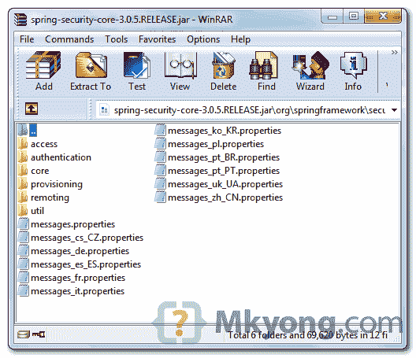

# 在 Spring Security 中显示自定义错误消息

> 原文：<http://web.archive.org/web/20230101150211/http://www.mkyong.com/spring-security/display-custom-error-message-in-spring-security/>

在 Spring Security 中，当身份验证失败时，将显示以下预定义的错误消息:

```java
 Spring display : Bad credentials 
```

在本文中，我们将向您展示如何覆盖上述错误消息并显示您自定义的错误消息。举个例子，

```java
 Spring display : Bad credentials
You want override it with this message : Invalid username or password 
```

## 解决办法

Spring Security 将消息存储在“ **spring-security-core.jar** 内的“ **messages.properties** ”中，见下图:



要覆盖它，在 spring security**message . properties**文件中找到哪个键生成了什么错误消息，并用您自己的属性文件重新定义它。

 ## 1.覆盖密钥和消息

创建一个新的属性文件，将其放在项目类路径中，并用您的自定义错误消息覆盖 Spring 的“key”。在这种情况下，只需覆盖“`AbstractUserDetailsAuthenticationProvider.badCredentials`”。

*文件:mymessages.properties*

```java
 AbstractUserDetailsAuthenticationProvider.badCredentials=Invalid username or password 
```

 ## 2.注册资源 BundleMessageSource

要加载上述属性文件，请在 Spring bean 配置文件中定义`ResourceBundleMessageSource`。

```java
 <bean id="messageSource"
	class="org.springframework.context.support.ResourceBundleMessageSource">
	<property name="basenames">
	    <list>
		<value>mymessages</value>
	    </list>
	</property>
  </bean> 
```

现在，当认证失败时，它将显示您自定义的错误消息“**无效用户名或密码**”，而不是默认的“**错误凭证**”。

**Note**
With this trick, you can override any Spring Security messages easily.

## 下载源代码

Download it – [Spring-Security-Display-Custom-Error-Msg.zip](http://web.archive.org/web/20190308012835/http://www.mkyong.com/wp-content/uploads/2011/08/Spring-Security-Display-Custom-Error-Msg.zip) (9 KB)[spring security](http://web.archive.org/web/20190308012835/http://www.mkyong.com/tag/spring-security/)


