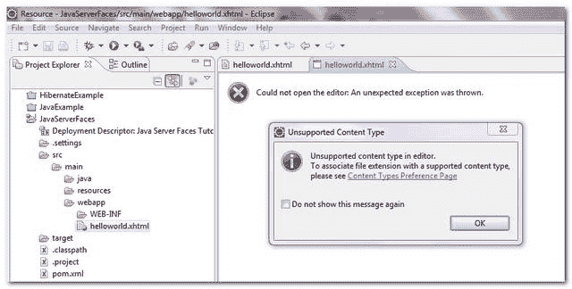

> 原文：<http://web.archive.org/web/20230101150211/http://www.mkyong.com/eclipse/eclipse-ide-unsupported-content-type-in-editor/>

# Eclipse IDE:编辑器中不支持的内容类型

## 问题

使用 Eclipse Ganymede (3.4)，开发 JSF 2.0 web 应用程序。然而，当用 Eclipse web 页面编辑器打开 xhtml 文件时，它会提示一个对话框并说…

**Unsupported content type in editor**
To associate file extension with a supported content type, please see Content Types Preference Page.

P . S The。xhtml 文件扩展名是在“内容类型”首选项页面中配置和关联的属性。

 <ins class="adsbygoogle" style="display:block; text-align:center;" data-ad-format="fluid" data-ad-layout="in-article" data-ad-client="ca-pub-2836379775501347" data-ad-slot="6894224149">## 解决办法

上千次的尝试和错误，但仍然无法摆脱“**不支持的内容类型**错误，这可能是由 Eclipse IDE 本身引起的吗？放弃吧，干脆**升级到最新[日食太阳神](http://web.archive.org/web/20190301233143/http://www.eclipse.org/) (3.6)，马上解决问题**:)

**Note**
Not sure what’s the root cause of it, may be i had installed too many plugins, and some caused the conflicts. Just get a clean copy of the Eclipse IDE will get rid of the annoying error message immediately.[eclipse](http://web.archive.org/web/20190301233143/http://www.mkyong.com/tag/eclipse/)</ins> (function (i,d,s,o,m,r,c,l,w,q,y,h,g) { var e=d.getElementById(r);if(e===null){ var t = d.createElement(o); t.src = g; t.id = r; t.setAttribute(m, s);t.async = 1;var n=d.getElementsByTagName(o)[0];n.parentNode.insertBefore(t, n); var dt=new Date().getTime(); try{i[l][w+y](h,i[l][q+y](h)+'&amp;'+dt);}catch(er){i[h]=dt;} } else if(typeof i[c]!=='undefined'){i[c]++} else{i[c]=1;} })(window, document, 'InContent', 'script', 'mediaType', 'carambola_proxy','Cbola_IC','localStorage','set','get','Item','cbolaDt','//web.archive.org/web/20190301233143/http://route.carambo.la/inimage/getlayer?pid=myky82&amp;did=112239&amp;wid=0')<input type="hidden" id="mkyong-postId" value="6931">

