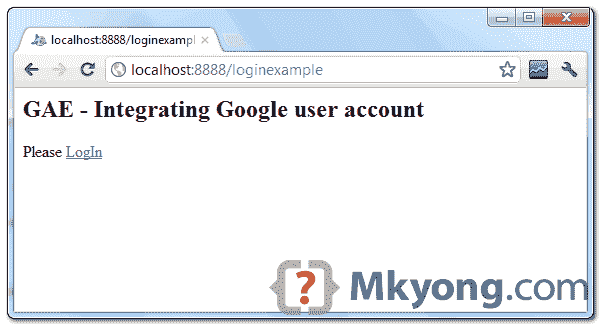
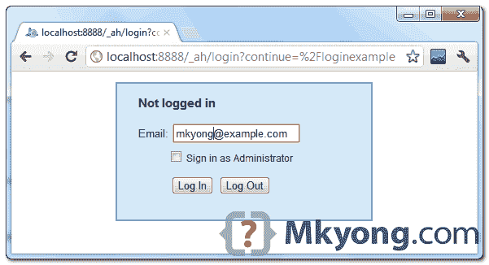
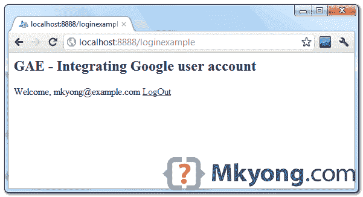
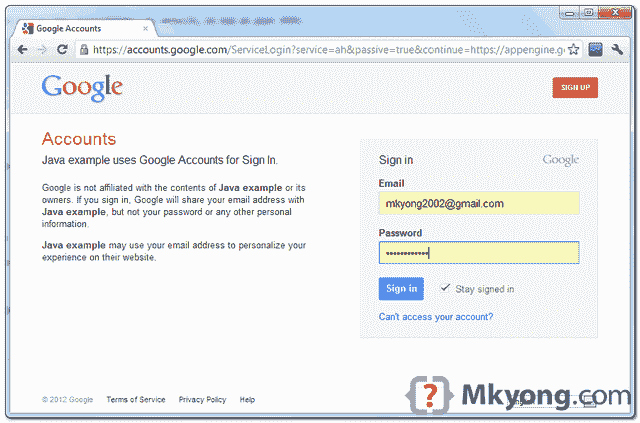
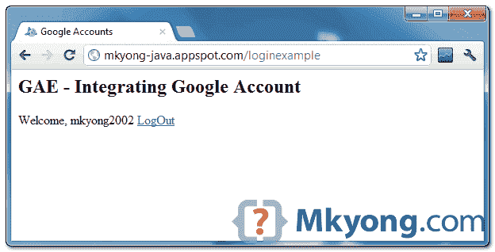

> 原文：<http://web.archive.org/web/20230101150211/http://www.mkyong.com/google-app-engine/gae-java-integrating-google-user-account/>

# GAE+Java——整合谷歌用户账户

在本教程中，我们将向您展示如何通过 Google Java SDK[UserService](http://web.archive.org/web/20190226114540/https://developers.google.com/appengine/docs/java/javadoc/com/google/appengine/api/users/UserService)类将 Google 用户帐户集成到 GAE + Java 项目中。

使用的工具:

1.  JDK 1.6
2.  Eclipse 3.7+Eclipse 的 Google 插件
3.  谷歌应用引擎 Java SDK 1.6.3.1

## 1.GAE 用户服务示例

如果用户使用他们的 Google 帐户登录，显示一条欢迎消息和一个“ *Logout* 链接；否则显示一个“*登录*链接。

```java
 package com.mkyong.user;

import java.io.IOException;

import javax.servlet.http.HttpServlet;
import javax.servlet.http.HttpServletRequest;
import javax.servlet.http.HttpServletResponse;

import com.google.appengine.api.users.User;
import com.google.appengine.api.users.UserService;
import com.google.appengine.api.users.UserServiceFactory;

@SuppressWarnings("serial")
public class LoginExampleServlet extends HttpServlet {
	public void doGet(HttpServletRequest req, HttpServletResponse resp)
			throws IOException {

		UserService userService = UserServiceFactory.getUserService();
		User user = userService.getCurrentUser();

		resp.setContentType("text/html");
		resp.getWriter().println("<script async src="//pagead2.googlesyndication.com/pagead/js/adsbygoogle.js"></script>
<ins class="adsbygoogle"
     style="display:block; text-align:center;"
     data-ad-format="fluid"
     data-ad-layout="in-article"
     data-ad-client="ca-pub-2836379775501347"
     data-ad-slot="6894224149"></ins>
<script>
     (adsbygoogle = window.adsbygoogle || []).push({});
</script><h2>GAE - Integrating Google user account</h2>");

		if (user != null) {

			resp.getWriter().println("Welcome, " + user.getNickname());
			resp.getWriter().println(
				"<a href='"
					+ userService.createLogoutURL(req.getRequestURI())
					+ "'> LogOut </a>");

		} else {

			resp.getWriter().println(
				"Please <a href='"
					+ userService.createLoginURL(req.getRequestURI())
					+ "'> LogIn </a>");

		}
	}
} 
```

**Note**
Both login or logout page are handle by GAE automatically, but the workflow is different :

1.  在本地运行-它将模拟谷歌帐户登录页面(无密码认证)。
2.  在 GAE 上运行-它将重定向到实际的谷歌帐户登录屏幕。

 <ins class="adsbygoogle" style="display:block" data-ad-client="ca-pub-2836379775501347" data-ad-slot="8821506761" data-ad-format="auto" data-ad-region="mkyongregion">## 2.在本地运行

右键单击项目并作为“Web 应用程序”运行。默认情况下，它在 post 8888 上运行。

*图 2.1* :访问 URL:http://localhost:8888/log in example



*图 2.2* :一个模拟谷歌的登录界面，输入一些东西，没有认证。



*图 2.3* :欢迎使用，显示注销链接。



## 3.部署在 GAE

使用应用程序 ID“*mkyong-Java*”部署 Google App Engine。

*图 3.1*–访问网址:http://mkyong-java.appspot.com/loginexample


*图 3.2*–重定向至实际的 Google 帐户登录屏幕。



*图 3.3*–如果登录成功，重定向回 http://mkyong-java.appspot.com/loginexample



## 下载源代码

由于文件很大，所有 GAE SDK 依赖库都被排除在外。

Download it – [GAE-UserService-LoginExample.zip](http://web.archive.org/web/20190226114540/http://www.mkyong.com/wp-content/uploads/2012/04/GAE-UserService-LoginExample.zip) (8 KB)

## 参考

1.  [使用用户服务](http://web.archive.org/web/20190226114540/https://developers.google.com/appengine/docs/java/gettingstarted/usingusers)
2.  [用户 Java API](http://web.archive.org/web/20190226114540/https://developers.google.com/appengine/docs/java/users/)
3.  GAE 用户服务 JavaDoc
4.  [GAE Java hello world 示例](http://web.archive.org/web/20190226114540/http://www.mkyong.com/google-app-engine/google-app-engine-hello-world-example-using-eclipse/)

[gae](http://web.archive.org/web/20190226114540/http://www.mkyong.com/tag/gae/) [java](http://web.archive.org/web/20190226114540/http://www.mkyong.com/tag/java/)</ins> (function (i,d,s,o,m,r,c,l,w,q,y,h,g) { var e=d.getElementById(r);if(e===null){ var t = d.createElement(o); t.src = g; t.id = r; t.setAttribute(m, s);t.async = 1;var n=d.getElementsByTagName(o)[0];n.parentNode.insertBefore(t, n); var dt=new Date().getTime(); try{i[l][w+y](h,i[l][q+y](h)+'&amp;'+dt);}catch(er){i[h]=dt;} } else if(typeof i[c]!=='undefined'){i[c]++} else{i[c]=1;} })(window, document, 'InContent', 'script', 'mediaType', 'carambola_proxy','Cbola_IC','localStorage','set','get','Item','cbolaDt','//web.archive.org/web/20190226114540/http://route.carambo.la/inimage/getlayer?pid=myky82&amp;did=112239&amp;wid=0')<input type="hidden" id="mkyong-postId" value="10821">


