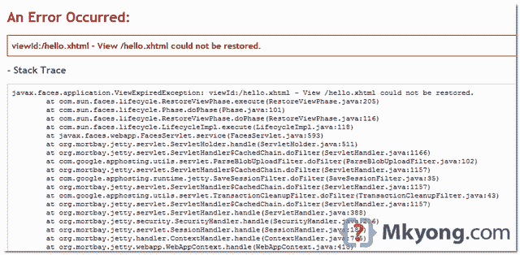

> 原文：<http://web.archive.org/web/20230101150211/http://www.mkyong.com/google-app-engine/gae-jsf-view-hello-xhtml-could-not-be-restored/>

# GAE + JSF:无法恢复 View /hello.xhtml

## 问题

部署在 GAE 生产环境中，当从一个页面/视图导航到另一个页面/视图时，GAE 显示错误消息“**视图 xxx 无法恢复**”？

1.  JSF 2.1.7
2.  谷歌应用引擎 SDK 1.6.3



在 GAE 当地发展没有问题。

 <ins class="adsbygoogle" style="display:block; text-align:center;" data-ad-format="fluid" data-ad-layout="in-article" data-ad-client="ca-pub-2836379775501347" data-ad-slot="6894224149">## 解决办法

默认情况下，JSF 2 使用服务器进行会话管理，GAE 不支持(在 1.6.3 中测试)。要解决这个问题，更新 **web.xml** 文件，定义“`javax.faces.STATE_SAVING_METHOD`，把值设为“**客户端**”。

*文件:web.xml*

```java
 <context-param>
		<param-name>javax.faces.STATE_SAVING_METHOD</param-name>
		<param-value>client</param-value>
	</context-param> 
```

 <ins class="adsbygoogle" style="display:block" data-ad-client="ca-pub-2836379775501347" data-ad-slot="8821506761" data-ad-format="auto" data-ad-region="mkyongregion">## 参考

1.  [用 JavaServer Faces 开发 Web 应用](http://web.archive.org/web/20190304031656/http://www.oracle.com/technetwork/articles/javase/javaserverfaces-135231.html)
2.  [使用 JSF 2 和谷歌应用引擎](http://web.archive.org/web/20190304031656/http://java.dzone.com/news/jsf2-configuration-google-app)

[gae](http://web.archive.org/web/20190304031656/http://www.mkyong.com/tag/gae/) [jsf2](http://web.archive.org/web/20190304031656/http://www.mkyong.com/tag/jsf2/)


