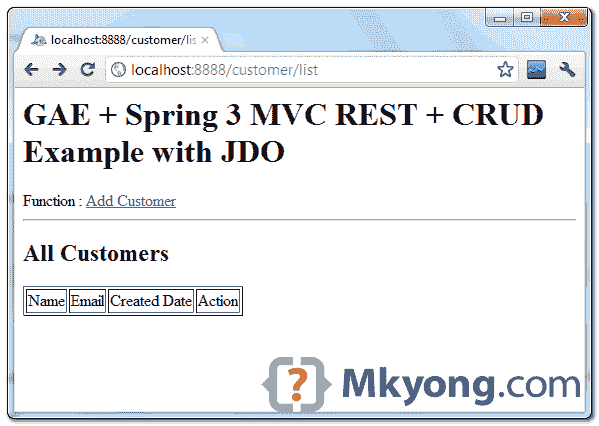
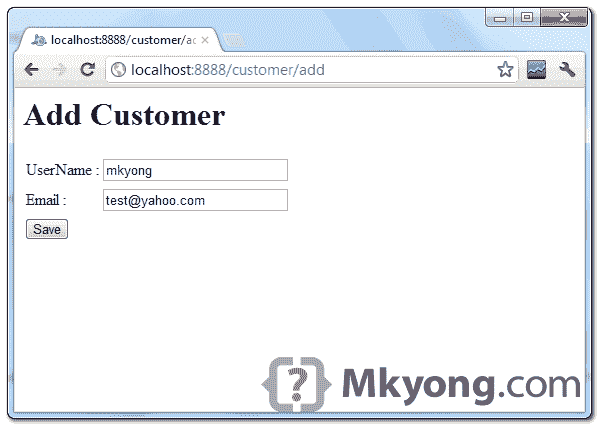
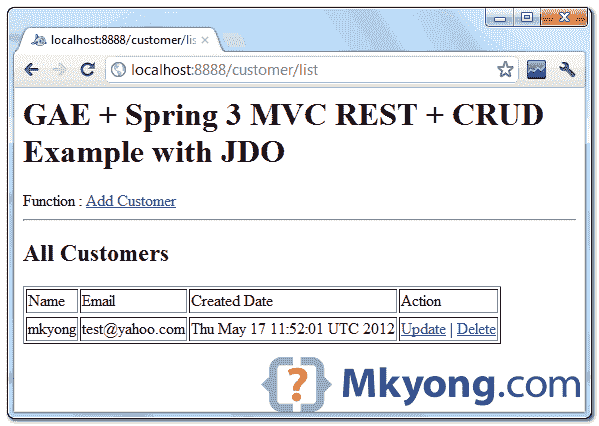
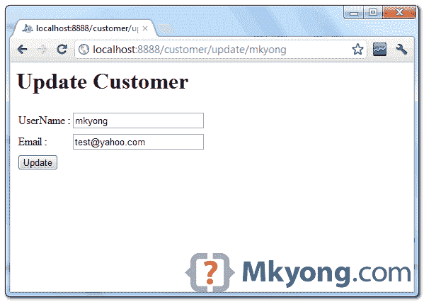
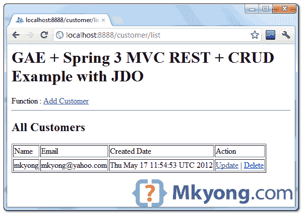

# 谷歌应用引擎+ JDO + Spring MVC，CRUD 例子

> 原文：<http://web.archive.org/web/20230101150211/http://www.mkyong.com/google-app-engine/google-app-engine-jdo-spring-mvc-crud-example/>

**Note**
This tutorial is more on practice guide, please refer to this [official Using JDO in datastore](http://web.archive.org/web/20190214234538/https://developers.google.com/appengine/docs/java/datastore/jdo/) for detail explanation.

参见下面的代码片段，使用 [Java 数据对象(JDO)](http://web.archive.org/web/20190214234538/http://www.oracle.com/technetwork/java/index-jsp-135919.html) 在 GAE 数据存储上执行 CRUD。只需用 **JDO 注释**对客户进行注释，并通过 **PersistenceManager** 执行 CRUD。

## 增加

```java
 Customer c = new Customer();
	c.setName(name);

	PersistenceManager pm = PMF.get().getPersistenceManager();
	try {
		pm.makePersistent(c);
	} finally {
		pm.close();
	} 
```

 <ins class="adsbygoogle" style="display:block; text-align:center;" data-ad-format="fluid" data-ad-layout="in-article" data-ad-client="ca-pub-2836379775501347" data-ad-slot="6894224149">## 搜索

搜索“客户”，其中 name = =“mkyong”。

```java
 PersistenceManager pm = PMF.get().getPersistenceManager();

	Query q = pm.newQuery(Customer.class);
	q.setFilter("name == nameParameter");
	q.setOrdering("date desc");
	q.declareParameters("String nameParameter");

	try {
		List<Customer> results = (List<Customer>) q.execute("mkyong");
		//...
	} finally {
		q.closeAll();
		pm.close();
	} 
```

搜索“客户”，其中 name = =“mkyong”，email = =“test @ Gmail . com”。

```java
 Query q = pm.newQuery(Customer.class);
	q.setOrdering("date desc");
	q.setFilter("name == nameParameter && email == emailParameter");
	q.declareParameters("String nameParameter, String emailParameter");

	try {
		List<Customer> results = (List<Customer>) q.execute("mkyong", "test@gmail.com");
		//...
	} finally {
		q.closeAll();
		pm.close();
	} 
```

客户记录返回列表。

```java
 PersistenceManager pm = PMF.get().getPersistenceManager();
	Query q = pm.newQuery(Customer.class);
	q.setOrdering("date desc");
	List<Customer> results = null;

	try {
		results = (List<Customer>) q.execute();
		if (!results.isEmpty()) {
			// good for listing
		}	
	} finally {
		q.closeAll();
		pm.close();
	} 
```

 <ins class="adsbygoogle" style="display:block" data-ad-client="ca-pub-2836379775501347" data-ad-slot="8821506761" data-ad-format="auto" data-ad-region="mkyongregion">## 更新

若要更新，请获取现有对象并修改它。

```java
 PersistenceManager pm = PMF.get().getPersistenceManager();
	try {
		Customer c = pm.getObjectById(Customer.class, key);
		c.setName(name);
		c.setEmail(email);
		c.setDate(new Date());
	} finally {
		pm.close();
	} 
```

## 删除

```java
 PersistenceManager pm = PMF.get().getPersistenceManager();
	try {
		Customer c = pm.getObjectById(Customer.class, key);
		pm.deletePersistent(c);
	} finally {
		pm.close();
	} 
```

## GAE + Spring MVC + CRUD 示例

好了，现在我们将向您展示一个使用 Spring MVC 以 REST 风格开发的简单 web 应用程序，它使用 JDO 在 datastore 中存储数据。

1.  谷歌应用引擎 Java SDK 1.6.3.1，JDO 2.3
2.  弹簧 3.1.1
3.  JDK 1.6
4.  Eclipse 3.7+Eclipse 的 Google 插件

*另外，使用 Google Plugin for Eclipse 创建一个 web 应用程序项目模板，它会自动为您创建和配置`jdoconfig.xml`。*

**Note**
This example is keep into as simple as possible, to show you how to use JDO to perform CRUD only, no layers like DAO or BO, no validation or message notification of the success or failed action.

## 1.顾客

用 JDO 注释来注释客户对象。

```java
 package com.mkyong.model;

import java.util.Date;
import javax.jdo.annotations.IdGeneratorStrategy;
import javax.jdo.annotations.PersistenceCapable;
import javax.jdo.annotations.Persistent;
import javax.jdo.annotations.PrimaryKey;
import com.google.appengine.api.datastore.Key;

@PersistenceCapable
public class Customer {

    @PrimaryKey
    @Persistent(valueStrategy = IdGeneratorStrategy.IDENTITY)
    private Key key;

    @Persistent
    private String name;

    @Persistent
    private String email;

    @Persistent
    private Date date;

    //getter and setter methods
} 
```

## 2.持久性管理器

创建一个 singleton PersistenceManager 类。

```java
 package com.mkyong;

import javax.jdo.JDOHelper;
import javax.jdo.PersistenceManagerFactory;

public final class PMF {
	private static final PersistenceManagerFactory pmfInstance = JDOHelper
		.getPersistenceManagerFactory("transactions-optional");

	private PMF() {
	}

	public static PersistenceManagerFactory get() {
		return pmfInstance;
	}
} 
```

## 3.弹簧控制器

弹簧控制器，REST 风格，执行 CRUD 操作。代码应该是不言自明的。

*文件:CustomerController.java*

```java
 package com.mkyong.controller;

import java.util.Date;
import java.util.List;

import javax.jdo.PersistenceManager;
import javax.jdo.Query;
import javax.servlet.http.HttpServletRequest;

import org.springframework.stereotype.Controller;
import org.springframework.ui.ModelMap;
import org.springframework.web.bind.annotation.PathVariable;
import org.springframework.web.bind.annotation.RequestMapping;
import org.springframework.web.bind.annotation.RequestMethod;
import org.springframework.web.servlet.ModelAndView;
import com.mkyong.PMF;
import com.mkyong.model.Customer;

@Controller
@RequestMapping("/customer")
public class CustomerController {

	@RequestMapping(value = "/add", method = RequestMethod.GET)
	public String getAddCustomerPage(ModelMap model) {

		return "add";

	}

	@RequestMapping(value = "/add", method = RequestMethod.POST)
	public ModelAndView add(HttpServletRequest request, ModelMap model) {

		String name = request.getParameter("name");
		String email = request.getParameter("email");

		Customer c = new Customer();
		c.setName(name);
		c.setEmail(email);
		c.setDate(new Date());

		PersistenceManager pm = PMF.get().getPersistenceManager();
		try {
			pm.makePersistent(c);
		} finally {
			pm.close();
		}

		return new ModelAndView("redirect:list");

	}

	@RequestMapping(value = "/update/{name}", method = RequestMethod.GET)
	public String getUpdateCustomerPage(@PathVariable String name,
		HttpServletRequest request, ModelMap model) {

		PersistenceManager pm = PMF.get().getPersistenceManager();

		Query q = pm.newQuery(Customer.class);
		q.setFilter("name == nameParameter");
		q.setOrdering("date desc");
		q.declareParameters("String nameParameter");

		try {
			List<Customer> results = (List<Customer>) q.execute(name);

			if (results.isEmpty()) {
				model.addAttribute("customer", null);
			} else {
				model.addAttribute("customer", results.get(0));
			}
		} finally {
			q.closeAll();
			pm.close();
		}

		return "update";

	}

	@RequestMapping(value = "/update", method = RequestMethod.POST)
	public ModelAndView update(HttpServletRequest request, ModelMap model) {

		String name = request.getParameter("name");
		String email = request.getParameter("email");
		String key = request.getParameter("key");

		PersistenceManager pm = PMF.get().getPersistenceManager();

		try {

			Customer c = pm.getObjectById(Customer.class, key);

			c.setName(name);
			c.setEmail(email);
			c.setDate(new Date());

		} finally {

			pm.close();
		}

		// return to list
		return new ModelAndView("redirect:list");

	}

	@RequestMapping(value = "/delete/{key}", method = RequestMethod.GET)
	public ModelAndView delete(@PathVariable String key,
			HttpServletRequest request, ModelMap model) {

		PersistenceManager pm = PMF.get().getPersistenceManager();

		try {

			Customer c = pm.getObjectById(Customer.class, key);
			pm.deletePersistent(c);

		} finally {
			pm.close();
		}

		// return to list
		return new ModelAndView("redirect:../list");

	}

	// get all customers
	@RequestMapping(value = "/list", method = RequestMethod.GET)
	public String listCustomer(ModelMap model) {

		PersistenceManager pm = PMF.get().getPersistenceManager();
		Query q = pm.newQuery(Customer.class);
		q.setOrdering("date desc");

		List<Customer> results = null;

		try {
			results = (List<Customer>) q.execute();

			if (results.isEmpty()) {
				model.addAttribute("customerList", null);
			} else {
				model.addAttribute("customerList", results);
			}

		} finally {
			q.closeAll();
			pm.close();
		}

		return "list";

	}

} 
```

## 4.JSP 页面

显示客户并执行添加、更新和删除的 JSP 页面。

*文件:list.jsp*

```java
 <%@ page import="java.util.List" %>
<%@ page import="com.mkyong.model.Customer" %>
<%@ page import="com.google.appengine.api.datastore.KeyFactory" %>
<html>
<body>
	<h1>GAE + Spring 3 MVC REST + CRUD Example with JDO</h1>

	Function : <a href="add">Add Customer</a>
	<hr />

	<h2>All Customers</h2>
	<table border="1">
		<thead>
			<tr>
				<td>Name</td>
				<td>Email</td>
				<td>Created Date</td>
				<td>Action</td>
			</tr>
		</thead>

		<%

		if(request.getAttribute("customerList")!=null){

			List<Customer> customers = 
                           (List<Customer>)request.getAttribute("customerList");

			if(!customers.isEmpty()){
				 for(Customer c : customers){

		%>
				<tr>
				  <td><%=c.getName() %></td>
				  <td><%=c.getEmail() %></td>
				  <td><%=c.getDate() %></td>
				  <td><a href="update/<%=c.getName()%>">Update</a> | 
                                      <a href="delete/<%=KeyFactory.keyToString(c.getKey()) %>">
                                       Delete</a>
                                  </td>
				</tr>
		<%	

				}

			}

		   }
		%>

        </tr>

	</table>

</body>
</html> 
```

*文件:add.jsp*

```java
 <html>
<body>
	<h1>Add Customer</h1>

	<form method="post" action="add">
		<table>
			<tr>
				<td>UserName :</td>
				<td><input type="text" style="width: 185px;" maxlength="30"
					name="name" id="name" /></span></td>
			</tr>
			<tr>
				<td>Email :</td>
				<td><input type="text" style="width: 185px;" maxlength="30"
					name="email" id="email" /></span></td>
			</tr>
		</table>
		<input type="submit" class="save" title="Save" value="Save" />
	</form>

</body>
</html> 
```

*文件:update.jsp*

```java
 <%@ page import="com.mkyong.model.Customer" %>
<%@ page import="com.google.appengine.api.datastore.KeyFactory" %>
<html>
<body>
	<h1>Update Customer</h1>

	<%
		Customer customer = new Customer();

		if(request.getAttribute("customer")!=null){

			customer = (Customer)request.getAttribute("customer");

		}

	%>

	<form method="post" action="../update" >
		<input type="hidden" name="key" id="key" 
			value="<%=KeyFactory.keyToString(customer.getKey()) %>" /> 

		<table>
			<tr>
				<td>
					UserName :
				</td>
				<td>
					<input type="text" style="width: 185px;" 
                                             maxlength="30" name="name" id="name" 
						value="<%=customer.getName() %>" />
				</td>
			</tr>
			<tr>
				<td>
					Email :
				</td>
				<td>
					<input type="text" style="width: 185px;" 
                                             maxlength="30" name="email" id="email" 
						value="<%=customer.getEmail() %>" />
				</td>
			</tr>
		</table>
		<input type="submit" class="update" title="Update" value="Update" />
	</form>

</body>
</html> 
```

## 5.演示

完成，看 demo 向你展示 web 应用的工作流程。

1.列表页面，显示现有客户列表。

*网址:http://localhost:8888/customer/list*



2.在列表页面中，点击“添加客户”链接，显示添加客户页面，填写新客户，姓名= " **mkyong** "，邮箱= "【test@yahoo.com】"，点击“添加”按钮。

*网址:http://localhost:8888/customer/add*



3.保存了客户，就会返回到列表页面。

*网址:http://localhost:8888/customer/list*



4.尝试更新链接，它将显示所选客户的数据，更新电子邮件至“**mkyong@yahoo.com**”，并点击更新按钮。

*网址:http://localhost:8888/customer/update/mkyong*



5.电子邮件被更新，并重定向回列表页面。

*网址:http://localhost:8888/customer/list*



6.要删除客户，只需点击“删除”链接。

## 下载源代码

由于文件很大，所有 Spring MVC 和 GAE jar 都被排除在外。

Download – [GAE-SpringMVC-JDO-example.zip](http://web.archive.org/web/20190214234538/http://www.mkyong.com/wp-content/uploads/2012/05/GAE-SpringMVC-JDO-example.zip) (22 KB)

## 参考

1.  [Java 数据对象(JDO)](http://web.archive.org/web/20190214234538/http://www.oracle.com/technetwork/java/index-jsp-135919.html)
2.  [GAE:利用 JDO](http://web.archive.org/web/20190214234538/https://developers.google.com/appengine/docs/java/datastore/jdo/)
3.  [GAE:数据存储低层 api](http://web.archive.org/web/20190214234538/https://developers.google.com/appengine/docs/java/javadoc/com/google/appengine/api/datastore/package-summary)
4.  [GAE:JDO 和 Spring MVC 的 CRUD 操作](http://web.archive.org/web/20190214234538/http://digitalsanctum.com/2009/07/02/google-app-engine-for-java-crud-with-jdo-spring-mvc/)

[crud](http://web.archive.org/web/20190214234538/http://www.mkyong.com/tag/crud/) [gae](http://web.archive.org/web/20190214234538/http://www.mkyong.com/tag/gae/) [jdo](http://web.archive.org/web/20190214234538/http://www.mkyong.com/tag/jdo/) [spring mvc](http://web.archive.org/web/20190214234538/http://www.mkyong.com/tag/spring-mvc/)


