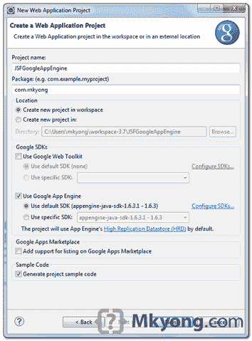
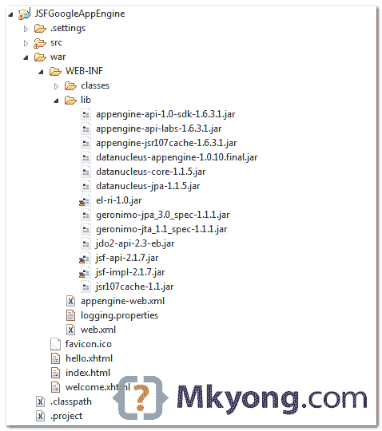
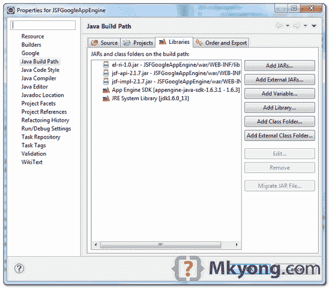
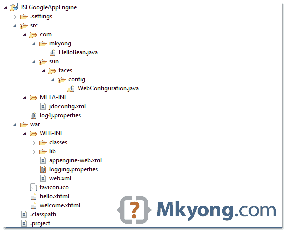
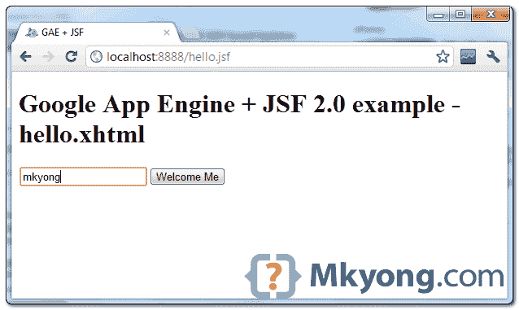
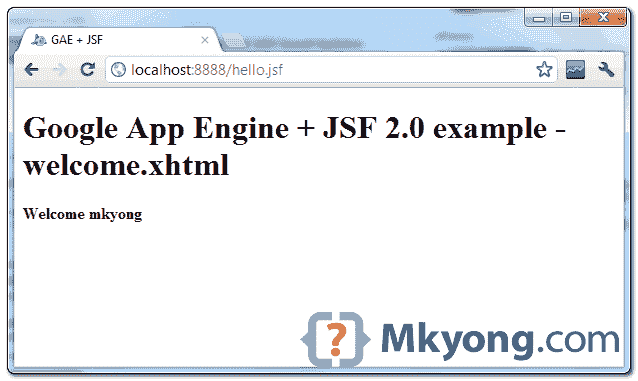
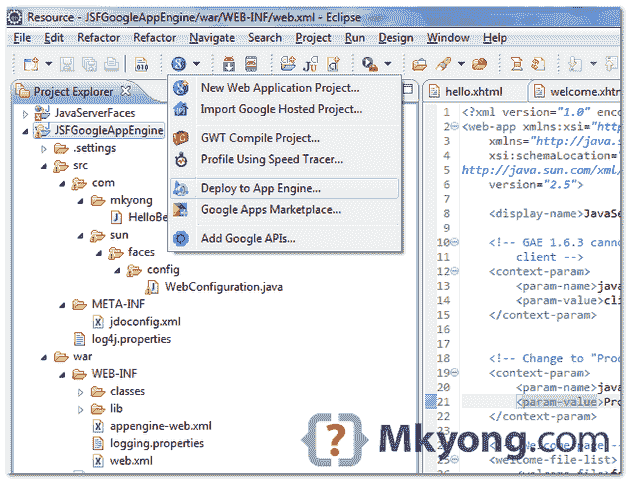
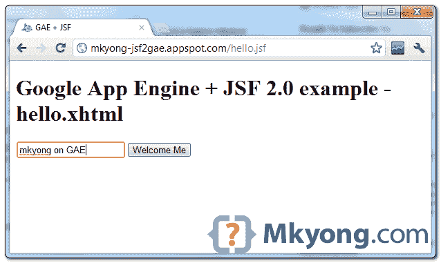

# 谷歌应用引擎+ JSF 2 的例子

> 原文：<http://web.archive.org/web/20230101150211/http://www.mkyong.com/google-app-engine/google-app-engine-jsf-2-example/>

在本教程中，我们将向您展示如何在谷歌应用引擎(GAE)环境中开发和部署 JSF 2.0 web 应用程序。

使用的工具和技术:

1.  JDK 1.6
2.  Eclipse 3.7+Eclipse 的 Google 插件
3.  谷歌应用引擎 Java SDK 1.6.3.1
4.  JSF 2.1.7

**Note**
This example is going to reuse this [JSF 2.0 hello world example](http://web.archive.org/web/20201112020642/http://www.mkyong.com/jsf2/jsf-2-0-hello-world-example/), modify it and merge it with this [GAE + Java example](http://web.archive.org/web/20201112020642/http://www.mkyong.com/google-app-engine/google-app-engine-hello-world-example-using-eclipse/).

## 1.新建 Web 应用程序项目

在 Eclipse 中，创建一个新的 Web 应用项目，命名为“ **JSFGoogleAppEngine** ”。

<noscript></noscript>


“谷歌 Eclipse 插件”将生成一个 GAE 项目结构的样本。

## 2.JSF 新协议的附属协议

要在 GAE 使用 JSF 2，你需要以下罐子

1.  jsf-api-2.1.7.jar
2.  jsf-impl-2.1.7.jar
3.  埃尔里-1.0.jar

复制后放入“ **war/WEB-INF/lib** ”文件夹。

<noscript></noscript>


右击项目文件夹，选择“**属性**”。选择“ **Java 构建路径**->-**库**”选项卡，点击“**添加 Jars** 按钮，选择上面的 Jars。

<noscript></noscript>

**Note**
You need to put this `el-ri-1.0.jar`, otherwise, you will hit error message – [Unable to instantiate ExpressionFactory ‘com.sun.el.ExpressionFactoryImpl’](http://web.archive.org/web/20201112020642/http://www.mkyong.com/google-app-engine/gae-jsf-unable-to-instantiate-expressionfactory-com-sun-el-expressionfactoryimpl/).

## 3.JSF 管理比恩

3.1 删除插件生成的`JSFGoogleAppEngineServlet.java`，不需要这个。

3.2 创建一个受管理的 bean。

*文件:src/com/mkyong/hello bean . Java*

```java
 package com.mkyong;

import javax.faces.bean.ManagedBean;
import javax.faces.bean.SessionScoped;

import java.io.Serializable;

@ManagedBean
@SessionScoped
public class HelloBean implements Serializable {

	private static final long serialVersionUID = 1L;

	private String name;

	public String getName() {
		return name;
	}

	public void setName(String name) {
		this.name = name;
	}

} 
```

3.3 创建一个新的 WebConfiguration.java。

JSF 2 号正在使用“`javax.naming.InitialContext`”这在 GAE 是不支持的。

要解决这个问题，你需要得到一份 JSF 的源代码，克隆出`WebConfiguration.java`，注释正在使用`javax.naming.InitialContext`类的方法，把它放在**src/com/sun/faces/com fig/web configuration . Java**。现在，您新创建的`WebConfiguration.java`类将重载原来的`WebConfiguration.java`。

**Note**
Get the full [source code of the WebConfiguration.java](http://web.archive.org/web/20201112020642/http://www.mkyong.com/google-app-engine/gae-jsf-javax-naming-initialcontext-is-a-restricted-class/).

我不认为 GAE 团队会白名单这个罐子，只是希望 JSF 的团队可以在未来的版本中修复这个问题。

## 4.JSF 页面

4.1 创建`hello.xhtml`页面，接受用户输入并将其传递给 helloBean。

*文件:war/hello.xhtml*

```java
 <?xml version="1.0" encoding="UTF-8"?>
<!DOCTYPE html PUBLIC "-//W3C//DTD XHTML 1.0 Transitional//EN" 
"http://www.w3.org/TR/xhtml1/DTD/xhtml1-transitional.dtd">
<html 
	xmlns:f="http://java.sun.com/jsf/core"
	xmlns:h="http://java.sun.com/jsf/html">

<h:head>
	<title>GAE + JSF</title>
</h:head>
<h:body>
	<h1>Google App Engine + JSF 2.0 example - hello.xhtml</h1>
	<h:form>
		<h:inputText value="#{helloBean.name}"></h:inputText>
		<h:commandButton value="Welcome Me" action="welcome"></h:commandButton>
	</h:form>
</h:body>
</html> 
```

4.2 创建`welcome.xhtml`页面，显示来自 hellobean 的用户输入。

*文件:war/welcome.xhtml*

```java
 <?xml version="1.0" encoding="UTF-8"?>
<!DOCTYPE html PUBLIC "-//W3C//DTD XHTML 1.0 Transitional//EN" 
"http://www.w3.org/TR/xhtml1/DTD/xhtml1-transitional.dtd">
<html 
	xmlns:f="http://java.sun.com/jsf/core"
	xmlns:h="http://java.sun.com/jsf/html">

<h:head>
	<title>GAE + JSF</title>
</h:head>
<h:body bgcolor="white">
	<h1>Google App Engine + JSF 2.0 example - welcome.xhtml</h1>
	<h2>Welcome #{helloBean.name}</h2>
</h:body>
</html> 
```

4.3 删除插件生成的`index.html`文件，你不需要这个。

## 5.web.xml

更新 web.xml，集成 JSF 2。

*文件:web.xml*

```java
 <?xml version="1.0" encoding="utf-8"?>
<web-app xmlns:xsi="http://www.w3.org/2001/XMLSchema-instance"

	xmlns:web="http://java.sun.com/xml/ns/javaee/web-app_2_5.xsd"
	xsi:schemaLocation="http://java.sun.com/xml/ns/javaee
	http://java.sun.com/xml/ns/javaee/web-app_2_5.xsd"
	version="2.5">

	<display-name>JavaServerFaces</display-name>

	<!-- GAE 1.6.3 cannot handle server side (JSF default) state management. -->
	<context-param>
		<param-name>javax.faces.STATE_SAVING_METHOD</param-name>
		<param-value>client</param-value>
	</context-param>

	<!-- Change to "Production" when you are ready to deploy -->
	<context-param>
		<param-name>javax.faces.PROJECT_STAGE</param-name>
		<param-value>Development</param-value>
	</context-param>

	<!-- Welcome page -->
	<welcome-file-list>
		<welcome-file>faces/hello.xhtml</welcome-file>
	</welcome-file-list>

	<!-- JSF mapping -->
	<servlet>
		<servlet-name>Faces Servlet</servlet-name>
		<servlet-class>javax.faces.webapp.FacesServlet</servlet-class>
		<load-on-startup>1</load-on-startup>
	</servlet>

	<!-- Map these files with JSF -->
	<servlet-mapping>
		<servlet-name>Faces Servlet</servlet-name>
		<url-pattern>/faces/*</url-pattern>
	</servlet-mapping>
	<servlet-mapping>
		<servlet-name>Faces Servlet</servlet-name>
		<url-pattern>*.jsf</url-pattern>
	</servlet-mapping>
	<servlet-mapping>
		<servlet-name>Faces Servlet</servlet-name>
		<url-pattern>*.faces</url-pattern>
	</servlet-mapping>
	<servlet-mapping>
		<servlet-name>Faces Servlet</servlet-name>
		<url-pattern>*.xhtml</url-pattern>
	</servlet-mapping>

</web-app> 
```

**Note**
GAE do not support server side state management, so, you need to define “`javax.faces.STATE_SAVING_METHOD`” to “`client`“, to avoid of this “[View /hello.xhtml could not be restored](http://web.archive.org/web/20201112020642/http://www.mkyong.com/google-app-engine/gae-jsf-view-hello-xhtml-could-not-be-restored/)” error message in GAE production environment.

## 6.在 GAE 启用会话

更新`appengine-web.xml`，启用会话支持，JSF 需要这个。
 *文件:appengine-web.xml*

```java
 <?xml version="1.0" encoding="utf-8"?>
<appengine-web-app >
  <application></application>
  <version>1</version>

	<sessions-enabled>true</sessions-enabled>

</appengine-web-app> 
```

## 7.目录结构

审查最终目录结构。

<noscript></noscript>


## 8.在本地运行

右键单击项目，作为“Web 应用程序”运行。

*网址:http://localhost:8888/hello . JSF*

<noscript></noscript>


点击按钮。

<noscript></noscript>


## 10.部署在 GAE

更新`appengine-web.xml`文件，添加您的 App Engine 应用 ID。

*文件:appengine-web.xml*

```java
 <?xml version="1.0" encoding="utf-8"?>
<appengine-web-app >
  <application>mkyong-jsf2gae</application>
  <version>1</version>

	<sessions-enabled>true</sessions-enabled>

</appengine-web-app> 
```

选择项目，点击谷歌图标，“**部署到应用引擎**”。

<noscript></noscript>


*网址:http://mkyong-jsf2gae.appspot.com/hello.jsf*

<noscript></noscript>


## 下载源代码

由于文件很大，所有 JSF 和 GAE 的罐子都被排除在外。

Download – [JSF2-GoogleAppEngine-Example.zip](http://web.archive.org/web/20201112020642/http://www.mkyong.com/wp-content/uploads/2012/04/JSF2-GoogleAppEngine-Example.zip) (42 KB)

## 参考

1.  [JSF 和 GAE 兼容问题](http://web.archive.org/web/20201112020642/https://sites.google.com/a/wildstartech.com/adventures-in-java/Java-Platform-Enterprise-Edition/JavaServer-Faces/javaserver-faces-20/configuring-javaserver-faces-20-to-run-on-the-google-appengine/javaserverfaces-20-and-google-app-engine-compatibility-issues)
2.  [谷歌应用上的 JSF 2 配置](http://web.archive.org/web/20201112020642/http://java.dzone.com/news/jsf2-configuration-google-app)
3.  [带 JSF 2 + CDI 的谷歌应用引擎](http://web.archive.org/web/20201112020642/http://javamomentum.be/2011/04/google-app-engine-with-jsf2-cdi/)
4.  [开始使用谷歌应用和 JSF](http://web.archive.org/web/20201112020642/http://whileitcompiles.com/programming/java/getting-started-with-google-app-engine-and-jsf/)
5.  [JSF 2.0 hello world 示例](http://web.archive.org/web/20201112020642/http://www.mkyong.com/jsf2/jsf-2-0-hello-world-example/)
6.  [Oracle : JavaServer Faces 开发教程](http://web.archive.org/web/20201112020642/http://www.oracle.com/technetwork/articles/javase/javaserverfaces-135231.html)

Tags : [gae](http://web.archive.org/web/20201112020642/https://mkyong.com/tag/gae/) [jsf2](http://web.archive.org/web/20201112020642/https://mkyong.com/tag/jsf2/)<input type="hidden" id="mkyong-current-postId" value="10925">

### 相关文章

*   [GAE + JSF:无法实例化表达式因子](/web/20201112020642/https://mkyong.com/google-app-engine/gae-jsf-unable-to-instantiate-expressionfactory-com-sun-el-expressionfactoryimpl/)
*   [GAE + JSF : View /hello.xhtml 无法还原](/web/20201112020642/https://mkyong.com/google-app-engine/gae-jsf-view-hello-xhtml-could-not-be-restored/)
*   [GAE+JSF:javax . naming . initial context 是一个 restr](/web/20201112020642/https://mkyong.com/google-app-engine/gae-jsf-javax-naming-initialcontext-is-a-restricted-class/)
*   [JSF 2.0 教程](/web/20201112020642/https://mkyong.com/tutorials/jsf-2-0-tutorials/)
*   [谷歌应用引擎教程](/web/20201112020642/https://mkyong.com/tutorials/google-app-engine-tutorial/)

*   [JSF 2 预渲染事件示例](/web/20201112020642/https://mkyong.com/jsf2/jsf-2-prerenderviewevent-example/)
*   [JSF 2.0 中的多组件验证器](/web/20201112020642/https://mkyong.com/jsf2/multi-components-validator-in-jsf-2-0/)
*   [JSF 2 多选列表框示例](/web/20201112020642/https://mkyong.com/jsf2/jsf-2-multiple-select-listbox-example/)
*   [JSF 2 链接、命令链接和输出链接示例](/web/20201112020642/https://mkyong.com/jsf2/jsf-2-link-commandlink-and-outputlink-example/)
*   [JSF 2 列表框示例](/web/20201112020642/https://mkyong.com/jsf2/jsf-2-listbox-example/)