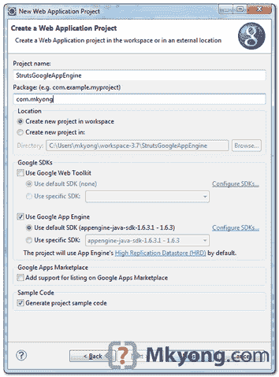
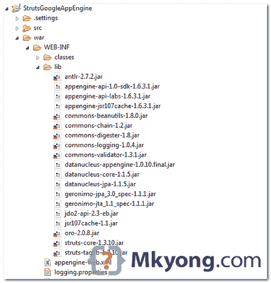
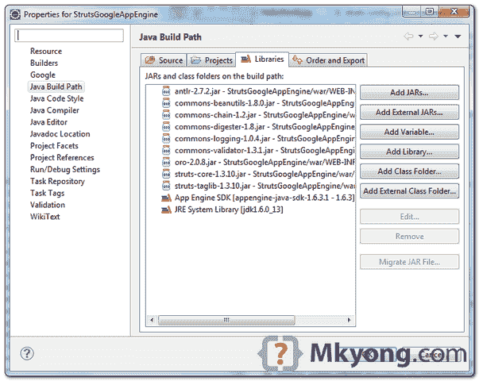
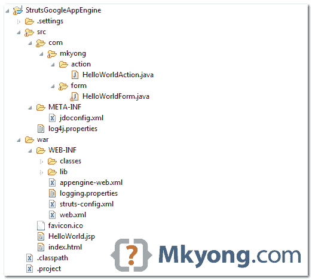
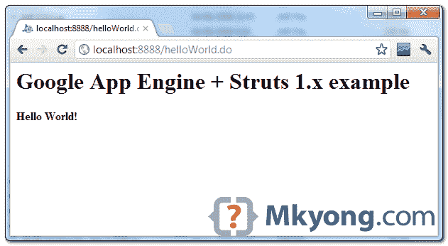
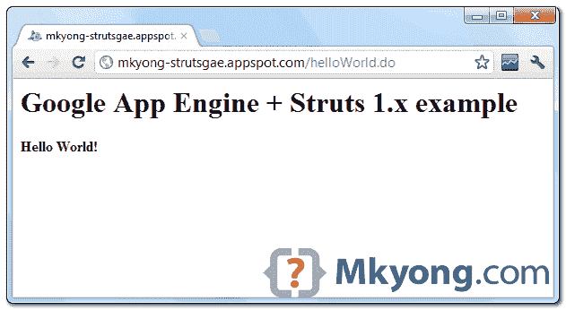

# Google 应用引擎+ Struts 1 示例

> 原文：<http://web.archive.org/web/20230101150211/http://www.mkyong.com/google-app-engine/google-app-engine-struts-1-example/>

经典 Struts 1 框架万岁，在本教程中，我们将向您展示如何在 **Google App Engine** (GAE)环境下开发一个 **Struts 1.x** web 应用。

使用的工具和技术:

1.  JDK 1.6
2.  Eclipse 3.7+Eclipse 的 Google 插件
3.  谷歌应用引擎 Java SDK 1.6.3.1
4.  Struts 1.3.10

**Note**
You may also interest at this [Google App Engine + Struts 2 example](http://web.archive.org/web/20190304032322/http://www.mkyong.com/google-app-engine/google-app-engine-struts-2-example/).

这个例子将把 [Struts 1.x hello world 例子](http://web.archive.org/web/20190304032322/http://www.mkyong.com/struts/struts-hello-world-example/)与这个 [GAE + Java 例子](http://web.archive.org/web/20190304032322/http://www.mkyong.com/google-app-engine/google-app-engine-hello-world-example-using-eclipse/)合并。

## 1.新建 Web 应用程序项目

在 Eclipse 中，创建一个新的 Web 应用程序项目，命名为“StrutsGoogleAppEngine”。



Google Plugin for Eclipse 将生成一个样本 GAE 项目结构。稍后将把 Struts 1 集成到这个 GAE 结构中。

 ## 2.集成 Struts 1.x 库

访问此链接[下载 Struts 1.x](http://web.archive.org/web/20190304032322/http://struts.apache.org/download.cgi#struts1310) 。需要以下罐子:

*   antlr-2.7.2.jar
*   commons-beanutils-1.8.0.jar
*   公共链 1.2.jar
*   1.8.jar
*   commons-logging-1.0.4.jar
*   公共验证器 1.3.1.jar
*   奥罗-2.0.8.jar
*   struts-core-1.3.10.jar
*   struts-taglib-1.3.10.jar

复制后放入“ **war/WEB-INF/lib** ”文件夹。



右击项目文件夹，选择**属性**。选择" **Java 构建路径** " - > " **库**"选项卡，点击"**添加 Jars** "按钮，从" **war/WEB-INF/lib** "文件夹中选择上面 9 个 Jars 进入构建路径。

 ## 3.集成 Struts 1.x 动作和表单

3.1 删除`StrutsGoogleAppEngineServlet.java`，你不需要这个。

3.2 创建新的操作类。

*文件:src/com/mkyong/action/hello world action . Java*

```java
 package com.mkyong.action;

import javax.servlet.http.HttpServletRequest;
import javax.servlet.http.HttpServletResponse;

import org.apache.struts.action.Action;
import org.apache.struts.action.ActionForm;
import org.apache.struts.action.ActionForward;
import org.apache.struts.action.ActionMapping;

import com.mkyong.form.HelloWorldForm;

public class HelloWorldAction extends Action {

	public ActionForward execute(ActionMapping mapping, ActionForm form,
		HttpServletRequest request, HttpServletResponse response)
		throws Exception {

		HelloWorldForm helloWorldForm = (HelloWorldForm) form;
		helloWorldForm.setMessage("Hello World!");

		return mapping.findForward("success");
	}

} 
```

3.3 创建一个新的表单类。

*文件:src/com/mkyong/form/hello world form . Java*

```java
 package com.mkyong.form;

import org.apache.struts.action.ActionForm;

public class HelloWorldForm extends ActionForm {

	String message;

	public String getMessage() {
		return message;
	}

	public void setMessage(String message) {
		this.message = message;
	}

} 
```

## 4.集成 Struts 1.x JSP 页面

4.1 创建`HelloWorld.jsp`页面，放入“**war/User/pages/hello world . JSP**”。

*文件:HelloWorld.jsp*

```java
 <%@taglib uri="http://struts.apache.org/tags-bean" prefix="bean"%>

<html>
<head>
</head>
<body>
	<h1>
	   Google App Engine + Struts 1.x example
	</h1>
	<h2><bean:write name="helloWorldForm" property="message" /></h2>
</body>
</html> 
```

## 5.Struts XML 配置

创建一个`struts-config.xml`文件，放在“**war/we b-INF/struts-config . XML**”中。

*文件:struts-config.xml*

```java
 <?xml version="1.0" encoding="UTF-8"?>
<!DOCTYPE struts-config PUBLIC 
"-//Apache Software Foundation//DTD Struts Configuration 1.3//EN" 
"http://jakarta.apache.org/struts/dtds/struts-config_1_3.dtd">

<struts-config>

	<form-beans>
	   <form-bean name="helloWorldForm" type="com.mkyong.form.HelloWorldForm" />
	</form-beans>

	<action-mappings>
	   <action path="/helloWorld" type="com.mkyong.action.HelloWorldAction"
		name="helloWorldForm">
		<forward name="success" path="/HelloWorld.jsp" />

	   </action>
	</action-mappings>

</struts-config> 
```

## 6.web.xml

更新`web.xml`，整合 Struts。

*文件:web.xml*

```java
 <?xml version="1.0" encoding="utf-8"?>
<web-app xmlns:xsi="http://www.w3.org/2001/XMLSchema-instance"

        xmlns:web="http://java.sun.com/xml/ns/javaee/web-app_2_5.xsd"
	xsi:schemaLocation="http://java.sun.com/xml/ns/javaee
        http://java.sun.com/xml/ns/javaee/web-app_2_5.xsd"
	version="2.5">

	<servlet>
		<servlet-name>action</servlet-name>
		<servlet-class>org.apache.struts.action.ActionServlet</servlet-class>
		<init-param>
		    <param-name>config</param-name>
		    <param-value>
         		/WEB-INF/struts-config.xml
        	    </param-value>
		</init-param>
		<load-on-startup>1</load-on-startup>
	</servlet>

	<servlet-mapping>
		<servlet-name>action</servlet-name>
		<url-pattern>*.do</url-pattern>
	</servlet-mapping>

	<welcome-file-list>
		<welcome-file>index.html</welcome-file>
	</welcome-file-list>
</web-app> 
```

## 7.在 GAE 启用会话

更新`appengine-web.xml`，启用会话支持，Struts 需要这个。

*文件:appengine-web.xml*

```java
 <?xml version="1.0" encoding="utf-8"?>
<appengine-web-app >
  <application></application>
  <version>1</version>

	<sessions-enabled>true</sessions-enabled>

</appengine-web-app> 
```

**Note**
If you don’t enable session in GAE, you will hit error “*java.lang.RuntimeException: Session support is not enabled in appengine-web.xml*“.

## 8.目录结构

查看最终的目录结构。



## 9.在本地运行

右键点击项目，运行为“ **Web 应用**”。

*网址:http://localhost:8888/hello world . do*



## 10.部署在 GAE

更新`appengine-web.xml`文件，添加您的 App Engine 应用 ID。

*文件:appengine-web.xml*

```java
 <?xml version="1.0" encoding="utf-8"?>
<appengine-web-app >
  <application>mkyong-strutsgae</application>
  <version>1</version>

  <sessions-enabled>true</sessions-enabled>

</appengine-web-app> 
```

选择项目，点击谷歌图标，“**部署到应用引擎**”。

*网址:http://mkyong-strutsgae.appspot.com/helloWorld.do*

**Note**
Not much problem, just follow GAE directory structure, at least integrate Struts 1 is more easily than Struts 2.

## 下载源代码

由于文件较大，所有 Struts1 jars 都被排除在外，需要手动下载。

Download – [StrutsGoogleAppEngine](http://web.archive.org/web/20190304032322/http://www.mkyong.com/wp-content/uploads/2012/04/StrutsGoogleAppEngine.zip) (13 KB)

## 参考

1.  [Struts hello world 示例](http://web.archive.org/web/20190304032322/http://www.mkyong.com/struts/struts-hello-world-example/)
2.  [Google App Engine+Java hello world 示例，使用 Eclipse](http://web.archive.org/web/20190304032322/http://www.mkyong.com/google-app-engine/google-app-engine-hello-world-example-using-eclipse/)
3.  [下载 Struts 1.x](http://web.archive.org/web/20190304032322/http://struts.apache.org/download.cgi#struts1310)

[gae](http://web.archive.org/web/20190304032322/http://www.mkyong.com/tag/gae/) [struts](http://web.archive.org/web/20190304032322/http://www.mkyong.com/tag/struts/)


