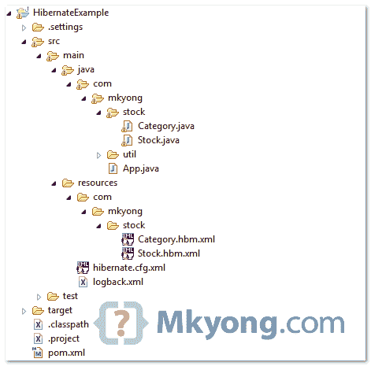
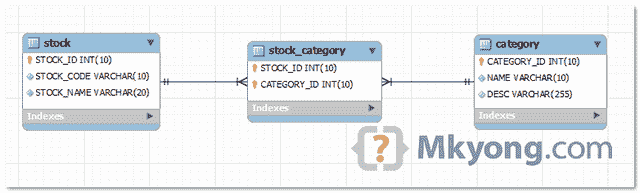

# hibernate–多对多示例(XML 映射)

> 原文：<http://web.archive.org/web/20230101150211/http://www.mkyong.com/hibernate/hibernate-many-to-many-relationship-example/>

> 当一个实体中的每个记录在另一个实体中可能有许多链接的记录时，就会出现多对多关系，反之亦然。

在本教程中，我们将向您展示如何通过 XML 映射文件(hbm)在 Hibernate 中处理多对多表关系。

**Note**
For many to many with extra columns in join table, please refer to this [tutorial](http://web.archive.org/web/20210507052017/http://www.mkyong.com/hibernate/hibernate-many-to-many-example-join-table-extra-column-annotation/).

本教程中使用的工具和技术:

1.  Hibernate 3.6.3 .最终版
2.  MySQL 5.1.15
3.  Maven 3.0.3
4.  Eclipse 3.6

## 项目结构

本教程的项目结构。



## 项目依赖性

从 JBoss 存储库中获取最新的 **hibernate.jar** 。

*文件:pom.xml*

```java
 <project ...>

	<repositories>
		<repository>
			<id>JBoss repository</id>
			<url>http://repository.jboss.org/nexus/content/groups/public/</url>
		</repository>
	</repositories>

	<dependencies>

		<!-- MySQL database driver -->
		<dependency>
			<groupId>mysql</groupId>
			<artifactId>mysql-connector-java</artifactId>
			<version>5.1.15</version>
		</dependency>

		<dependency>
			<groupId>org.hibernate</groupId>
			<artifactId>hibernate-core</artifactId>
			<version>3.6.3.Final</version>
		</dependency>

		<dependency>
			<groupId>javassist</groupId>
			<artifactId>javassist</artifactId>
			<version>3.12.1.GA</version>
		</dependency>

	</dependencies>
</project> 
```

## 1.“多对多”示例

这是一个多对多的关系表设计，一个股票表有多个类别，而类别可以属于多个股票，这种关系与第三个名为 STOCK_CATEGORY 的表相链接。

表 STOCK_CATEGORY 只包含两个主键，以及引用 STOCK 和 CATEGORY 外键。



*MySQL 表格脚本*

```java
 CREATE TABLE `stock` (
  `STOCK_ID` int(10) unsigned NOT NULL AUTO_INCREMENT,
  `STOCK_CODE` varchar(10) NOT NULL,
  `STOCK_NAME` varchar(20) NOT NULL,
  PRIMARY KEY (`STOCK_ID`) USING BTREE,
  UNIQUE KEY `UNI_STOCK_NAME` (`STOCK_NAME`),
  UNIQUE KEY `UNI_STOCK_ID` (`STOCK_CODE`) USING BTREE
)

CREATE TABLE `category` (
  `CATEGORY_ID` int(10) unsigned NOT NULL AUTO_INCREMENT,
  `NAME` varchar(10) NOT NULL,
  `DESC` varchar(255) NOT NULL,
  PRIMARY KEY (`CATEGORY_ID`) USING BTREE
)

CREATE TABLE  `stock_category` (
  `STOCK_ID` int(10) unsigned NOT NULL,
  `CATEGORY_ID` int(10) unsigned NOT NULL,
  PRIMARY KEY (`STOCK_ID`,`CATEGORY_ID`),
  CONSTRAINT `FK_CATEGORY_ID` FOREIGN KEY (`CATEGORY_ID`) REFERENCES `category` (`CATEGORY_ID`),
  CONSTRAINT `FK_STOCK_ID` FOREIGN KEY (`STOCK_ID`) REFERENCES `stock` (`STOCK_ID`)
) 
```

## 2.Hibernate 模型类

创建两个模型类—`Stock.java`和`Category.java`，来表示上面的表。不需要为表' **stock_category** 创建额外的类。

*文件:Stock.java*

```java
 package com.mkyong.stock;

import java.util.HashSet;
import java.util.Set;

public class Stock implements java.io.Serializable {

	private Integer stockId;
	private String stockCode;
	private String stockName;
	private Set<Category> categories = new HashSet<Category>(0);

	//getter, setter and constructor
} 
```

*文件:Category.java*

```java
 package com.mkyong.stock;

import java.util.HashSet;
import java.util.Set;

public class Category implements java.io.Serializable {

	private Integer categoryId;
	private String name;
	private String desc;
	private Set<Stock> stocks = new HashSet<Stock>(0);

	//getter, setter and constructor
} 
```

## 3.Hibernate XML 映射

现在，创建两个 Hibernate 映射文件(hbm)—`Stock.hbm.xml`和`Category.hbm.xml`。您会注意到第三个'**股票 _ 类别**'表是通过“**多对多**标记引用的。

*文件:Stock.hbm.xml*

```java
 <?xml version="1.0"?>
<!DOCTYPE hibernate-mapping PUBLIC "-//Hibernate/Hibernate Mapping DTD 3.0//EN"
"http://hibernate.sourceforge.net/hibernate-mapping-3.0.dtd">
<hibernate-mapping>
    <class name="com.mkyong.stock.Stock" table="stock" catalog="mkyongdb">
        <id name="stockId" type="java.lang.Integer">
            <column name="STOCK_ID" />
            <generator class="identity" />
        </id>
        <property name="stockCode" type="string">
            <column name="STOCK_CODE" length="10" not-null="true" unique="true" />
        </property>
        <property name="stockName" type="string">
            <column name="STOCK_NAME" length="20" not-null="true" unique="true" />
        </property>
        <set name="categories" table="stock_category" 
        	inverse="false" lazy="true" fetch="select" cascade="all" >
            <key>
                <column name="STOCK_ID" not-null="true" />
            </key>
            <many-to-many entity-name="com.mkyong.stock.Category">
                <column name="CATEGORY_ID" not-null="true" />
            </many-to-many>
        </set>
    </class>
</hibernate-mapping> 
```

*文件:Category.hbm.xml*

```java
 <?xml version="1.0"?>
<!DOCTYPE hibernate-mapping PUBLIC "-//Hibernate/Hibernate Mapping DTD 3.0//EN"
"http://hibernate.sourceforge.net/hibernate-mapping-3.0.dtd">
<hibernate-mapping>
    <class name="com.mkyong.stock.Category" table="category" catalog="mkyongdb">
        <id name="categoryId" type="java.lang.Integer">
            <column name="CATEGORY_ID" />
            <generator class="identity" />
        </id>
        <property name="name" type="string">
            <column name="NAME" length="10" not-null="true" />
        </property>
        <property name="desc" type="string">
            <column name="[DESC]" not-null="true" />
        </property>
        <set name="stocks" table="stock_category" inverse="true" lazy="true" fetch="select">
            <key>
                <column name="CATEGORY_ID" not-null="true" />
            </key>
            <many-to-many entity-name="com.mkyong.stock.Stock">
                <column name="STOCK_ID" not-null="true" />
            </many-to-many>
        </set>
    </class>
</hibernate-mapping> 
```

## 4.休眠配置文件

现在，将`Stock.hbm.xml`和`Category.hbm.xml`以及 MySQL 细节放在`hibernate.cfg.xml`中。

*文件:hibernate.cfg.xml*

```java
 <?xml version="1.0" encoding="utf-8"?>
<!DOCTYPE hibernate-configuration PUBLIC
"-//Hibernate/Hibernate Configuration DTD 3.0//EN"
"http://www.hibernate.org/dtd/hibernate-configuration-3.0.dtd">

<hibernate-configuration>
<session-factory>
    <property name="hibernate.connection.driver_class">com.mysql.jdbc.Driver</property>
    <property name="hibernate.connection.url">jdbc:mysql://localhost:3306/mkyongdb</property>
    <property name="hibernate.connection.username">root</property>
    <property name="hibernate.connection.password">password</property>
    <property name="hibernate.dialect">org.hibernate.dialect.MySQLDialect</property>
    <property name="show_sql">true</property>
    <property name="format_sql">true</property>
    <mapping resource="com/mkyong/stock/Stock.hbm.xml" />
    <mapping resource="com/mkyong/stock/Category.hbm.xml" />
</session-factory>
</hibernate-configuration> 
```

## 5.运行它

运行它，Hibernate 将在股票表中插入一条记录，在类别表中插入两条记录，在股票类别表中也插入两条记录。

*文件:App.java*

```java
 package com.mkyong;

import java.util.HashSet;
import java.util.Set;
import org.hibernate.Session;
import com.mkyong.stock.Category;
import com.mkyong.stock.Stock;
import com.mkyong.util.HibernateUtil;

public class App {
	public static void main(String[] args) {

        System.out.println("Hibernate many to many (XML Mapping)");
	Session session = HibernateUtil.getSessionFactory().openSession();

	session.beginTransaction();

	Stock stock = new Stock();
        stock.setStockCode("7052");
        stock.setStockName("PADINI");

        Category category1 = new Category("CONSUMER", "CONSUMER COMPANY");
        Category category2 = new Category("INVESTMENT", "INVESTMENT COMPANY");

        Set<Category> categories = new HashSet<Category>();
        categories.add(category1);
        categories.add(category2);

        stock.setCategories(categories);

        session.save(stock);

	session.getTransaction().commit();
	System.out.println("Done");
	}
} 
```

*输出…结果应该是不言自明的*

```java
 Hibernate many to many (XML Mapping)
Hibernate: 
    insert 
    into
        mkyongdb.stock
        (STOCK_CODE, STOCK_NAME) 
    values
        (?, ?)
Hibernate: 
    insert 
    into
        mkyongdb.category
        (NAME, `DESC`) 
    values
        (?, ?)
Hibernate: 
    insert 
    into
        mkyongdb.category
        (NAME, `DESC`) 
    values
        (?, ?)
Hibernate: 
    insert 
    into
        stock_category
        (STOCK_ID, CATEGORY_ID) 
    values
        (?, ?)
Hibernate: 
    insert 
    into
        stock_category
        (STOCK_ID, CATEGORY_ID) 
    values
        (?, ?)
Done 
```

**Hibernate Annotation**
For many-to-many in Hibernate annotation, please refer to this [example](http://web.archive.org/web/20210507052017/http://www.mkyong.com/hibernate/hibernate-many-to-many-relationship-example-annotation/).Download it – [Hibernate-many-to-many-xml-mapping.zip](http://web.archive.org/web/20210507052017/http://www.mkyong.com/wp-content/uploads/2010/02/Hibernate-many-to-many-xml-mapping.zip) (10KB)

## 参考

1.  Hibernate 文档–多对多关系。

Tags : [hibernate](http://web.archive.org/web/20210507052017/https://mkyong.com/tag/hibernate/) [many-to-many](http://web.archive.org/web/20210507052017/https://mkyong.com/tag/many-to-many/)<input type="hidden" id="mkyong-current-postId" value="3269">