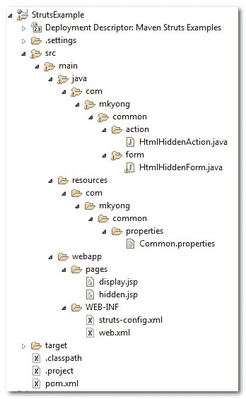
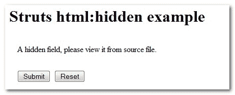

# Struts <hidden>隐藏值示例</hidden>

> 原文：<http://web.archive.org/web/20230101150211/http://www.mkyong.com/struts/struts-htmlhidden-hidden-value-example/>

Download this Struts hidden value example – [Struts-HiddenValue-Example.zip](http://web.archive.org/web/20210421200357/http://www.mkyong.com/wp-content/uploads/2010/04/Struts-HiddenValue-Example.zip)

在这个 Struts 示例中，您将学习如何使用 Struts**<HTML:hidden>**标签创建一个 HTML 隐藏字段。

## 1.文件夹结构

这是 Maven 创建的最终项目结构。请创建相应的文件夹。



## 2.动作类

创建一个 Action 类，除了转发请求什么也不做。

**HtmlHiddenAction.java**

```java
 package com.mkyong.common.action;

import javax.servlet.http.HttpServletRequest;
import javax.servlet.http.HttpServletResponse;

import org.apache.struts.action.Action;
import org.apache.struts.action.ActionForm;
import org.apache.struts.action.ActionForward;
import org.apache.struts.action.ActionMapping;

public class HtmlHiddenAction extends Action{

	public ActionForward execute(ActionMapping mapping,ActionForm form,
			HttpServletRequest request,HttpServletResponse response) 
        throws Exception {

		return mapping.findForward("success");
	}

} 
```

## 3.属性文件

创建一个属性文件，并声明错误和标签消息。

**公共属性**

```java
 #error message
error.common.html.hidden.name.required = Hidden value "Name" is required.

#label message
label.common.html.hidden.button.submit = Submit
label.common.html.hidden.button.reset = Reset 
```

## 4.动作形式

创建一个 ActionForm，包含一个名称变量和表单验证–validate()。

**html 格式。java**

```java
 package com.mkyong.common.form;

import javax.servlet.http.HttpServletRequest;

import org.apache.struts.action.ActionErrors;
import org.apache.struts.action.ActionForm;
import org.apache.struts.action.ActionMapping;
import org.apache.struts.action.ActionMessage;

public class HtmlHiddenForm extends ActionForm{

	String name;

	public String getName() {
		return name;
	}

	public void setName(String name) {
		this.name = name;
	}

	@Override
	public ActionErrors validate(ActionMapping mapping,
			HttpServletRequest request) {

	    ActionErrors errors = new ActionErrors();

	    if( getName() == null || ("".equals(getName()))) {
	       errors.add("common.name.err",
                  new ActionMessage("error.common.html.hidden.name.required"));
	    }

	    return errors;
	}

	@Override
	public void reset(ActionMapping mapping, HttpServletRequest request) {
		// reset properties
		name = "";
	}

} 
```

## 5.JSP 页面

使用 Struts 的 html 标签 **< html:hidden >** 创建一个 HTML 隐藏值。

**hidden.jsp**

```java
<%@taglib uri="http://struts.apache.org/tags-html" prefix="html"%>
<%@taglib uri="http://struts.apache.org/tags-bean" prefix="bean"%>

Struts html:隐藏示例

```

<form action="/Hidden"><messages id="err_name" property="common.name.err"></messages><hidden property="name" value="This is mkyong.com">A hidden field, please view it from source file.</hidden><submit><message key="label.common.html.hidden.button.submit"></message></submit><reset><message key="label.common.html.hidden.button.reset"></message></reset></form>

从 ActionForm 获取隐藏值并显示它

**display.jsp**

```java
<%@taglib uri="http://struts.apache.org/tags-bean" prefix="bean"%>

隐藏值:

```

## 6.struts-config.xml

创建一个 Struts 配置文件，并将它们链接在一起。

```java
 <?xml version="1.0" encoding="UTF-8"?>
<!DOCTYPE struts-config PUBLIC 
"-//Apache Software Foundation//DTD Struts Configuration 1.3//EN" 
"http://jakarta.apache.org/struts/dtds/struts-config_1_3.dtd">

<struts-config>

	<form-beans>
		<form-bean
			name="htmlHiddenForm"
			type="com.mkyong.common.form.HtmlHiddenForm"/>

	</form-beans>

	<action-mappings>

	    <action
			path="/HiddenPage"
			type="org.apache.struts.actions.ForwardAction"
			parameter="/pages/hidden.jsp"/>

		<action
			path="/Hidden"
			type="com.mkyong.common.action.HtmlHiddenAction"
			name="htmlHiddenForm"
			validate="true"
			input="/pages/hidden.jsp"
			>	

			<forward name="success" path="/pages/display.jsp"/>
		</action>
	</action-mappings>

	<message-resources
		parameter="com.mkyong.common.properties.Common" />

</struts-config> 
```

## 7.web.xml

最后一步，为 Strut 框架集成创建一个 web.xml。

```java
 <!DOCTYPE web-app PUBLIC
 "-//Sun Microsystems, Inc.//DTD Web Application 2.3//EN"
 "http://java.sun.com/dtd/web-app_2_3.dtd" >

<web-app>
  <display-name>Maven Struts Examples</display-name>

  <servlet>
    <servlet-name>action</servlet-name>
    <servlet-class>
        org.apache.struts.action.ActionServlet
    </servlet-class>
    <init-param>
        <param-name>config</param-name>
        <param-value>
         /WEB-INF/struts-config.xml
        </param-value>
    </init-param>
    <load-on-startup>1</load-on-startup>
  </servlet>

  <servlet-mapping>
       <servlet-name>action</servlet-name>
       <url-pattern>*.do</url-pattern>
  </servlet-mapping>

</web-app> 
```

访问它

> http://localhost:8080/struts example/hidden page . do



**hidden.jsp**HTML 源代码。

```java

Struts html:隐藏示例

```

<form name="htmlHiddenForm" method="post" action="/web/20210421200357/https://mkyong.com/StrutsExample/Hidden.do"><input type="hidden" name="name" value="This is mkyong.com"> A hidden field, please view it from source file.<input type="submit" value="Submit"><input type="reset" value="Reset"></form>

按下提交按钮，它将转发到

> http://localhost:8080/struts example/hidden . do

并显示隐藏的值。

Tags : [hidden value](http://web.archive.org/web/20210421200357/https://mkyong.com/tag/hidden-value/) [struts](http://web.archive.org/web/20210421200357/https://mkyong.com/tag/struts/)<input type="hidden" id="mkyong-current-postId" value="4485">