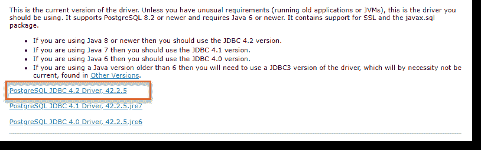
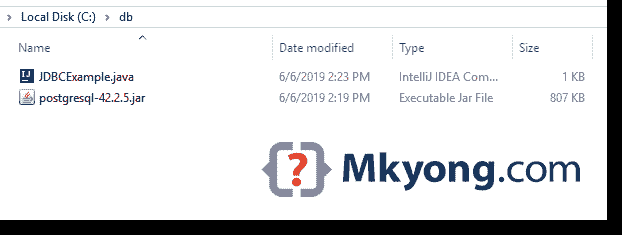

# 使用 JDBC 驱动程序连接到 PostgreSQL

> 原文：<http://web.archive.org/web/20230101150211/https://mkyong.com/jdbc/how-do-connect-to-postgresql-with-jdbc-driver-java/>

一个 JDBC 的例子，展示了如何用 JDBC 驱动程序连接到 PostgreSQL 数据库。

*测试者:*

*   Java 8
*   PostgreSQL 11
*   PostgreSQL JDBC 驱动程序

## 1.下载 PostgreSQL JDBC 驱动程序

访问 http://jdbc.postgresql.org/download.html 下载最新的 PostgreSQL JDBC 驱动程序。



## 2.JDBC 连接

2.1 建立到 PostgreSQL 数据库的连接。

JDBCExample.java

```java
 import java.sql.Connection;
import java.sql.DriverManager;
import java.sql.SQLException;

public class JDBCExample {

    public static void main(String[] args) {

		// https://docs.oracle.com/javase/8/docs/api/java/sql/package-summary.html#package.description
        // auto java.sql.Driver discovery -- no longer need to load a java.sql.Driver class via Class.forName

        // register JDBC driver, optional, since java 1.6
        /*try {
            Class.forName("org.postgresql.Driver");
        } catch (ClassNotFoundException e) {
            e.printStackTrace();
        }*/

        // auto close connection
        try (Connection conn = DriverManager.getConnection(
                "jdbc:postgresql://127.0.0.1:5432/test", "postgres", "password")) {

            if (conn != null) {
                System.out.println("Connected to the database!");
            } else {
                System.out.println("Failed to make connection!");
            }

        } catch (SQLException e) {
            System.err.format("SQL State: %s\n%s", e.getSQLState(), e.getMessage());
        } catch (Exception e) {
            e.printStackTrace();
        }

    }
} 
```

输出，没有驱动？

```java
 > javac JDBCExample.java

> java JDBCExample
SQL State: 08001
No suitable driver found for jdbc:postgresql://127.0.0.1:5432/test 
```

要用`java`命令运行它，我们需要手动加载 PostgreSQL JDBC 驱动程序。假设所有东西都存储在`c:\db`文件夹中，用`-cp`选项再次运行它。



```java
 > java -cp "c:\db\postgresql-42.2.5.jar;c:\db" JDBCExample
Connected to the database! 
```

## 3.专家

PostgreSQL JDBC 驱动程序可以在 Maven 中央存储库中获得。

pom.xml

```java
 <dependency>
		<groupId>org.postgresql</groupId>
		<artifactId>postgresql</artifactId>
		<version>42.2.5</version>
	</dependency> 
```

## 4.JDBC 精选

4.1 从表中获取所有行的另一个 JDBC 示例。

JDBCExample2.java

```java
 package com.mkyong.jdbc;

import com.mkyong.jdbc.model.Employee;

import java.math.BigDecimal;
import java.sql.*;
import java.util.ArrayList;
import java.util.List;

public class JDBCExample2 {

    public static void main(String[] args) {

        List<Employee> result = new ArrayList<>();

        String SQL_SELECT = "Select * from EMPLOYEE";

        // auto close connection and preparedStatement
        try (Connection conn = DriverManager.getConnection(
                "jdbc:postgresql://127.0.0.1:5432/test", "postgres", "password");
             PreparedStatement preparedStatement = conn.prepareStatement(SQL_SELECT)) {

            ResultSet resultSet = preparedStatement.executeQuery();

            while (resultSet.next()) {

                long id = resultSet.getLong("ID");
                String name = resultSet.getString("NAME");
                BigDecimal salary = resultSet.getBigDecimal("SALARY");
                Timestamp createdDate = resultSet.getTimestamp("CREATED_DATE");

                Employee obj = new Employee();
                obj.setId(id);
                obj.setName(name);
                obj.setSalary(salary);
                // Timestamp -> LocalDateTime
                obj.setCreatedDate(createdDate.toLocalDateTime());

                result.add(obj);

            }
            result.forEach(x -> System.out.println(x));

        } catch (SQLException e) {
            System.err.format("SQL State: %s\n%s", e.getSQLState(), e.getMessage());
        } catch (Exception e) {
            e.printStackTrace();
        }

    }

} 
```

Employee.java

```java
 package com.mkyong.jdbc.model;

import java.math.BigDecimal;
import java.time.LocalDateTime;

public class Employee {

    private Long id;
    private String name;
    private BigDecimal salary;
    private LocalDateTime createdDate;

    //...
} 
```

表定义。

```java
 CREATE TABLE EMPLOYEE
(
    ID serial,
    NAME varchar(100) NOT NULL,
    SALARY numeric(15, 2) NOT NULL,
    CREATED_DATE timestamp with time zone NOT NULL DEFAULT CURRENT_TIMESTAMP
    PRIMARY KEY (ID)
); 
```

## 下载源代码

$ git clone [https://github.com/mkyong/java-jdbc.git](http://web.archive.org/web/20221225035543/https://github.com/mkyong/java-jdbc.git)

## 参考

*   [PostgreSQL JDBC 驱动程序](http://web.archive.org/web/20221225035543/https://jdbc.postgresql.org/download.html)
*   [Java JDBC 教程](/web/20221225035543/https://mkyong.com/tutorials/jdbc-tutorials/)

<input type="hidden" id="mkyong-current-postId" value="750">