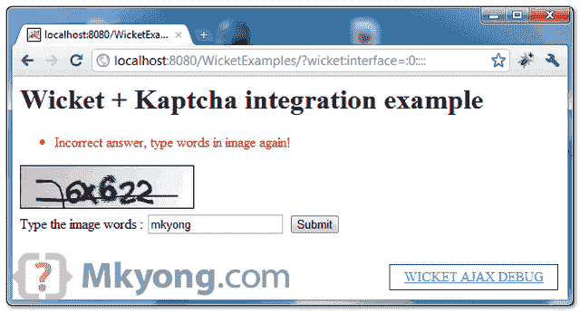
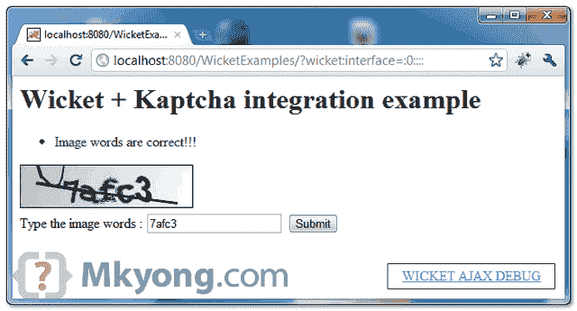

# Wicket + Kaptcha 集成示例

> 原文：<http://web.archive.org/web/20230101150211/http://www.mkyong.com/wicket/how-do-integrate-kaptcha-in-wicket-solution/>

Kaptcha 是一个简单易用的 Java 库，用于生成验证码图片验证。在本教程中，我们将向您展示如何通过 Spring 将 Kaptcha 与 Wicket 框架集成。

使用的库:

1.  2.3.2 节
2.  Wicket v1.4.17
3.  小门弹簧 v1.4.17
4.  Spring v3.0.5.RELEASE

**Note**
This article is mainly describes how to integrate Kaptcha with Wicket framework, for Wicket + Spring, please refer to this “[Wicket + Spring integration example](http://web.archive.org/web/20201109020338/http://www.mkyong.com/wicket/wicket-spring-integration-example/)“.

## 1.去吧

根据这个[线程](http://web.archive.org/web/20201109020338/http://code.google.com/p/kaptcha/issues/detail?id=12)，主人不喜欢 Maven，所以你必须手动安装这个库到你的本地 Maven 库。

1.在这里得到卡普查图书馆[http://code.google.com/p/kaptcha/](http://web.archive.org/web/20201109020338/http://code.google.com/p/kaptcha/)T2【2】。发出以下 Maven 命令来手动安装它。

```java
 mvn install:install-file -Dfile=c:\kaptcha-2.3.2.jar -DgroupId=com.google.code 
	-DartifactId=kaptcha -Dversion=2.3.2 -Dpackaging=jar 
```

3.稍后，您可以在 pom.xml 文件中包含 kaptcha。

*文件:pom.xml*

```java
 <dependency>
		<groupId>com.google.code</groupId>
		<artifactId>kaptcha</artifactId>
		<version>2.3.2</version>
	</dependency> 
```

## 2.DefaultKaptcha via Spring

为 **DefaultKaptcha** 创建一个春豆，命名为 **captchaProducer** 。

*文件:applicationContext.xml*

```java
 <beans 
	xmlns:xsi="http://www.w3.org/2001/XMLSchema-instance" 
	xsi:schemaLocation="http://www.springframework.org/schema/beans
	http://www.springframework.org/schema/beans/spring-beans-3.0.xsd">

	<bean id="captchaProducer" class="com.google.code.kaptcha.impl.DefaultKaptcha">
		<property name="config">
			<bean class="com.google.code.kaptcha.util.Config">
				<constructor-arg type="java.util.Properties" value="null">
				</constructor-arg>
			</bean>
		</property>
	</bean>

</beans> 
```

## 3.CaptchaImage

创建一个扩展 Wicket 的`NonCachingImage`的 CaptchaImage 类，并使用`DynamicImageResource`类动态生成 captcha 图像。

*文件:CaptchaImage.java*

```java
 package com.mkyong.user;

import java.awt.image.BufferedImage;
import java.io.ByteArrayOutputStream;
import javax.servlet.http.HttpServletRequest;
import org.apache.wicket.Request;
import org.apache.wicket.RequestCycle;
import org.apache.wicket.markup.html.image.NonCachingImage;
import org.apache.wicket.markup.html.image.resource.DynamicImageResource;
import org.apache.wicket.protocol.http.WebRequest;
import org.apache.wicket.spring.injection.annot.SpringBean;
import com.google.code.kaptcha.Constants;
import com.google.code.kaptcha.impl.DefaultKaptcha;
import com.sun.image.codec.jpeg.JPEGCodec;
import com.sun.image.codec.jpeg.JPEGImageEncoder;

public class CaptchaImage extends NonCachingImage {

	private static final String CAPTCHA_PRODUCER = "captchaProducer";

	// inject via Spring
	@SpringBean
	private DefaultKaptcha captchaProducer;

	// private DefaultKaptcha captchaProducer;
	public CaptchaImage(String id) {
		super(id);

		setImageResource(new DynamicImageResource() {

			public byte[] getImageData() {
				ByteArrayOutputStream os = new ByteArrayOutputStream();

				JPEGImageEncoder encoder = JPEGCodec.createJPEGEncoder(os);

				try {
					BufferedImage bi = getImageCaptchaService();
					encoder.encode(bi);
					return os.toByteArray();
				} catch (Exception e) {
					throw new RuntimeException(e);
				}

			};

			private BufferedImage getImageCaptchaService() {

				Request request = RequestCycle.get().getRequest();
				HttpServletRequest httpRequest = ((WebRequest) request)
						.getHttpServletRequest();

				String capText = captchaProducer.createText();

				// store the text in the session
				httpRequest.getSession().setAttribute(
						Constants.KAPTCHA_SESSION_KEY, capText);

				// create the image with the text
				BufferedImage bi = captchaProducer.createImage(capText);

				return bi;

			}
		});

	}
} 
```

## 4.验证码验证器

创建一个自定义验证器，命名为" **CaptchaValidator** "，用于验证用户输入并与 Kaptcha 生成的代码进行比较。

*文件:CaptchaValidator.java*

```java
 package com.mkyong.user;

import javax.servlet.http.HttpServletRequest;
import org.apache.wicket.Request;
import org.apache.wicket.RequestCycle;
import org.apache.wicket.protocol.http.WebRequest;
import org.apache.wicket.validation.IValidatable;
import org.apache.wicket.validation.validator.AbstractValidator;

public class CaptchaValidator extends AbstractValidator<String> {

	private static final long serialVersionUID = 1L;
	private String INVALID_CODE = "captcha.invalid";

	public void onValidate(IValidatable validatable) {
		String kaptchaReceived = (String) validatable.getValue();

		Request request = RequestCycle.get().getRequest();
		HttpServletRequest httpRequest = ((WebRequest) request)
				.getHttpServletRequest();

		String kaptchaExpected = (String) httpRequest.getSession()
			.getAttribute(com.google.code.kaptcha.Constants.KAPTCHA_SESSION_KEY);

		if (kaptchaReceived == null
				|| !kaptchaReceived.equalsIgnoreCase(kaptchaExpected)) {
			error(validatable);
		}

	}

	// validate on numm value as well
	@Override
	public boolean validateOnNullValue() {

		return true;

	}

	@Override
	protected String resourceKey() {
		return INVALID_CODE;
	}
} 
```

*文件:package.properties*

```java
 captcha.invalid = Incorrect answer, type words in image again! 
```

## 5.Wicket 组件

将 Kaptcha 与 Wicket 组件集成。

```java
 package com.mkyong.user;

import org.apache.wicket.PageParameters;
import org.apache.wicket.ajax.AjaxRequestTarget;
import org.apache.wicket.ajax.markup.html.AjaxFallbackLink;
import org.apache.wicket.markup.html.form.Form;
import org.apache.wicket.markup.html.form.TextField;
import org.apache.wicket.markup.html.panel.FeedbackPanel;
import org.apache.wicket.markup.html.WebPage;
import org.apache.wicket.model.PropertyModel;

public class KaptchaPage extends WebPage {

	private String captchaInput;

	public KaptchaPage(final PageParameters parameters) {

		final CaptchaImage captchaImage = new CaptchaImage("kaptchaImage");
		captchaImage.setOutputMarkupId(true);

		TextField<String> captchaTF = new TextField<String>("captcha",
				new PropertyModel<String>(this, "captchaInput"));
		captchaTF.add(new CaptchaValidator());

		Form<?> form = new Form<Void>("form") {
			@Override
			protected void onSubmit() {

				info("Image words are correct!!!");
			};
		};

		form.add(new AjaxFallbackLink("link") {
			@Override
			public void onClick(final AjaxRequestTarget target) {

				captchaImage.detach();

				if (target != null) {
					target.addComponent(captchaImage);
				} else {
					// javascript is disable
				}
			}
		}.add(captchaImage));

		form.add(captchaTF);
		add(form);
		add(new FeedbackPanel("feedback"));
	}

} 
```

**Note**
`captchaImage.detach();` is enables generate a new captcha image dynamically while user click on the captcha image.

```java
 <html>
<head>
<style>
.feedbackPanelINFO {
	color: green;
}

.feedbackPanelERROR {
	color: red;
}
</style>
</head>
<body>

	<h1>Wicket + Kaptcha integration example</h1>
	<div wicket:id="feedback"></div>
	<form wicket:id="form">
		<a wicket:id="link" title="Refresh image words"> 
		</a>
		<br>
		<label>Type the image words :</label>
		<input type="text"wicket:id="captcha">
		<input type="submit" value="Submit" />
	</form>

</body>
</html> 
```

## 6.演示

开始并访问—*http://localhost:8080/wicket examples/*

如果输入不正确:




如果输入正确:


Download it – [Wicket-Kaptcha-Integration-Example.zip](http://web.archive.org/web/20201109020338/http://www.mkyong.com/wp-content/uploads/2009/05/Wicket-Kaptcha-Integration-Example.zip) (10 KB)

## 参考

1.  [Kaptcha 官网](http://web.archive.org/web/20201109020338/http://code.google.com/p/kaptcha/)
2.  [Wicket + Spring 集成示例](http://web.archive.org/web/20201109020338/http://www.mkyong.com/wicket/wicket-spring-integration-example/)
3.  [将库包含到本地 Maven 库中](http://web.archive.org/web/20201109020338/http://www.mkyong.com/maven/how-to-include-library-manully-into-maven-local-repository/)

Tags : [captcha](http://web.archive.org/web/20201109020338/https://mkyong.com/tag/captcha/) [wicket](http://web.archive.org/web/20201109020338/https://mkyong.com/tag/wicket/)<input type="hidden" id="mkyong-current-postId" value="1425">

### 相关文章

*   [如何将自定义库包含到 maven 本地代表中](/web/20201109020338/https://www.mkyong.com/maven/how-to-include-library-manully-into-maven-local-repository/)
*   [如何在 Eclipse 中设置 Wicket 示例](/web/20201109020338/https://www.mkyong.com/wicket/how-do-setup-wicket-examples-in-eclipse/)
*   [Java . lang . classnotfoundexception:org . slf4j . impl .](/web/20201109020338/https://www.mkyong.com/wicket/java-lang-classnotfoundexception-org-slf4j-impl-staticloggerbinder/)
*   [Wicket 文本框示例](/web/20201109020338/https://www.mkyong.com/wicket/wicket-textbox-example/)
*   [Wicket 属性模型示例](/web/20201109020338/https://www.mkyong.com/wicket/wicket-propertymodel-example/)

*   [Wicket Hello World 示例](/web/20201109020338/https://www.mkyong.com/wicket/wicket-hello-world-example-with-maven-tutorial/)
*   [Wicket + Log4j 集成示例](/web/20201109020338/https://www.mkyong.com/wicket/wicket-log4j-integration-example/)
*   [启用 org.apache.wicket.util.r 的调试消息](/web/20201109020338/https://www.mkyong.com/wicket/enable-debug-messages-for-org-apache-wicket-util-resource/)
*   [如何改变 Wicket 中 html 文件的位置](/web/20201109020338/https://www.mkyong.com/wicket/how-do-change-the-html-file-location-wicket/)
*   [如何在 Wicket 中获取 servlet context](/web/20201109020338/https://www.mkyong.com/wicket/how-do-get-servletcontext-in-wicket/)