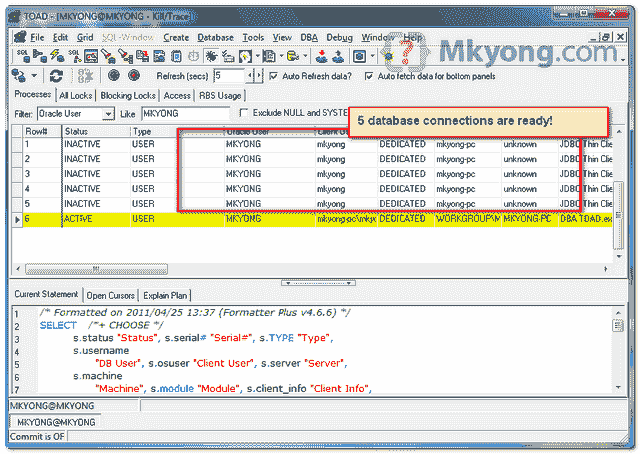

# 如何在 Hibernate 中配置 C3P0 连接池

> 原文：<http://web.archive.org/web/20230101150211/http://www.mkyong.com/hibernate/how-to-configure-the-c3p0-connection-pool-in-hibernate/>

**Connection Pool**
Connection pool is good for performance, as it prevents Java application create a connection each time when interact with database and minimizes the cost of opening and closing connections.

参见 [wiki 连接池](http://web.archive.org/web/20210506212620/https://en.wikipedia.org/wiki/Connection_pool)的解释

Hibernate 自带内部连接池，但不适合生产使用。在本教程中，我们将向您展示如何将第三方连接池 C3P0 与 Hibernate 集成。

## 1.获取 hibernate-c3p0.jar

要集成 c3p0 和 Hibernate，需要 **hibernate-c3p0.jar** ，从 JBoss repository 获取。

*文件:pom.xml*

```java
 <project ...>

	<repositories>
		<repository>
			<id>JBoss repository</id>
			<url>http://repository.jboss.org/nexus/content/groups/public/</url>
		</repository>
	</repositories>

	<dependencies>

		<dependency>
			<groupId>org.hibernate</groupId>
			<artifactId>hibernate-core</artifactId>
			<version>3.6.3.Final</version>
		</dependency>

		<!-- Hibernate c3p0 connection pool -->
		<dependency>
			<groupId>org.hibernate</groupId>
			<artifactId>hibernate-c3p0</artifactId>
			<version>3.6.3.Final</version>
		</dependency>

	</dependencies>
</project> 
```

## 2.配置 c3p0 属性

为了配置 c3p0，将 c3p0 配置详细信息放入" **hibernate.cfg.xml** "中，如下所示:

*文件:hibernate.cfg.xml*

```java
 <?xml version="1.0" encoding="utf-8"?>
<!DOCTYPE hibernate-configuration PUBLIC
"-//Hibernate/Hibernate Configuration DTD 3.0//EN"
"http://hibernate.sourceforge.net/hibernate-configuration-3.0.dtd">
<hibernate-configuration>
 <session-factory>
  <property name="hibernate.connection.driver_class">oracle.jdbc.driver.OracleDriver</property>
  <property name="hibernate.connection.url">jdbc:oracle:thin:@localhost:1521:MKYONG</property>
  <property name="hibernate.connection.username">mkyong</property>
  <property name="hibernate.connection.password">password</property>
  <property name="hibernate.dialect">org.hibernate.dialect.Oracle10gDialect</property>
  <property name="hibernate.default_schema">MKYONG</property>
  <property name="show_sql">true</property>

  <property name="hibernate.c3p0.min_size">5</property>
  <property name="hibernate.c3p0.max_size">20</property>
  <property name="hibernate.c3p0.timeout">300</property>
  <property name="hibernate.c3p0.max_statements">50</property>
  <property name="hibernate.c3p0.idle_test_period">3000</property>

  <mapping class="com.mkyong.user.DBUser"></mapping>
</session-factory>
</hibernate-configuration> 
```

1.  hibernate . c3p 0 . min _ size–池中 JDBC 连接的最小数量。休眠默认值:1
2.  hibernate . c3p 0 . max _ size–池中 JDBC 连接的最大数量。休眠默认值:100
3.  hibernate . c3p 0 . time out–从池中删除空闲连接的时间(秒)。休眠默认值:0，永不过期。
4.  hibernate . c3p 0 . max _ statements–将缓存准备好的语句数。提高性能。休眠默认值:0，禁用缓存。
5.  hibernate . c3p 0 . idle _ test _ period–自动验证连接之前的空闲时间(秒)。休眠默认值:0

**Note**
For detail about **hibernate-c3p0** configuration settings, please read [this](http://web.archive.org/web/20210506212620/http://community.jboss.org/wiki/HowToConfigureTheC3P0ConnectionPool) article.

## 运行它，输出

完成后，运行它并查看以下输出:



在连接初始化过程中，连接池中创建了 5 个数据库连接，以备 web 应用程序重用。

Download it – [Hibernate-C3P0-Connection-Pool-Example.zip](http://web.archive.org/web/20210506212620/http://www.mkyong.com/wp-content/uploads/2009/12/Hibernate-C3P0-Connection-Pool-Example.zip) (8KB)

## 参考

1.  [http://docs . JBoss . org/hibernate/core/3.6/reference/en-US/html _ single/# d0e 1748](http://web.archive.org/web/20210506212620/http://docs.jboss.org/hibernate/core/3.6/reference/en-US/html_single/#d0e1748)
2.  [http://www.mchange.com/projects/c3p0/index.html#appendix_d](http://web.archive.org/web/20210506212620/http://www.mchange.com/projects/c3p0/index.html#appendix_d)

Tags : [c3p0](http://web.archive.org/web/20210506212620/https://mkyong.com/tag/c3p0/) [connection pool](http://web.archive.org/web/20210506212620/https://mkyong.com/tag/connection-pool/) [hibernate](http://web.archive.org/web/20210506212620/https://mkyong.com/tag/hibernate/)<input type="hidden" id="mkyong-current-postId" value="2560">