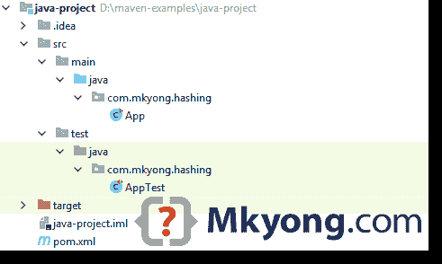

# maven——如何创建 Java 项目

> 原文：<http://web.archive.org/web/20230101150211/https://www.mkyong.com/maven/how-to-create-a-java-project-with-maven/>

在本教程中，我们将向您展示如何使用 [Maven](http://web.archive.org/web/20220130175428/https://maven.apache.org/) 来管理 Java 项目——创建、添加依赖项并将 Java 项目打包到可执行的 jar 文件中。最后，我们将创建一个可执行的 jar 文件，用 SHA-256 算法散列一个给定的字符串。

使用的技术:

1.  Maven 3.5.3
2.  JDK 8
3.  Apache Commons 编解码器 1.11

## 1.从 Maven 模板创建项目

在终端(*uix 或 Mac)或命令提示符(Windows)中，导航到要创建 Java 项目的文件夹。键入以下命令:

```java
 mvn archetype:generate 
	-DgroupId={project-packaging}
	-DartifactId={project-name}
	-DarchetypeArtifactId={maven-template} 
	-DinteractiveMode=false 
```

这告诉 Maven 从一个 Maven 模板生成一个 Java 项目。举个例子，

```java
 D:\>mvn archetype:generate -DgroupId=com.mkyong.hashing -DartifactId=java-project -DarchetypeArtifactId=maven-archetype-quickstart -DinteractiveMode=false

...
[INFO] ------------------------------------------------------------------------
[INFO] BUILD SUCCESS
[INFO] ------------------------------------------------------------------------
[INFO] Total time: 3.992 s
[INFO] Finished at: 2018-09-27T17:15:57+08:00
[INFO] ------------------------------------------------------------------------ 
```

上面的命令将从`maven-archetype-quickstart`模板生成一个 Java 项目。

## 2.Maven 目录布局

将创建以下项目目录结构。简而言之，源代码放在文件夹`/src/main/java/`，单元测试代码放在`/src/test/java/`。



*P.S 上图是从 IntelliJ IDEA 抓取的，只需忽略那些`.idea`文件夹。*

**Note**
Read this [Maven standard directory layout](http://web.archive.org/web/20220130175428/https://maven.apache.org/guides/introduction/introduction-to-the-standard-directory-layout.html).

## 3.POM 文件

查看生成的`pom.xml`。它很空，只有一个 jUnit 依赖项。

pom.xml

```java
 <project  
	xmlns:xsi="http://www.w3.org/2001/XMLSchema-instance"
         xsi:schemaLocation="http://maven.apache.org/POM/4.0.0 
		 http://maven.apache.org/maven-v4_0_0.xsd">
    <modelVersion>4.0.0</modelVersion>
    <groupId>com.mkyong.hashing</groupId>
    <artifactId>java-project3</artifactId>
    <packaging>jar</packaging>
    <version>1.0-SNAPSHOT</version>
    <name>java-project</name>
    <url>http://maven.apache.org</url>
    <dependencies>
        <dependency>
            <groupId>junit</groupId>
            <artifactId>junit</artifactId>
            <version>3.8.1</version>
            <scope>test</scope>
        </dependency>
    </dependencies>
</project> 
```

这个 POM 文件就像 Ant `build.xml`文件，它描述了整个项目的信息，从目录结构，项目插件，项目依赖，如何构建这个项目等等，阅读这个[官方 POM 指南](http://web.archive.org/web/20220130175428/https://maven.apache.org/guides/introduction/introduction-to-the-pom.html)。

## 4.更新 POM

4.1 添加编译器属性，告诉 Maven 使用指定的 JDK 版本来编译源代码。

```java
 <properties>
		<!-- https://maven.apache.org/general.html#encoding-warning -->
        <project.build.sourceEncoding>UTF-8</project.build.sourceEncoding>

        <maven.compiler.source>1.8</maven.compiler.source>
        <maven.compiler.target>1.8</maven.compiler.target>
    </properties> 
```

4.2 将 jUnit 更新到 4.12

```java
 <dependency>
		<groupId>junit</groupId>
		<artifactId>junit</artifactId>
		<version>4.12</version>
		<scope>test</scope>
	</dependency> 
```

4.3 为 SHA 哈希增加`commons-codec`。

```java
 <!-- Dependency for hashing -->
	<!-- https://search.maven.org/artifact/commons-codec/commons-codec/1.11/jar -->
	<dependency>
		<groupId>commons-codec</groupId>
		<artifactId>commons-codec</artifactId>
		<version>1.11</version>
	</dependency> 
```

4.4 完整的更新版本。

pom.xml

```java
 <project  
	xmlns:xsi="http://www.w3.org/2001/XMLSchema-instance"
         xsi:schemaLocation="http://maven.apache.org/POM/4.0.0 
		 http://maven.apache.org/maven-v4_0_0.xsd">
    <modelVersion>4.0.0</modelVersion>
    <groupId>com.mkyong.hashing</groupId>
    <artifactId>java-project</artifactId>
    <packaging>jar</packaging>
    <version>1.0-SNAPSHOT</version>
    <name>java-project</name>
    <url>http://maven.apache.org</url>

    <properties>
        <!-- https://maven.apache.org/general.html#encoding-warning -->
        <project.build.sourceEncoding>UTF-8</project.build.sourceEncoding>
        <maven.compiler.source>1.8</maven.compiler.source>
        <maven.compiler.target>1.8</maven.compiler.target>
    </properties>

    <dependencies>
        <dependency>
            <groupId>junit</groupId>
            <artifactId>junit</artifactId>
            <version>4.12</version>
            <scope>test</scope>
        </dependency>
        <dependency>
            <groupId>commons-codec</groupId>
            <artifactId>commons-codec</artifactId>
            <version>1.11</version>
        </dependency>
    </dependencies>

</project> 
```

## 5.写代码

5.1 更新`App.java`以接受一个输入，并用阿沙-256 算法对其进行哈希运算。

App.java

```java
 package com.mkyong.hashing;

import org.apache.commons.codec.digest.DigestUtils;

public class App {

    public static void main(String[] args) {

        if (args.length < 1) {
            System.err.println("Please provide an input!");
            System.exit(0);
        }
        System.out.println(sha256hex(args[0]));

    }

    public static String sha256hex(String input) {
        return DigestUtils.sha256Hex(input);
    }

} 
```

5.2 单元测试。

AppTest.java

```java
 package com.mkyong.hashing;

import org.junit.Assert;
import org.junit.Test;

public class AppTest {

    private String INPUT = "123456";

    @Test
    public void testLength() {
        Assert.assertEquals(64, App.sha256hex(INPUT).length());
    }

    @Test
    public void testHex() {
        String expected = "8d969eef6ecad3c29a3a629280e686cf0c3f5d5a86aff3ca12020c923adc6c92";
        Assert.assertEquals(expected, App.sha256hex(INPUT));
    }

} 
```

完成了。

## 6.Maven 构建

6.1 让我们用`mvn package`来建造它

```java
 D:\java-project>mvn package
[INFO] Scanning for projects...
[INFO]
[INFO] ------------------< com.mkyong.hashing:java-project >-------------------
[INFO] Building java-project 1.0-SNAPSHOT
[INFO] --------------------------------[ jar ]---------------------------------
[INFO]
......

-------------------------------------------------------
 T E S T S
-------------------------------------------------------
Running com.mkyong.hashing.AppTest
Tests run: 2, Failures: 0, Errors: 0, Skipped: 0, Time elapsed: 0.067 sec

Results :

Tests run: 2, Failures: 0, Errors: 0, Skipped: 0

[INFO]
[INFO] --- maven-jar-plugin:2.4:jar (default-jar) @ java-project ---
[INFO] Building jar: D:\java-project\target\java-project-1.0-SNAPSHOT.jar
[INFO] ------------------------------------------------------------------------
[INFO] BUILD SUCCESS
[INFO] ------------------------------------------------------------------------
[INFO] Total time: 1.956 s
[INFO] Finished at: 2018-09-28T12:40:18+08:00
[INFO] ------------------------------------------------------------------------ 
```

它编译、运行单元测试并将项目打包成一个`jar`文件，并将其放入`project/target`文件夹。

## 7.运行#1

7.1 运行它。哎呀…默认情况下，Maven 没有将项目依赖关系`commons-codec`添加到 jar 文件中。

```java
 D:\java-project>java -cp target/java-project-1.0-SNAPSHOT.jar com.mkyong.hashing.App 123456

Exception in thread "main" java.lang.NoClassDefFoundError: org/apache/commons/codec/digest/DigestUtils
        at com.mkyong.hashing.App.sha256hex(App.java:18)
        at com.mkyong.hashing.App.main(App.java:13)
Caused by: java.lang.ClassNotFoundException: org.apache.commons.codec.digest.DigestUtils
        at java.base/jdk.internal.loader.BuiltinClassLoader.loadClass(Unknown Source)
        at java.base/jdk.internal.loader.ClassLoaders$AppClassLoader.loadClass(Unknown Source)
        at java.base/java.lang.ClassLoader.loadClass(Unknown Source)
        ... 2 more 
```

7.2 为了解决这个问题，我们可以使用这个`maven-shade-plugin`来创建一个 Uber/fat-jar——将所有的东西组合到一个 jar 文件中。

pom.xml

```java
 <build>
        <plugins>

            <plugin>
                <groupId>org.apache.maven.plugins</groupId>
                <artifactId>maven-shade-plugin</artifactId>
                <version>3.2.0</version>
                <executions>
                    <!-- Attach the shade goal into the package phase -->
                    <execution>
                        <phase>package</phase>
                        <goals>
                            <goal>shade</goal>
                        </goals>
                    </execution>
                </executions>
            </plugin>

        </plugins>
    </build> 
```

7.3 再包一次！

```java
 D:\java-project>mvn clean package
[INFO] Scanning for projects...
[...

[INFO] --- maven-shade-plugin:3.2.0:shade (default) @ java-project ---
[INFO] Including commons-codec:commons-codec:jar:1.11 in the shaded jar.
[INFO] Replacing original artifact with shaded artifact.

[INFO] Replacing D:\java-project\target\java-project-1.0-SNAPSHOT.jar 
	with D:\java-project\target\java-project-1.0-SNAPSHOT-shaded.jar
... 
```

将生成两个 jar，检查文件大小:

```java
 D:\java-project>dir target
 Volume in drive D is Samsung970
 Volume Serial Number is 10DF-E63D

 Directory of D:\java-project\target

28/09/2018  12:57 PM           335,643 java-project-1.0-SNAPSHOT.jar
28/09/2018  12:57 PM             3,053 original-java-project-1.0-SNAPSHOT.jar
... 
```

## 8.运行#2

8.1 再运行一次。好，结果在意料之中。

```java
 D:\java-project>java -cp target/java-project-1.0-SNAPSHOT.jar com.mkyong.hashing.App 123456
8d969eef6ecad3c29a3a629280e686cf0c3f5d5a86aff3ca12020c923adc6c92 
```

8.2 我们能像 Jar 一样运行它吗？不，没有主类。

```java
 D:\java-project>java -jar target/java-project-1.0-SNAPSHOT.jar 123456
no main manifest attribute, in target/java-project-1.0-SNAPSHOT.jar 
```

8.3 要解决它，像这样在`maven-shade-plugin`中添加主类。

pom.xml

```java
 <plugin>
	<groupId>org.apache.maven.plugins</groupId>
	<artifactId>maven-shade-plugin</artifactId>
	<version>3.2.0</version>
	<executions>
		<!-- Attach the shade into the package phase -->
		<execution>
			<phase>package</phase>
			<goals>
				<goal>shade</goal>
			</goals>
			<configuration>
				<transformers>
					<transformer implementation="org.apache.maven.plugins.shade.resource.ManifestResourceTransformer">
						<mainClass>com.mkyong.hashing.App</mainClass>
					</transformer>
				</transformers>
			</configuration>
		</execution>
	</executions>
</plugin> 
```

## 9.运行#3

9.1 再包一次！

```java
 D:\java-project>mvn clean package 
```

9.2 将它作为 Jar 运行。

```java
 D:\java-project>java -jar target/java-project-1.0-SNAPSHOT.jar 123456
8d969eef6ecad3c29a3a629280e686cf0c3f5d5a86aff3ca12020c923adc6c92 
```

完成了。

## 10.砰的一声

最终 POM 文件。

pom.xml

```java
 <project  
	xmlns:xsi="http://www.w3.org/2001/XMLSchema-instance"
         xsi:schemaLocation="http://maven.apache.org/POM/4.0.0 
		 http://maven.apache.org/maven-v4_0_0.xsd">
    <modelVersion>4.0.0</modelVersion>
    <groupId>com.mkyong.hashing</groupId>
    <artifactId>java-project</artifactId>
    <packaging>jar</packaging>
    <version>1.0-SNAPSHOT</version>
    <name>java-project</name>
    <url>http://maven.apache.org</url>

    <properties>
        <!-- https://maven.apache.org/general.html#encoding-warning -->
        <project.build.sourceEncoding>UTF-8</project.build.sourceEncoding>
        <maven.compiler.source>1.8</maven.compiler.source>
        <maven.compiler.target>1.8</maven.compiler.target>
    </properties>

    <dependencies>
        <dependency>
            <groupId>junit</groupId>
            <artifactId>junit</artifactId>
            <version>4.12</version>
            <scope>test</scope>
        </dependency>
        <dependency>
            <groupId>commons-codec</groupId>
            <artifactId>commons-codec</artifactId>
            <version>1.11</version>
        </dependency>
    </dependencies>
    <build>
        <plugins>
            <plugin>
                <groupId>org.apache.maven.plugins</groupId>
                <artifactId>maven-shade-plugin</artifactId>
                <version>3.2.0</version>
                <executions>
                    <!-- Attach the shade into the package phase -->
                    <execution>
                        <phase>package</phase>
                        <goals>
                            <goal>shade</goal>
                        </goals>
                        <configuration>
                            <transformers>
                                <transformer
                                        implementation="org.apache.maven.plugins.shade.resource.ManifestResourceTransformer">
                                    <mainClass>com.mkyong.hashing.App</mainClass>
                                </transformer>
                            </transformers>
                        </configuration>
                    </execution>
                </executions>
            </plugin>

        </plugins>
    </build>
</project> 
```

## 下载源代码

$ git clone [https://github.com/mkyong/maven-examples.git](http://web.archive.org/web/20220130175428/https://github.com/mkyong/maven-examples.git)
$ cd java-project
$ mvn package
$ java -jar target/java-project-1.0-SNAPSHOT.jar 123456

## 参考

1.  [Maven–如何创建 Java web 应用项目](http://web.archive.org/web/20220130175428/http://www.mkyong.com/maven/how-to-create-a-web-application-project-with-maven/)
2.  [阿帕奇 Maven 项目](http://web.archive.org/web/20220130175428/https://maven.apache.org/index.html)
3.  一个简单的 Maven 项目
4.  [Java SHA 哈希示例](http://web.archive.org/web/20220130175428/https://www.mkyong.com/java/java-sha-hashing-example/)
5.  [如何创建一个 Jar 文件，thin-jar 示例](http://web.archive.org/web/20220130175428/http://www.mkyong.com/maven/how-to-create-a-jar-file-with-maven/)
6.  [创建一个 fat Jar 文件——一个 Jar 示例](http://web.archive.org/web/20220130175428/http://www.mkyong.com/maven/maven-create-a-fat-jar-file-one-jar-example/)
7.  [创建一个胖罐子文件——Maven Shade 插件示例](http://web.archive.org/web/20220130175428/http://www.mkyong.com/maven/create-a-fat-jar-file-maven-shade-plugin/)

<input type="hidden" id="mkyong-current-postId" value="8414">