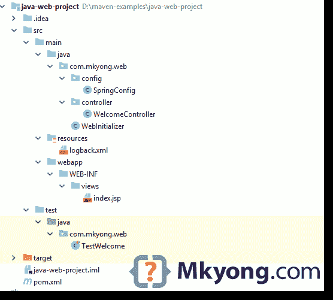
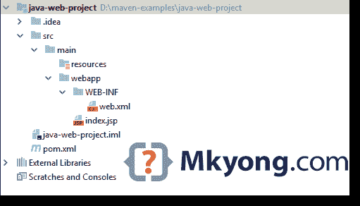

# maven——如何创建 Java web 应用程序项目

> 原文：<http://web.archive.org/web/20230101150211/https://www.mkyong.com/maven/how-to-create-a-web-application-project-with-maven/>



在本教程中，我们将向您展示如何使用 Maven 来管理 Java web 项目。最后，我们将创建一个 Spring MVC web 应用程序，在 JSP 页面上显示当前日期。

使用的技术:

1.  Maven 3.5.3
2.  JDK 8
3.  释放弹簧 5.1.0
4.  JUnit 5
5.  回溯 1.2.3
6.  Jetty 9.4.x 或 Tomcat 8.5

## 1.从 Maven 模板创建一个 web 项目

从 Maven 模板创建一个 web 项目`maven-archetype-webapp`

```java
 mvn archetype:generate 
	-DgroupId={project-packaging}
	-DartifactId={project-name}
	-DarchetypeArtifactId={maven-template} 
	-DinteractiveMode=false 
```

举个例子，

```java
 D:\>mvn archetype:generate -DgroupId=com.mkyong.web -DartifactId=java-web-project -DarchetypeArtifactId=maven-archetype-webapp -DinteractiveMode=false

[INFO] Scanning for projects...
[INFO]
[INFO] ------------------< org.apache.maven:standalone-pom >-------------------
[INFO] Building Maven Stub Project (No POM) 1
[INFO] --------------------------------[ pom ]---------------------------------
[INFO]
[INFO] >>> maven-archetype-plugin:3.0.1:generate (default-cli) > generate-sources @ standalone-pom >>>
[INFO]
[INFO] <<< maven-archetype-plugin:3.0.1:generate (default-cli) < generate-sources @ standalone-pom <<<
[INFO]
[INFO]
[INFO] --- maven-archetype-plugin:3.0.1:generate (default-cli) @ standalone-pom ---
[INFO] Generating project in Batch mode
[INFO] ----------------------------------------------------------------------------
[INFO] Using following parameters for creating project from Old (1.x) Archetype: maven-archetype-webapp:1.0
[INFO] ----------------------------------------------------------------------------
[INFO] Parameter: basedir, Value: D:\
[INFO] Parameter: package, Value: com.mkyong.web
[INFO] Parameter: groupId, Value: com.mkyong.web
[INFO] Parameter: artifactId, Value: java-web-project
[INFO] Parameter: packageName, Value: com.mkyong.web
[INFO] Parameter: version, Value: 1.0-SNAPSHOT
[INFO] project created from Old (1.x) Archetype in dir: D:\java-web-project
[INFO] ------------------------------------------------------------------------
[INFO] BUILD SUCCESS
[INFO] ------------------------------------------------------------------------
[INFO] Total time: 6.509 s
[INFO] Finished at: 2018-10-04T15:25:16+08:00
[INFO] ------------------------------------------------------------------------ 
```

**Note**
Actually, this is optional to generate a web project from a Maven web template. You can always generate those folders with the classic `mkdir` command manually.

## 2.Maven 模板

2.1 将创建以下项目目录结构。



*注:上图来自 IntelliJ IDEA，忽略掉那些 IDE 文件夹，比如`.idea``java-web-project.iml`*

2.2 审核生成的`pom.xml`。

pom.xml

```java
 <project  
	xmlns:xsi="http://www.w3.org/2001/XMLSchema-instance"
	xsi:schemaLocation="http://maven.apache.org/POM/4.0.0 
	http://maven.apache.org/maven-v4_0_0.xsd">
  <modelVersion>4.0.0</modelVersion>
  <groupId>com.mkyong.web</groupId>
  <artifactId>java-web-project</artifactId>
  <packaging>war</packaging>
  <version>1.0-SNAPSHOT</version>
  <name>java-web-project Maven Webapp</name>
  <url>http://maven.apache.org</url>
  <dependencies>
    <dependency>
      <groupId>junit</groupId>
      <artifactId>junit</artifactId>
      <version>3.8.1</version>
      <scope>test</scope>
    </dependency>
  </dependencies>
  <build>
    <finalName>java-web-project</finalName>
  </build>
</project> 
```

*P.S 生成的文件没什么价值，我们以后会全部更新。首先删除`web.xml`，我们不需要这个。*

## 3.更新 POM

3.1 更新`pom.xml`文件，添加 Spring MVC for web framework、JUnit for unit test、Jetty server to test the web project 的依赖项，还有一些 Maven 配置。

pom.xml

```java
 <project 
         xmlns:xsi="http://www.w3.org/2001/XMLSchema-instance"
         xsi:schemaLocation="http://maven.apache.org/POM/4.0.0 
		 http://maven.apache.org/maven-v4_0_0.xsd">
    <modelVersion>4.0.0</modelVersion>
    <groupId>com.mkyong.web</groupId>
    <artifactId>java-web-project</artifactId>
    <packaging>war</packaging>
    <version>1.0-SNAPSHOT</version>
    <name>java-web-project Maven Webapp</name>
    <url>http://maven.apache.org</url>
    <properties>
        <!-- https://maven.apache.org/general.html#encoding-warning -->
        <project.build.sourceEncoding>UTF-8</project.build.sourceEncoding>
        <maven.compiler.source>1.8</maven.compiler.source>
        <maven.compiler.target>1.8</maven.compiler.target>
        <spring.version>5.1.0.RELEASE</spring.version>
    </properties>

    <dependencies>

        <dependency>
            <groupId>org.springframework</groupId>
            <artifactId>spring-webmvc</artifactId>
            <version>${spring.version}</version>
        </dependency>

        <dependency>
            <groupId>org.springframework</groupId>
            <artifactId>spring-test</artifactId>
            <version>${spring.version}</version>
        </dependency>

        <!-- logging , spring 5 no more bridge, thanks spring-jcl -->
        <dependency>
            <groupId>ch.qos.logback</groupId>
            <artifactId>logback-classic</artifactId>
            <version>1.2.3</version>
        </dependency>

        <!-- junit 5, unit test -->
        <dependency>
            <groupId>org.junit.jupiter</groupId>
            <artifactId>junit-jupiter-engine</artifactId>
            <version>5.3.1</version>
            <scope>test</scope>
        </dependency>

        <!-- unit test -->
        <dependency>
            <groupId>org.hamcrest</groupId>
            <artifactId>hamcrest-library</artifactId>
            <version>1.3</version>
            <scope>test</scope>
        </dependency>

        <!-- for web servlet -->
        <dependency>
            <groupId>javax.servlet</groupId>
            <artifactId>javax.servlet-api</artifactId>
            <version>3.1.0</version>
            <scope>provided</scope>
        </dependency>

        <!-- Some containers like Tomcat don't have jstl library -->
        <dependency>
            <groupId>javax.servlet</groupId>
            <artifactId>jstl</artifactId>
            <version>1.2</version>
            <scope>provided</scope>
        </dependency>

    </dependencies>
    <build>
        <finalName>java-web-project</finalName>
        <plugins>
            <!-- http://www.eclipse.org/jetty/documentation/current/jetty-maven-plugin.html -->
            <plugin>
                <groupId>org.eclipse.jetty</groupId>
                <artifactId>jetty-maven-plugin</artifactId>
                <version>9.4.12.v20180830</version>
            </plugin>

            <!-- Default is too old, update to latest to run the latest Spring 5 + jUnit 5 -->
            <plugin>
                <groupId>org.apache.maven.plugins</groupId>
                <artifactId>maven-surefire-plugin</artifactId>
                <version>2.22.0</version>
            </plugin>

            <!-- Default 2.2 is too old, update to latest -->
            <plugin>
                <groupId>org.apache.maven.plugins</groupId>
                <artifactId>maven-war-plugin</artifactId>
                <version>3.2.2</version>
            </plugin>

        </plugins>
    </build>

</project> 
```

3.2 显示项目依赖关系。

```java
 D:\> mvn dependency:tree

...
[INFO] --- maven-dependency-plugin:2.8:tree (default-cli) @ java-web-project ---
[INFO] com.mkyong.web:java-web-project:war:1.0-SNAPSHOT
[INFO] +- org.springframework:spring-webmvc:jar:5.1.0.RELEASE:compile
[INFO] |  +- org.springframework:spring-aop:jar:5.1.0.RELEASE:compile
[INFO] |  +- org.springframework:spring-beans:jar:5.1.0.RELEASE:compile
[INFO] |  +- org.springframework:spring-context:jar:5.1.0.RELEASE:compile
[INFO] |  +- org.springframework:spring-core:jar:5.1.0.RELEASE:compile
[INFO] |  |  \- org.springframework:spring-jcl:jar:5.1.0.RELEASE:compile
[INFO] |  +- org.springframework:spring-expression:jar:5.1.0.RELEASE:compile
[INFO] |  \- org.springframework:spring-web:jar:5.1.0.RELEASE:compile
[INFO] +- org.springframework:spring-test:jar:5.1.0.RELEASE:compile
[INFO] +- ch.qos.logback:logback-classic:jar:1.2.3:compile
[INFO] |  +- ch.qos.logback:logback-core:jar:1.2.3:compile
[INFO] |  \- org.slf4j:slf4j-api:jar:1.7.25:compile
[INFO] +- org.junit.jupiter:junit-jupiter-engine:jar:5.3.1:test
[INFO] |  +- org.apiguardian:apiguardian-api:jar:1.0.0:test
[INFO] |  +- org.junit.platform:junit-platform-engine:jar:1.3.1:test
[INFO] |  |  +- org.junit.platform:junit-platform-commons:jar:1.3.1:test
[INFO] |  |  \- org.opentest4j:opentest4j:jar:1.1.1:test
[INFO] |  \- org.junit.jupiter:junit-jupiter-api:jar:5.3.1:test
[INFO] +- org.hamcrest:hamcrest-library:jar:1.3:test
[INFO] |  \- org.hamcrest:hamcrest-core:jar:1.3:test
[INFO] +- javax.servlet:javax.servlet-api:jar:3.1.0:provided
[INFO] \- javax.servlet:jstl:jar:1.2:provided
[INFO] ------------------------------------------------------------------------
[INFO] BUILD SUCCESS
[INFO] ------------------------------------------------------------------------
[INFO] Total time: 0.931 s
[INFO] Finished at: 2018-10-08T15:55:08+08:00
[INFO] ------------------------------------------------------------------------ 
```

## 4.Spring MVC + JSP + LogBack

4.1 创建几个文件来引导 Spring MVC web 项目。

SpringConfig.java

```java
 package com.mkyong.web.config;

import org.springframework.context.annotation.Bean;
import org.springframework.context.annotation.ComponentScan;
import org.springframework.context.annotation.Configuration;
import org.springframework.web.servlet.config.annotation.EnableWebMvc;
import org.springframework.web.servlet.config.annotation.ResourceHandlerRegistry;
import org.springframework.web.servlet.config.annotation.WebMvcConfigurer;
import org.springframework.web.servlet.view.InternalResourceViewResolver;
import org.springframework.web.servlet.view.JstlView;

@EnableWebMvc
@Configuration
@ComponentScan({"com.mkyong.web"})
public class SpringConfig implements WebMvcConfigurer {

    @Override
    public void addResourceHandlers(ResourceHandlerRegistry registry) {
        registry.addResourceHandler("/resources/**")
                .addResourceLocations("/resources/");
    }

    @Bean
    public InternalResourceViewResolver viewResolver() {
        InternalResourceViewResolver viewResolver
                = new InternalResourceViewResolver();
        viewResolver.setViewClass(JstlView.class);
        viewResolver.setPrefix("/WEB-INF/views/");
        viewResolver.setSuffix(".jsp");
        return viewResolver;
    }
} 
```

WebInitializer.java

```java
 package com.mkyong.web;

import com.mkyong.web.config.SpringConfig;
import org.springframework.web.servlet.support.AbstractAnnotationConfigDispatcherServletInitializer;

public class WebInitializer extends AbstractAnnotationConfigDispatcherServletInitializer {

    @Override
    protected Class<?>[] getRootConfigClasses() {
        return null;
    }

    @Override
    protected Class<?>[] getServletConfigClasses() {
        return new Class[]{SpringConfig.class};
    }

    @Override
    protected String[] getServletMappings() {
        return new String[]{"/"};
    }

} 
```

WelcomeController.java

```java
 package com.mkyong.web.controller;

import org.slf4j.Logger;
import org.slf4j.LoggerFactory;
import org.springframework.stereotype.Controller;
import org.springframework.ui.Model;
import org.springframework.web.bind.annotation.GetMapping;

import java.util.Date;

@Controller
public class WelcomeController {

    private final Logger logger = LoggerFactory.getLogger(WelcomeController.class);

    @GetMapping("/")
    public String index(Model model) {
        logger.debug("Welcome to mkyong.com...");
        model.addAttribute("msg", getMessage());
        model.addAttribute("today", new Date());
        return "index";

    }

    private String getMessage() {
        return "Hello World";
    }

} 
```

4.2 将`index.jsp`文件移动到`WEB-INF`文件夹中，并进行更新

index.jsp

```java
 <%@ taglib prefix="fmt" uri="http://java.sun.com/jsp/jstl/fmt"%>
<html>
<body>
<h1>${msg}</h1>
<h2>Today is <fmt:formatDate value="${today}" pattern="yyy-MM-dd" /></h2>
</body>
</html> 
```

4.3 记录到控制台。

logbacl.xml

```java
 <?xml version="1.0" encoding="UTF-8"?>
<configuration>

    <appender name="STDOUT" class="ch.qos.logback.core.ConsoleAppender">
        <layout class="ch.qos.logback.classic.PatternLayout">

            <Pattern>
                %d{yyyy-MM-dd HH:mm:ss} [%thread] %-5level %logger{36} - %msg%n
            </Pattern>

        </layout>
    </appender>

    <logger name="com.mkyong.web" level="debug"
            additivity="false">
        <appender-ref ref="STDOUT"/>
    </logger>

    <root level="error">
        <appender-ref ref="STDOUT"/>
    </root>

</configuration> 
```

## 5.单元测试

一个简单的 Spring MVC 5 + JUnit 5 例子。

TestWelcome.java

```java
 package com.mkyong.web;

import com.mkyong.web.config.SpringConfig;
import org.junit.jupiter.api.BeforeEach;
import org.junit.jupiter.api.Test;
import org.springframework.beans.factory.annotation.Autowired;
import org.springframework.test.context.junit.jupiter.web.SpringJUnitWebConfig;
import org.springframework.test.web.servlet.MockMvc;
import org.springframework.test.web.servlet.setup.MockMvcBuilders;
import org.springframework.web.context.WebApplicationContext;

import static org.springframework.test.web.servlet.request.MockMvcRequestBuilders.get;
import static org.springframework.test.web.servlet.result.MockMvcResultHandlers.print;
import static org.springframework.test.web.servlet.result.MockMvcResultMatchers.*;

@SpringJUnitWebConfig(SpringConfig.class)
public class TestWelcome {

    private MockMvc mockMvc;

    @Autowired
    private WebApplicationContext webAppContext;

    @BeforeEach
    public void setup() {
        mockMvc = MockMvcBuilders.webAppContextSetup(webAppContext).build();
    }

    @Test
    public void testWelcome() throws Exception {

        this.mockMvc.perform(
                get("/"))
                .andDo(print())
                .andExpect(status().isOk())
                .andExpect(view().name("index"))
                .andExpect(forwardedUrl("/WEB-INF/views/index.jsp"))
                .andExpect(model().attribute("msg", "Hello World"));
    }

} 
```

## 6.目录结构

查看最终文件和目录结构。


看这个 [Maven 标准目录布局](http://web.archive.org/web/20210814204021/https://maven.apache.org/guides/introduction/introduction-to-the-standard-directory-layout.html)。

## 7.演示

7.1 使用 Jetty web 服务器测试 web 项目—`mvn jetty:run`

```java
 D:\> mvn jetty:run

[INFO] webAppSourceDirectory not set. Trying src\main\webapp
[INFO] Reload Mechanic: automatic
[INFO] nonBlocking:false
[INFO] Classes = D:\java-web-project\target\classes
[INFO] Configuring Jetty for project: java-web-project Maven Webapp
[INFO] Logging initialized @4821ms to org.eclipse.jetty.util.log.Slf4jLog
[INFO] Context path = /
[INFO] Tmp directory = D:\java-web-project\target\tmp
[INFO] Web defaults = org/eclipse/jetty/webapp/webdefault.xml
[INFO] Web overrides =  none
[INFO] web.xml file = null
[INFO] Webapp directory = D:\java-web-project\src\main\webapp
[INFO] jetty-9.4.12.v20180830; built: 2018-08-30T13:59:14.071Z; git: 27208684755d94a92186989f695db2d7b21ebc51; jvm 10.0.1+10

...

[INFO] 1 Spring WebApplicationInitializers detected on classpath
2018-10-08 15:11:50 [main] DEBUG com.mkyong.web.WebInitializer - No ContextLoaderListener registered, as createRootApplicationContext() did not return an application context
[INFO] DefaultSessionIdManager workerName=node0
[INFO] No SessionScavenger set, using defaults
[INFO] node0 Scavenging every 660000ms
[INFO] Initializing Spring DispatcherServlet 'dispatcher'
[INFO] Started o.e.j.m.p.JettyWebAppContext@68a78f3c{/,file:///D:/java-web-project/src/main/webapp/,AVAILABLE}{file:///D:/java-web-project/src/main/webapp/}
[INFO] Started ServerConnector@3355168{HTTP/1.1,[http/1.1]}{0.0.0.0:8080}
[INFO] Started @6271ms
[INFO] Started Jetty Server
2018-10-08 15:12:01 [qtp1373051324-19] DEBUG c.m.web.controller.WelcomeController - Welcome to mkyong.com... 
```

7.2 通过 *http://localhost:8080/* 访问


P.S CTRL + C 停止 Jetty web 服务器。

## 8.部署

8.1 `mvn package`生成 WAR 文件进行部署。

```java
 D:\> mvn package

...

[INFO] Packaging webapp
[INFO] Assembling webapp [java-web-project] in [D:\java-web-project\target\java-web-project]
[INFO] Processing war project
[INFO] Copying webapp resources [D:\java-web-project\src\main\webapp]
[INFO] Webapp assembled in [89 msecs]
[INFO] Building war: D:\java-web-project\target\java-web-project.war
[INFO] ------------------------------------------------------------------------
[INFO] BUILD SUCCESS
[INFO] ------------------------------------------------------------------------
[INFO] Total time: 3.844 s
[INFO] Finished at: 2018-10-08T15:31:12+08:00
[INFO] ------------------------------------------------------------------------ 
```

生成的 WAR 的默认目录是`target/finalName`。完成了。

## 下载源代码

$ git clone [https://github.com/mkyong/maven-examples.git](http://web.archive.org/web/20210814204021/https://github.com/mkyong/maven-examples.git)
$ cd java-web-project
$ mvn jetty:run

*http://localhost:8080*

## 参考

1.  [Maven Surefire 插件——使用 JUnit 5 平台](http://web.archive.org/web/20210814204021/https://maven.apache.org/surefire/maven-surefire-plugin/examples/junit-platform.html)
2.  [Maven–列出项目的所有插件](http://web.archive.org/web/20210814204021/http://www.mkyong.com/maven/maven-list-all-the-projects-plugins/)
3.  [Maven–标准目录布局简介](http://web.archive.org/web/20210814204021/https://maven.apache.org/guides/introduction/introduction-to-the-standard-directory-layout.html)
4.  [Apache Tomcat Maven 插件](http://web.archive.org/web/20210814204021/https://tomcat.apache.org/maven-plugin-2.2/)
5.  [Maven——如何创建一个 Java 项目](http://web.archive.org/web/20210814204021/http://www.mkyong.com/maven/how-to-create-a-java-project-with-maven/)
6.  [春季 MVC 教程](http://web.archive.org/web/20210814204021/http://www.mkyong.com/tutorials/spring-mvc-tutorials/)

Tags : [jetty](http://web.archive.org/web/20210814204021/https://mkyong.com/tag/jetty/) [junit 5](http://web.archive.org/web/20210814204021/https://mkyong.com/tag/junit-5/) [maven](http://web.archive.org/web/20210814204021/https://mkyong.com/tag/maven/) [spring mvc](http://web.archive.org/web/20210814204021/https://mkyong.com/tag/spring-mvc/) [web project](http://web.archive.org/web/20210814204021/https://mkyong.com/tag/web-project/)<input type="hidden" id="mkyong-current-postId" value="8444">