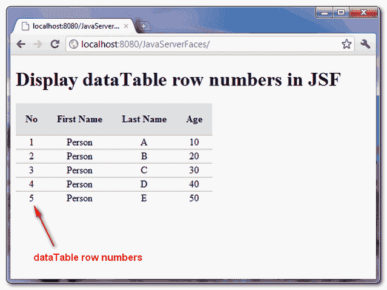

# 如何在 JSF 显示数据表的行号

> 原文：<http://web.archive.org/web/20230101150211/http://www.mkyong.com/jsf2/how-to-display-datatable-row-numbers-in-jsf/>

JSF 数据表不包含任何显示当前选定行号的方法。但是，您可以使用**javax . faces . model . data model**类来破解它，该类有一个 **getRowIndex()** 方法来返回当前选择的行号。

## JSF +数据模型

下面是一个 JSF 2.0 的例子，展示了如何使用 DataModel 返回当前选中的行号。

freestar.config.enabled_slots.push({ placementName: "mkyong_incontent_1", slotId: "mkyong_incontent_1" });

## 1.受管 Bean

一个名为“person”的托管 bean，并展示了如何使用 DataModel 来保存 person 对象的列表。

```java
 package com.mkyong;

import java.io.Serializable;
import javax.faces.bean.ManagedBean;
import javax.faces.bean.SessionScoped;
import javax.faces.model.ArrayDataModel;
import javax.faces.model.DataModel;

@ManagedBean(name="person")
@SessionScoped
public class PersonBean implements Serializable{

	private static final long serialVersionUID = 1L;

	private static final Person[] personList = new Person[]{

		new Person("Person", "A", 10),
		new Person("Person", "B", 20),
		new Person("Person", "C", 30),
		new Person("Person", "D", 40),
		new Person("Person", "E", 50)

	};

	/* To get the row numbers, use dataModel instead
	public Person[] getPersonList() {

		return personList;

	}
	*/

	private DataModel<Person> person = new ArrayDataModel<Person>(personList);

	public DataModel<Person> getPersonList() {

		return person;

	}

	public static class Person{

		String firstName;
		String lastName;
		int age;

		public Person(String firstName, String lastName, int age) {
			super();
			this.firstName = firstName;
			this.lastName = lastName;
			this.age = age;
		}

		//getter and setter methods 
	}
} 
```

## 2.JSF·佩奇

显示使用 DataModel " **rowIndex** "返回当前选定行号的 0 索引的 JSP 页面。

```java
 <?xml version="1.0" encoding="UTF-8"?>
<!DOCTYPE html PUBLIC "-//W3C//DTD XHTML 1.0 Transitional//EN" 
"http://www.w3.org/TR/xhtml1/DTD/xhtml1-transitional.dtd">
<html    
      xmlns:h="http://java.sun.com/jsf/html"
      xmlns:f="http://java.sun.com/jsf/core"
      xmlns:ui="http://java.sun.com/jsf/facelets"
      >
    <h:head>
    	<h:outputStylesheet library="css" name="table-style.css"  />
    </h:head>
    <h:body>

    	<h1>Display dataTable row numbers in JSF</h1>

    	   <h:dataTable value="#{person.personList}" var="p"
    		styleClass="person-table"
    		headerClass="person-table-header"
    		rowClasses="person-table-odd-row,person-table-even-row"
    	   >

		<h:column>

    			<!-- display currently selected row number -->
    			<f:facet name="header">No</f:facet>
    			#{person.personList.rowIndex + 1}

    		</h:column>

    		<h:column>

    			<f:facet name="header">First Name</f:facet>
    			#{p.firstName}

    		</h:column>

    		<h:column>

    			<f:facet name="header">Last Name</f:facet>
    			#{p.lastName}

    		</h:column>

    		<h:column>

    			<f:facet name="header">Age</f:facet>
    			#{p.age}

    		</h:column>

    	   </h:dataTable>

    </h:body>
</html> 
```

## 3.演示




## 下载源代码

Download It – [JSF-2-DataTable-RowNumbers-Example.zip](http://web.archive.org/web/20210210180639/http://www.mkyong.com/wp-content/uploads/2010/10/JSF-2-DataTable-RowNumbers-Example.zip) (10KB)

## 参考

1.  JSF 数据模型 JavaDoc
2.  [JSF 数组数据模型 JavaDoc](http://web.archive.org/web/20210210180639/https://javaserverfaces.dev.java.net/nonav/docs/2.0/javadocs/javax/faces/model/ArrayDataModel.html)

Tags : [datatable](http://web.archive.org/web/20210210180639/https://mkyong.com/tag/datatable/) [jsf2](http://web.archive.org/web/20210210180639/https://mkyong.com/tag/jsf2/)freestar.config.enabled_slots.push({ placementName: "mkyong_leaderboard_btf", slotId: "mkyong_leaderboard_btf" });<input type="hidden" id="mkyong-current-postId" value="7424">