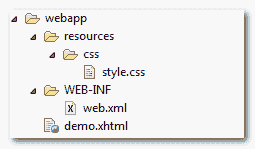

# 如何在 JSF 中包含级联样式表(CSS)

> 原文：<http://web.archive.org/web/20230101150211/http://www.mkyong.com/jsf2/how-to-include-cascading-style-sheets-css-in-jsf/>

在 JSF 2.0 中，你可以使用`<h:outputStylesheet />`输出一个 css 文件。

举个例子，

```java
 <h:outputStylesheet library="css" name="style.css"  /> 
```

它将生成以下 HTML 输出…

```java
 <link type="text/css" rel="stylesheet" 
	href="/JavaServerFaces/faces/javax.faces.resource/style.css?ln=css" /> 
```

## JSF 输出样式表示例

一个例子展示了使用 JSF 2 `<h:outputStylesheet />`渲染一个“style.css”文件，定位到“`resources/css`文件夹，见下图:

<noscript></noscript>


JSF 文件

```java
 <?xml version="1.0" encoding="UTF-8"?>
<!DOCTYPE html PUBLIC "-//W3C//DTD XHTML 1.0 Transitional//EN" 
"http://www.w3.org/TR/xhtml1/DTD/xhtml1-transitional.dtd">
<html    
      xmlns:h="http://java.sun.com/jsf/html"
      >
    <h:head></h:head>
    <h:body>

    	<h1>JSF 2 outputStylesheet example</h1>

    	<h:outputStylesheet library="css" name="style.css"  />

    	<div class="red">This is red color</div>

    </h:body>

</html> 
```

它将生成以下 HTML 输出

```java
 <?xml version="1.0" encoding="UTF-8"?>
<!DOCTYPE html PUBLIC "-//W3C//DTD XHTML 1.0 Transitional//EN" 
"http://www.w3.org/TR/xhtml1/DTD/xhtml1-transitional.dtd">
<html >
	<head>
		<link type="text/css" rel="stylesheet" 
		  href="/JavaServerFaces/faces/javax.faces.resource/style.css?ln=css" />
	</head>

	<body>

    	   <h1>JSF 2 outputStylesheet example</h1>

    	   <div class="red">This is red color</div>

	</body>

</html> 
```

**Warning**
When render CSS file via `<h:outputStylesheet />` tag, remember put the `<h:head />` tag as well; Otherwise the css file will not be included.

## 下载源代码

Download It – [JSF-2-outputStylesheet-Example.zip](http://web.archive.org/web/20210108083156/http://www.mkyong.com/wp-content/uploads/2010/10/JSF-2-outputStylesheet-Example.zip) (9KB)

#### 参考资料

1.  [JSF < h:输出样式表/ > JavaDoc](http://web.archive.org/web/20210108083156/https://javaserverfaces.dev.java.net/nonav/docs/2.0/pdldocs/facelets/h/outputStylesheet.html)
2.  [JSF2 resource library](http://web.archive.org/web/20210108083156/http://www.mkyong.com/jsf2/resources-library-in-jsf-2-0/)

标签:[css](http://web.archive.org/web/20210108083156/https://mkyong.com/tag/css/)[JSF 2](http://web.archive.org/web/20210108083156/https://mkyong.com/tag/jsf2/)<input type="hidden" id="mkyong-current-postId" value="7209">

### 相关文章

[jQuery-如何获取 CSS 类名为 an](/web/20210108083156/https://www.mkyong.com/jquery/jquery-how-to-get-element-with-css-class-name-and-id/) 

*   Dynamic removal of CSS class in [How to hide and display tabcon](/web/20210108083156/https://www.mkyong.com/jquery/how-to-use-css-and-jquery-to-hide-and-show-tab-content/) using CSS and jQuery
*   [Customize jQuery plug-in and CSS to show and hide C](/web/20210108083156/https://www.mkyong.com/jquery/custom-jquery-plugin-and-css-to-display-and-hide-content/)
*   [How to detect different IE versions? -Condition](/web/20210108083156/https://www.mkyong.com/css/how-do-detect-different-ie-version-conditional-comments/)

*   [ CSS padding attribute setting
*   [JSF 2.0 tutorial](/web/20210108083156/https://www.mkyong.com/tutorials/jsf-2-0-tutorials/)
*   [JSF 2 预渲染阀 103](/web/20210108083156/https://www.mkyong.com/jsf2/jsf-2-prerenderviewevent-example/)
*   [ JSF multi-component verifier 2.0
*   [Example of JSF2 multi-choice list box](/web/20210108083156/https://www.mkyong.com/jsf2/jsf-2-multiple-select-listbox-example/)