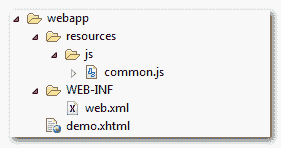

# 如何在 JSF 中包含 JavaScript 文件

> 原文：<http://web.archive.org/web/20230101150211/http://www.mkyong.com/jsf2/how-to-include-javascript-file-in-jsf/>

在 JSF 2.0 中，你可以使用`<h:outputScript />`标签来呈现一个 HTML“脚本”元素，并将它链接到一个 js 文件。

举个例子，

```java
 <h:outputScript library="js" name="common.js" /> 
```

它将生成以下 HTML 输出…

```java
 <script type="text/javascript" 
  	src="/JavaServerFaces/faces/javax.faces.resource/common.js?ln=js">
</script> 
```

## JSF 输出脚本示例

一个例子展示了如何使用`<h:outputScript />`来渲染一个`common.js`，见下图:




JSF 文件

```java
 <?xml version="1.0" encoding="UTF-8"?>
<!DOCTYPE html PUBLIC "-//W3C//DTD XHTML 1.0 Transitional//EN" 
"http://www.w3.org/TR/xhtml1/DTD/xhtml1-transitional.dtd">
<html    
      xmlns:h="http://java.sun.com/jsf/html"
      >
    <h:head></h:head>
    <h:body>

    	<h1>JSF 2 outputScript example</h1>

    	<h:outputScript library="js" name="common.js" />

    </h:body>
</html> 
```

它将生成以下 HTML 输出

```java
 <?xml version="1.0" encoding="UTF-8"?>
<!DOCTYPE html PUBLIC "-//W3C//DTD XHTML 1.0 Transitional//EN" 
"http://www.w3.org/TR/xhtml1/DTD/xhtml1-transitional.dtd">
<html >

   <head></head>

   <body>

     <h1>JSF 2 outputScript example</h1>

     <script type="text/javascript" 
       src="/JavaServerFaces/faces/javax.faces.resource/common.js?ln=js">
     </script>

   </body>
</html> 
```

JS 文件将呈现在放置 JSF `<h:outputScript />`标签的地方。

## 目标属性

此外，您可以使用“目标”属性来控制 js 文件的输出位置。

1.  target = " head "–显示在 HTML head 标签的顶部。
2.  target = " body "–显示在 body 标签的末尾。
3.  无目标–显示在放置标签的位置。

例如

```java
 <h:outputScript library="js" name="common.js" target="body" /> 
```

它将生成以下 HTML 输出

```java
 <?xml version="1.0" encoding="UTF-8"?>
<!DOCTYPE html PUBLIC "-//W3C//DTD XHTML 1.0 Transitional//EN" 
"http://www.w3.org/TR/xhtml1/DTD/xhtml1-transitional.dtd">
<html >

   <head>

   </head>

   <body> 	
     <h1>JSF 2 outputScript example</h1>

	<script type="text/javascript" 
	   src="/JavaServerFaces/faces/javax.faces.resource/common.js?ln=js">
	</script>
   </body>

</html> 
```