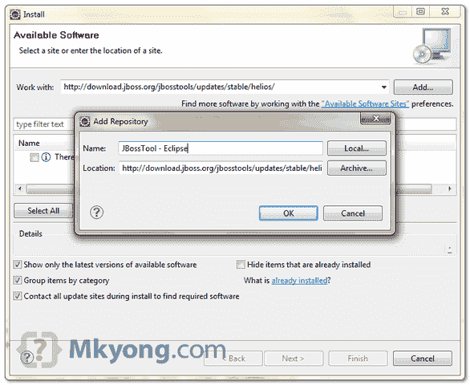
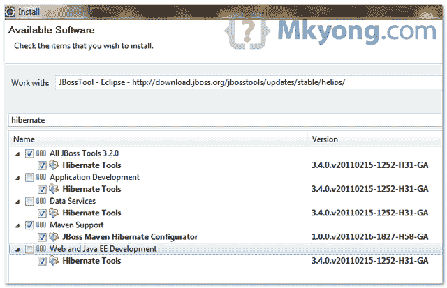
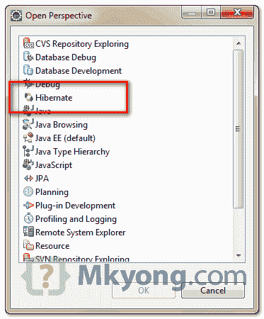

# 如何在 Eclipse IDE 中安装 Hibernate / JBoss 工具

> 原文：<http://web.archive.org/web/20230101150211/http://www.mkyong.com/hibernate/how-to-install-hibernate-tools-in-eclipse-ide/>

Hibernate Tools 对于 Java 开发人员来说是一个方便的工具，可以用来生成乏味的 Hibernate 相关的东西，比如映射文件和注释代码。常见的用例是从数据库表生成 Hibernate 模型类、hbm 映射文件或注释代码的“逆向工程”特性。

**Note**
Hibernate Tools is bundled as the core component of JBoss Tools. So, after installed JBoss tools, you installed the Hibernate tools as well.

这里有一个指南向您展示如何在 Eclipse IDE 中安装 Hibernate / JBoss 工具。

## 1.了解要下载的 Eclipse & JBoss 工具版本

首先，您必须为您的 Eclipse IDE 找到正确版本的 Hibernate/JBoss 工具。点击此处-[http://www.jboss.org/tools/download](http://web.archive.org/web/20210109132243/http://www.jboss.org/tools/download)下载可用的组合版本。

举个例子，

1.  如果您使用的是 Eclipse 3.6 / Helios，请下载 JBoss Tools 3.2
2.  如果您使用的是 Eclipse 3.5 / Galileo，请下载 JBoss Tools 3.1

## 2.JBoss 工具的 Eclipse 更新站点

指向你的正确版本，右键复制 JBoss 工具的 Eclipse 更新站点。对于 Eclipse 3.6，URL 是“*http://download.jboss.org/jbosstools/updates/stable/helios/*

## 3.安装它

在 Eclipse IDE 的菜单栏中，选择“**帮助**”>”**安装新软件…** ，放入 Eclipse 更新站点的 URL。

<noscript></noscript>

在过滤器框中键入“ **hibernate** ”，列出 hibernate 工具所需的组件。选择所有的 **Hibernate Tools** 组件，点击下一步下载。

<noscript></noscript>

**Warning**
Do not select all components, it will take much longer time download many unnecessary components. You want Hibernate tools only, not others.

## 4.重启 Eclipse

下载过程完成后，重启 Eclipse 以使其生效。

## 5.确认

如果 Hibernate tools 安装正确，您可以在**窗口**>>**打开透视图**>>**其他**中看到 **Hibernate 透视图**。

<noscript></noscript>

完成了。

## 参考

1.  [http://www.hibernate.org/subprojects/tools.html](http://web.archive.org/web/20210109132243/http://www.hibernate.org/subprojects/tools.html)
2.  [http://www.jboss.org/tools/download](http://web.archive.org/web/20210109132243/http://www.jboss.org/tools/download)

Tags : [hibernate](http://web.archive.org/web/20210109132243/https://mkyong.com/tag/hibernate/) [hibernate tools](http://web.archive.org/web/20210109132243/https://mkyong.com/tag/hibernate-tools/)<input type="hidden" id="mkyong-current-postId" value="2378">

### 相关文章

*   [如何生成 Hibernate 映射文件& annotati](/web/20210109132243/https://mkyong.com/hibernate/how-to-generate-code-with-hibernate-tools/)
*   [Java . lang . classnotfoundexception:org . object web . as](/web/20210109132243/https://mkyong.com/java/java-lang-classnotfoundexception-org-objectweb-asm-type/)
*   为什么我的项目选择 Hibernate？
*   [记住序数参数是从 1 开始的！-嗨](/web/20210109132243/https://mkyong.com/hibernate/remember-that-ordinal-parameters-are-1-based-hibernatetemplate/)
*   [如何显示 hibernate sql 参数值- P6](/web/20210109132243/https://mkyong.com/hibernate/how-to-display-hibernate-sql-parameter-values-solution/)

*   [如何在 Hibernate - Logback 中配置日志记录](/web/20210109132243/https://mkyong.com/hibernate/how-to-configure-logging-in-hibernate-logback/)
*   [org . hibernate . annotation 异常:未知 Id.gene](/web/20210109132243/https://mkyong.com/hibernate/org-hibernate-annotationexception-unknown-id-generator/)
*   [Maven 3+Hibernate 3.6+Oracle 11g 示例(XML](/web/20210109132243/https://mkyong.com/hibernate/maven-3-hibernate-3-6-oracle-11g-example-xml-mapping/)
*   [休眠-类型注释配置为 de](/web/20210109132243/https://mkyong.com/hibernate/hibernate-the-type-annotationconfiguration-is-deprecated/)
*   [Maven 2 + Hibernate 3.2 + MySQL 示例(XML Mappi](/web/20210109132243/https://mkyong.com/hibernate/quick-start-maven-hibernate-mysql-example/)