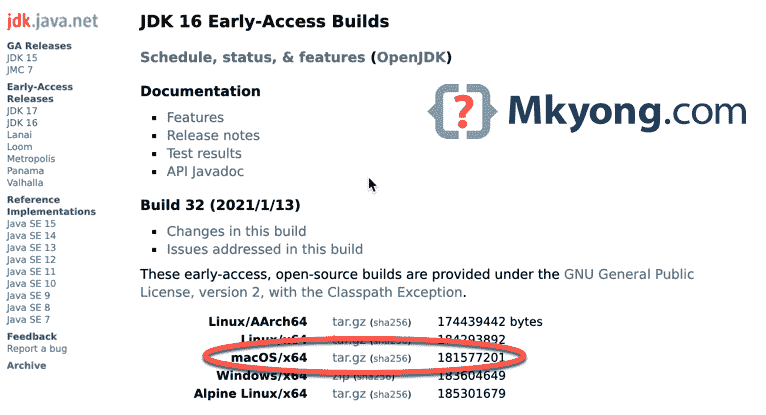

# 如何在 macOS 上安装 Java JDK

> 原文：<http://web.archive.org/web/20230101150211/https://mkyong.com/java/how-to-install-java-on-mac-osx/>

本文展示了如何在 macOS 上安装 Java JDK，家酿软件包管理器，手动安装，以及在不同 JDK 版本之间切换。

测试对象

*   马斯科 11 号
*   自制软件 2.7.4
*   JDK 8，14，16，16(采用 OpenJDK 和 OpenJDK)

主题

1.  [自制在 macOS 上安装最新的 Java(open JDK)](#homebrew-install-latest-java-on-macos)
2.  [自制在 macOS 上安装 Java 8(open JDK)](#homebrew-install-java-8-on-macos)
3.  [家酿在 macOS 上安装指定的 Java(AdoptOpenJDK)](#homebrew-install-a-specified-java-adoptopenjdk-on-macos)
4.  [在 macOS 上手动安装 Java(早期版本)](#manual-install-java-early-access-builds-on-macos)
5.  [在不同的 JDK 版本之间切换](#switch-between-different-jdk-versions)

在撰写本文时，最新的 JDK GA 是 JDK 15，早期的访问版本是 JDK 16。

**注意**
从 macOS 10.15 Catalina 开始，默认终端 shell 从 [bash](http://web.archive.org/web/20221225035418/https://en.wikipedia.org/wiki/Bash_(Unix_shell)) (Bourne-again shell)切换到 [zsh](http://web.archive.org/web/20221225035418/https://en.wikipedia.org/wiki/Z_shell) (Z shell)。我们应该将`~/.bash_profile`或`~/.bashrc`中的所有启动脚本和环境变量移到`~/.zshenv`或`~/.zshrc`。

还有，读这个 [Zsh 启动文件](http://web.archive.org/web/20221225035418/http://zsh.sourceforge.net/Intro/intro_3.html)。

## 1。自制软件在 macOS 上安装最新的 Java

1.1 安装和升级[自制软件](http://web.archive.org/web/20221225035418/https://brew.sh/)。

1.2 `brew search java`查找所有可用的 Java 相关公式。

Terminal

```java
 % brew search java      

==> Formulae
app-engine-java           java                      javacc                    jslint4java               pdftk-java
google-java-format        java11                    javarepl                  libreadline-java 
```

1.3 `brew info`显示配方详情。

`java`公式总是包含最新的 Java JDK (OpenJDK) GA 版本；在撰写本文时，最新的 GA 是 JDK 15。

Terminal

```java
 % brew info java

openjdk: stable 15.0.1 (bottled) [keg-only]
Development kit for the Java programming language
https://openjdk.java.net/
/usr/local/Cellar/openjdk/15.0.1 (614 files, 324.9MB)
  Poured from bottle on 2020-12-09 at 09:06:07
From: https://github.com/Homebrew/homebrew-core/blob/HEAD/Formula/openjdk.rb
License: Cannot Represent 
```

`java11`公式包含 Java 11 LTS 版本。

Terminal

```java
 % brew info java11  

openjdk@11: stable 11.0.9 (bottled) [keg-only]
Development kit for the Java programming language
https://openjdk.java.net/
Not installed
From: https://github.com/Homebrew/homebrew-core/blob/HEAD/Formula/openjdk@11.rb
License: GPL-2.0-only 
```

1.4 `brew install java`安装最新的 JDK 15。

Terminal

```java
 % brew info java 
```

1.5 家酿在哪里安装 java？
家酿在`/usr/local/Cellar/openjdk/`安装了 JDK 文件和目录，`/usr/local/opt/openjdk`的符号链接指向最新的 Java `15.0.1`版本。

Terminal

```java
 % ls -lsa /usr/local/Cellar/openjdk/      

total 0
0 drwxr-xr-x   3 mkyong  staff    96 Dec  9 09:06 .
0 drwxrwxr-x  69 mkyong  admin  2208 Jan 15 15:35 ..
0 drwxr-xr-x   9 mkyong  staff   288 Jan 15 16:47 15.0.1

% ls -lsa /usr/local/opt/openjdk
0 lrwxr-xr-x  1 mkyong  admin  24 Dec  9 09:06 /usr/local/opt/openjdk -> ../Cellar/openjdk/15.0.1 
```

1.6`java`配方为[桶专用](http://web.archive.org/web/20221225035418/https://docs.brew.sh/FAQ#what-does-keg-only-mean)，即安装在`/usr/local/Cellar`但不链接到`/usr/local/bin`或`/Library/Java/JavaVirtualMachines/`等地(macOS `/usr/bin/java`包装)。

为了让 macOS `/usr/bin/java`包装器找到已安装的 JDK，我们在`/Library/Java/JavaVirtualMachines/`手动创建一个符号链接。

Terminal

```java
 % sudo ln -sfn /usr/local/opt/openjdk/libexec/openjdk.jdk /Library/Java/JavaVirtualMachines/openjdk.jdk 
```

1.7 搞定。

Terminal

```java
 % java -version

openjdk version "15.0.1" 2020-10-20
OpenJDK Runtime Environment (build 15.0.1+9)
OpenJDK 64-Bit Server VM (build 15.0.1+9, mixed mode, sharing) 
```

## 2。自制在 macOS 上安装 Java 8

2.1 安装并升级[自制软件](http://web.archive.org/web/20221225035418/https://brew.sh/)。

2.2`brew search java`没有`java8`？

Terminal

```java
 % brew search java        
==> Formulae
app-engine-java           java                      javacc                    jslint4java               pdftk-java
google-java-format        java11                    javarepl                  libreadline-java 
```

2.3 Java 8 在`openjdk@8`公式处可用。`openjdk`和`java`公式一样，总是包含最新的 JDK GA 版本；`openjdk@11`与`java11`公式相同，包含 JDK 11。

Terminal

```java
 % brew search openjdk
==> Formulae
openjdk                                   openjdk@11                                  openjdk@8 
```

2.4 我们可以使用`openjdk@8`公式在 macOS 上安装 Java 8。

Terminal

```java
 % brew install openjdk@8 
```

2.5`openjdk@8`也是[专用桶](http://web.archive.org/web/20221225035418/https://docs.brew.sh/FAQ#what-does-keg-only-mean)；我们需要创建一个符号链接，以便 macOS `java`包装器能够找到它。

Terminal

```java
 % sudo ln -sfn /usr/local/opt/openjdk@8/libexec/openjdk.jdk /Library/Java/JavaVirtualMachines/openjdk-8.jdk 
```

2.6 搞定。

Terminal

```java
 % java -version

openjdk version "1.8.0_275"
OpenJDK Runtime Environment (build 1.8.0_275-bre_2020_11_16_15_09-b00)
OpenJDK 64-Bit Server VM (build 25.275-b00, mixed mode) 
```

2.7 如果我们安装了多个 Java 版本会怎样？

Terminal

```java
 ls -lsah /Library/Java/JavaVirtualMachines/               

openjdk-8.jdk -> /usr/local/opt/openjdk@8/libexec/openjdk.jdk
openjdk.jdk -> /usr/local/opt/openjdk/libexec/openjdk.jdk 
```

我们可以在`~/.zshrc`更新`$PATH`，这样 macOS 就可以找到正确安装的 Java。

Terminal

```java
 % java -version

openjdk version "15.0.1" 2020-10-20
OpenJDK Runtime Environment (build 15.0.1+9)
OpenJDK 64-Bit Server VM (build 15.0.1+9, mixed mode, sharing)

% echo 'export PATH="/usr/local/opt/openjdk@8/bin:$PATH"' >> ~/.zshrc  

% source ~/.zshrc

% java -version

openjdk version "1.8.0_275"
OpenJDK Runtime Environment (build 1.8.0_275-bre_2020_11_16_15_09-b00)
OpenJDK 64-Bit Server VM (build 25.275-b00, mixed mode) 
```

**$JAVA_HOME**
或者，我们可以在 macOS 上设置 [`$JAVA_HOME`环境变量。](/web/20221225035418/https://mkyong.com/java/how-to-set-java_home-environment-variable-on-mac-os-x/)

## 3。家酿在 macOS 上安装指定的 Java (AdoptOpenJDK)。

[adoptopenjdk/openjdk](http://web.archive.org/web/20221225035418/https://github.com/AdoptOpenJDK/homebrew-openjdk) tap 包含了很多不同的 JDK (AdoptOpenJDK)版本。

3.1 新增`tap`(第三方库)`adoptopenjdk/openjdk`。

Terminal

```java
 % brew tap adoptopenjdk/openjdk 
```

3.2 搜索相关的`adoptopenjdk`公式。

Terminal

```java
 % brew search adoptopenjdk

==> Casks
adoptopenjdk                              adoptopenjdk12-openj9                     adoptopenjdk14-openj9-large
adoptopenjdk-jre                          adoptopenjdk12-openj9-jre                 adoptopenjdk15
adoptopenjdk-openj9                       adoptopenjdk12-openj9-jre-large           adoptopenjdk15-jre
adoptopenjdk-openj9-jre                   adoptopenjdk12-openj9-large               adoptopenjdk15-openj9
adoptopenjdk-openj9-jre-large             adoptopenjdk13                            adoptopenjdk15-openj9-jre
adoptopenjdk-openj9-large                 adoptopenjdk13-jre                        adoptopenjdk15-openj9-jre-large
adoptopenjdk10                            adoptopenjdk13-openj9                     adoptopenjdk15-openj9-large
adoptopenjdk11                            adoptopenjdk13-openj9-jre                 adoptopenjdk8
adoptopenjdk11-jre                        adoptopenjdk13-openj9-jre-large           adoptopenjdk8
adoptopenjdk11-openj9                     adoptopenjdk13-openj9-large               adoptopenjdk8-jre
adoptopenjdk11-openj9-jre                 adoptopenjdk14                            adoptopenjdk8-openj9
adoptopenjdk11-openj9-jre-large           adoptopenjdk14-jre                        adoptopenjdk8-openj9-jre
adoptopenjdk11-openj9-large               adoptopenjdk14-openj9                     adoptopenjdk8-openj9-jre-large
adoptopenjdk12                            adoptopenjdk14-openj9-jre                 adoptopenjdk8-openj9-large
adoptopenjdk12-jre                        adoptopenjdk14-openj9-jre-large           adoptopenjdk9 
```

3.3 我们选择`adoptopenjdk14`公式来安装 JDK 14。

Terminal

```java
 % brew install adoptopenjdk14

installer: Package name is AdoptOpenJDK
installer: Installing at base path /
installer: The install was successful.
package-id: net.adoptopenjdk.14.jdk
version: 14.0.2+12
volume: /
location: Library/Java/JavaVirtualMachines/adoptopenjdk-14.jdk
install-time: 1610720586
adoptopenjdk14 was successfully installed! 
```

3.4`adoptopenjdk`公式直接在`/Library/Java/JavaVirtualMachines/`中创建 JDK 家。

Terminal

```java
 % ls -lsa /Library/Java/JavaVirtualMachines/

adoptopenjdk-14.jdk
openjdk-8.jdk -> /usr/local/opt/openjdk@8/libexec/openjdk.jdk
openjdk.jdk -> /usr/local/opt/openjdk/libexec/openjdk.jdk 
```

3.5 由于 JDK 家已经在`/Library/Java/JavaVirtualMachines/`中，我们不需要创建任何符号链接，只需导出`$PATH`并指向正确的`adoptopenjdk-14.jdk`。

Terminal

```java
 % echo 'export PATH="/Library/Java/JavaVirtualMachines/adoptopenjdk-14.jdk/Contents/Home/bin:$PATH"' >> ~/.zshrc

% source ~/.zshrc

% java -version
openjdk version "14.0.2" 2020-07-14
OpenJDK Runtime Environment AdoptOpenJDK (build 14.0.2+12)
OpenJDK 64-Bit Server VM AdoptOpenJDK (build 14.0.2+12, mixed mode, sharing) 
```

**注**
也读这个[切换 adoptopenjdk 桶使用 pkg #73145](http://web.archive.org/web/20221225035418/https://github.com/Homebrew/homebrew-cask/pull/73145)

## 4。在 macOS 上手动安装 Java(早期版本)。

出于某些原因，我们需要在 macOS 上手动安装 Java:

*   反自制，开发者爱控制一切。
*   JDK 版本不存在于自制软件库中，不像早期访问版本或甲骨文 JDK。

在撰写本文时，JDK 早期使用的版本是 JDK 16 号。

4.1 访问 [JDK 16 早期访问构建网站](http://web.archive.org/web/20221225035418/https://jdk.java.net/16/)并下载 JDK。



4.2 将下载的`tar.gz`文件提取到`/Library/Java/JavaVirtualMachines`

Terminal

```java
 % sudo tar xvzf ~/Downloads/openjdk-16-ea+32_osx-x64_bin.tar.gz -C /Library/Java/JavaVirtualMachines

% ls -lsa /Library/Java/JavaVirtualMachines

adoptopenjdk-14.jdk
jdk-16.jdk
openjdk-8.jdk -> /usr/local/opt/openjdk@8/libexec/openjdk.jdk
openjdk.jdk -> /usr/local/opt/openjdk/libexec/openjdk.jdk 
```

4.3 更新`$PATH`并指向`/Library/Java/JavaVirtualMachines/jdk-16.jdk`

Terminal

```java
 % echo 'export PATH="/Library/Java/JavaVirtualMachines/jdk-16.jdk/Contents/Home/bin:$PATH"' >> ~/.zshrc 
```

4.4 测试 JDK 16。

Terminal

```java
 % source ~/.zshrc

% java -version
openjdk version "16-ea" 2021-03-16
OpenJDK Runtime Environment (build 16-ea+32-2190)
OpenJDK 64-Bit Server VM (build 16-ea+32-2190, mixed mode, sharing) 
```

完成了。

## 5。在不同的 JDK 版本之间切换

从上面的例子 1 到例子 4，我们已经在 macOS 上安装了四个 JDK 版本。

5.1 列出 macOS 上的所有 JDK 版本。

Terminal

```java
 % /usr/libexec/java_home -V

Matching Java Virtual Machines (4):
  16 (x86_64) "Oracle Corporation" - "OpenJDK 16-ea" /Library/Java/JavaVirtualMachines/jdk-16.jdk/Contents/Home
  15.0.1 (x86_64) "UNDEFINED" - "OpenJDK 15.0.1" /usr/local/Cellar/openjdk/15.0.1/libexec/openjdk.jdk/Contents/Home
  14.0.2 (x86_64) "AdoptOpenJDK" - "AdoptOpenJDK 14" /Library/Java/JavaVirtualMachines/adoptopenjdk-14.jdk/Contents/Home
  1.8.0_275 (x86_64) "UNDEFINED" - "OpenJDK 8" /usr/local/Cellar/openjdk@8/1.8.0+275/libexec/openjdk.jdk/Contents/Home
/Library/Java/JavaVirtualMachines/jdk-16.jdk/Contents/Home

% ls -lsa /Library/Java/JavaVirtualMachines

adoptopenjdk-14.jdk
jdk-16.jdk
openjdk-8.jdk -> /usr/local/opt/openjdk@8/libexec/openjdk.jdk
openjdk.jdk -> /usr/local/opt/openjdk/libexec/openjdk.jdk 
```

5.2 在`~/.zshrc`(MAC OS 10.15 Catalina 及以上)或`~/.bashrc`(MAC OS 10.15 Catalina 之前)中增加以下功能。

~/.zshrc

```java
 jdk() {
      version=$1
      unset JAVA_HOME;
      export JAVA_HOME=$(/usr/libexec/java_home -v"$version");
      java -version
} 
```

如果文件`~/.zshrc`不存在，创建它。

5.3 生成`~/.zshrc`以反映变化。

Terminal

```java
 % source ~/.zshrc 
```

5.4 在不同的 JDK 版本之间切换。

Terminal

```java
 % java -version
openjdk version "16-ea" 2021-03-16
OpenJDK Runtime Environment (build 16-ea+32-2190)
OpenJDK 64-Bit Server VM (build 16-ea+32-2190, mixed mode, sharing)

% jdk 1.8
openjdk version "1.8.0_275"
OpenJDK Runtime Environment (build 1.8.0_275-bre_2020_11_16_15_09-b00)
OpenJDK 64-Bit Server VM (build 25.275-b00, mixed mode)

% jdk 14
openjdk version "14.0.2" 2020-07-14
OpenJDK Runtime Environment AdoptOpenJDK (build 14.0.2+12)
OpenJDK 64-Bit Server VM AdoptOpenJDK (build 14.0.2+12, mixed mode, sharing)

% jdk 15
openjdk version "15.0.1" 2020-10-20
OpenJDK Runtime Environment (build 15.0.1+9)
OpenJDK 64-Bit Server VM (build 15.0.1+9, mixed mode, sharing)

% jdk 16
openjdk version "16-ea" 2021-03-16
OpenJDK Runtime Environment (build 16-ea+32-2190)
OpenJDK 64-Bit Server VM (build 16-ea+32-2190, mixed mode, sharing) 
```

**延伸阅读**
如何在 macOS 上设置 [`$JAVA_HOME`环境变量。](/web/20221225035418/https://mkyong.com/java/how-to-set-java_home-environment-variable-on-mac-os-x/)

## 参考文献

*   [什么应该/不应该进去。zshenv，。zshrc，。兹洛金，。zprofile，。zlogout？](http://web.archive.org/web/20221225035418/https://unix.stackexchange.com/questions/71253/what-should-shouldnt-go-in-zshenv-zshrc-zlogin-zprofile-zlogout)
*   [维基百科 macOS](http://web.archive.org/web/20221225035418/https://en.wikipedia.org/wiki/MacOS)
*   [自制](http://web.archive.org/web/20221225035418/https://brew.sh/)
*   [AdoptOpenJDK–自制水龙头](http://web.archive.org/web/20221225035418/https://github.com/AdoptOpenJDK/homebrew-openjdk)
*   [如何在 Mac OSX 上安装 Maven](http://web.archive.org/web/20221225035418/https://mkyong.com/maven/install-maven-on-mac-osx/)
*   [Zsh 启动文件](http://web.archive.org/web/20221225035418/http://zsh.sourceforge.net/Intro/intro_3.html)

<input type="hidden" id="mkyong-current-postId" value="15526">