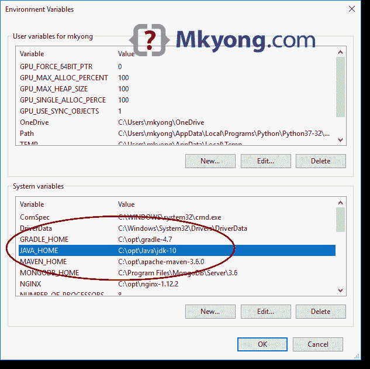
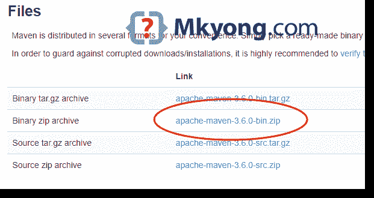
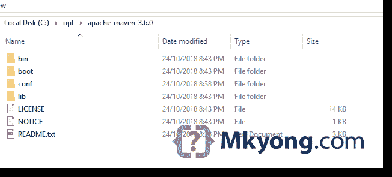
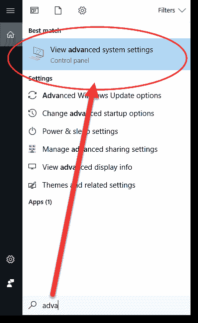
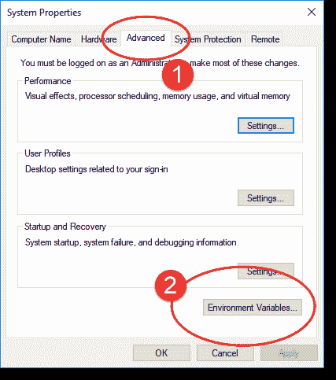
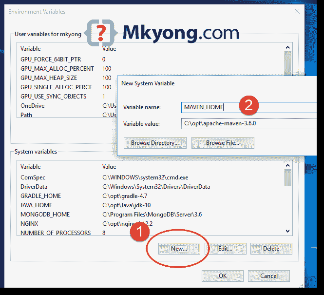
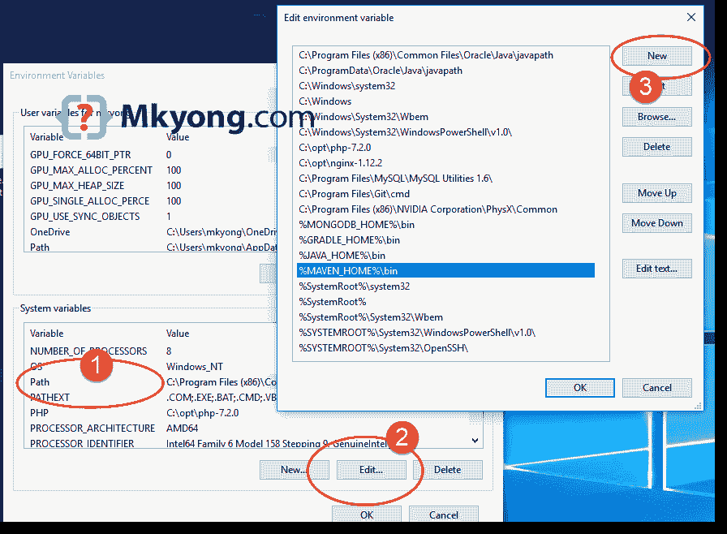

# 如何在 Windows 上安装 Maven

> 原文：<http://web.archive.org/web/20230101150211/https://www.mkyong.com/maven/how-to-install-maven-in-windows/>

要在 Windows 上安装 [Apache Maven](http://web.archive.org/web/20221119051918/https://maven.apache.org/) ，您只需要下载 Maven 的 zip 文件，将其解压缩到一个文件夹中，并配置 Windows 环境变量。

测试对象:

1.  JDK 10
2.  Maven 3.6
3.  Windows 10

**Note**

1.  Maven 3.3+需要 JDK 1.7+版本
2.  Maven 3.2 需要 JDK 1.6 以上版本
3.  Maven 3.0/3.1 需要 JDK 1.5 以上版本

## 1.JDK 和 JAVA_HOME

确保安装了 JDK，并且配置了`JAVA_HOME`环境变量。

**Note**
Please read this how to add [JAVA_HOME on Windows 10](http://web.archive.org/web/20221119051918/https://www.mkyong.com/java/how-to-set-java_home-on-windows-10/)

## 2.下载 Apache Maven

2.1 访问 [Maven 官网](http://web.archive.org/web/20221119051918/https://maven.apache.org/download.cgi)，下载 Maven zip 文件，例如:`apache-maven-3.6.0-bin.zip`。



2.2 解压到一个文件夹。在本文中，我们使用`c:\opt\apache-maven-3.6.0`

**Note**
That’s all, just download and unzip, installation is NOT required.

## 3.添加 MAVEN_HOME 系统变量

添加一个`MAVEN_HOME`系统变量，并将其指向 Maven 文件夹。

3.1 按 Windows 键，键入`adva`并点击`View advanced system settings`



3.2 在系统属性对话框中，选择`Advanced`选项卡并点击`Environment Variables...`按钮。



3.3 在“环境变量”对话框中，`System variables`，点击`New...`按钮，添加一个`MAVEN_HOME`变量并指向`c:\opt\apache-maven-3.6.0`



## 4.将%MAVEN_HOME%\bin 添加到路径

在系统变量中，找到`PATH`，点击`Edit...`按钮。在“编辑环境变量”对话框中，点击`New`按钮并添加此`%MAVEN_HOME%\bin`



## 5.确认

完成后，启动一个新的命令提示符，键入`mvn –version`:

```java
 C:\Users\mkyong>mvn -version
Apache Maven 3.6.0 (97c98ec64a1fdfee7767ce5ffb20918da4f719f3; 2018-10-25T02:41:47+08:00)
Maven home: C:\opt\apache-maven-3.6.0\bin\..
Java version: 10.0.1, vendor: Oracle Corporation, runtime: C:\opt\Java\jdk-10
Default locale: en_MY, platform encoding: Cp1252
OS name: "windows 10", version: "10.0", arch: "amd64", family: "windows"

C:\Users\mkyong>echo %MAVEN_HOME%
C:\opt\apache-maven-3.6.0 
```

Apache Maven 已成功安装在 Windows 上。

## 6.常见问题

6.1“mvn”不被识别为内部或外部命令？

```java
 > mvn -version
'mvn' is not recognized as an internal or external command,
operable program or batch file. 
```

**答:**参考步骤 4，确保`%MAVEN_HOME%\bin`被添加到`PATH`系统变量中。

6.2 未正确定义 JAVA_HOME 环境变量

```java
 > mvn -version
The JAVA_HOME environment variable is not defined correctly
This environment variable is needed to run this program
NB: JAVA_HOME should point to a JDK not a JRE 
```

**答:**参考步骤 2，确保安装了 JDK，并且配置了`JAVA_HOME`系统变量。

## 参考

1.  [如何在 Windows 10 上添加 JAVA _ HOME](http://web.archive.org/web/20221119051918/https://www.mkyong.com/java/how-to-set-java_home-on-windows-10/)

<input type="hidden" id="mkyong-current-postId" value="2099">