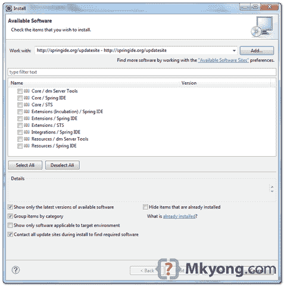
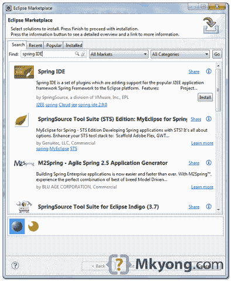

# 如何在 Eclipse 中安装 Spring IDE

> 原文：<http://web.archive.org/web/20230101150211/http://www.mkyong.com/spring/how-to-install-spring-ide-in-eclipse/>

Spring IDE 是一个非常有用的图形用户界面工具，增加了对 Spring 框架的支持。在本教程中，我们将向您展示在 Eclipse 中安装 Spring IDE 的两种方法。

本教程中使用的版本:

1.  Spring IDE 2.9
2.  Eclipse 3.7

**Spring IDE or SpringSource Tool Suite (STS)?**
Refer to this [Spring IDE vs STS pdf file](http://web.archive.org/web/20190210101641/http://download.springsource.com/release/STS/doc/STS-feature_comparison.pdf) for feature comparison. Personally, I go for Spring IDE for one reason – just can’t let go my existing Eclipse, too many plugins installed.

## 1.安装新软件

经典方式，Eclipse IDE，点击**帮助**->-**安装新软件** …。键入“【http://springide.org/updatesite】”访问 Spring IDE 更新站点。

选择您想要安装的所有 Spring IDE 特性。

完成后需要很长时间来安装和重启 Eclipse。

 ## 2.Eclipse 市场

这是更好的方法，因为你不需要记住很长的 Spring ide 更新 URL。在 Eclipse IDE 中，点击“**帮助**”->”**Eclipse market place**，输入“ **Spring IDE** ，按照向导完成安装。

同样，安装和重启 Eclipse 需要很长时间。

 ## 参考

1.  [http://www.springsource.com/developer/sts](http://web.archive.org/web/20190210101641/http://www.springsource.com/developer/sts)
2.  [http://marketplace.eclipse.org/content/spring-ide](http://web.archive.org/web/20190210101641/http://marketplace.eclipse.org/content/spring-ide)
3.  [http://download . springsource . com/release/STS/doc/STS-feature _ comparison . pdf](http://web.archive.org/web/20190210101641/http://download.springsource.com/release/STS/doc/STS-feature_comparison.pdf)

[eclipse](http://web.archive.org/web/20190210101641/http://www.mkyong.com/tag/eclipse/) [spring](http://web.archive.org/web/20190210101641/http://www.mkyong.com/tag/spring/) [spring ide](http://web.archive.org/web/20190210101641/http://www.mkyong.com/tag/spring-ide/)

