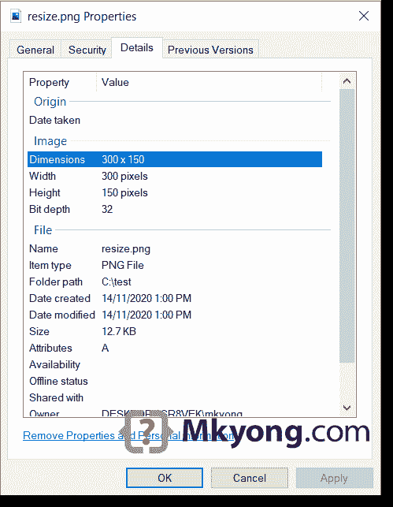

# 如何在 Java 中调整图像的大小

> 原文：<http://web.archive.org/web/20230101150211/https://mkyong.com/java/how-to-resize-an-image-in-java/>

本文展示了在 Java 中调整图像大小(创建缩略图)的两种方法。

## 1.原始图像，544×184

下面是一个[谷歌标志图像](http://web.archive.org/web/20220619003336/https://www.google.cimg/branding/googlelogo/2x/googlelogo_color_272x92dp.png)，宽度，高度`544x184`，以及文件大小`14k`。稍后，我们将调整下图的宽度和高度为新的`300x150`。


## 2.调整图像大小或创建缩略图。

这个 Java 示例使用`bufferedImage.getScaledInstance()` API 来调整图像的大小，我们可以传入不同的[图像的提示](http://web.archive.org/web/20220619003336/https://docs.oracle.com/en/java/javase/11/docs/api/java.desktop/java/awt/Image.html)来生成不同比例的图像。

```java
 BufferedImage bi = ImageIO.read(input);
  Image newResizedImage = bi.getScaledInstance(width, height, Image.SCALE_SMOOTH); 
```

我们可以通过以下图像的提示来配置缩放图像的质量:

1.  `SCALE_AREA_AVERAGING`–面积平均图像缩放算法。
2.  `SCALE_DEFAULT`–默认图像缩放算法
3.  `SCALE_FAST`–优先考虑缩放速度，而不是缩放图像的平滑度。
4.  `SCALE_REPLICATE`–包含在 ReplicateScaleFilter 类中的图像缩放算法
5.  `SCALE_SMOOTH`–优先考虑缩放图像的平滑度，而不是缩放速度。

下面的例子展示了如何将上面的图片(Google logo)调整到新的宽度和高度`300x150`。

ResizeImage1.java

```java
 package com.mkyong.io.image;

import javax.imageio.ImageIO;
import java.awt.*;
import java.awt.image.BufferedImage;
import java.io.FileInputStream;
import java.io.IOException;
import java.io.InputStream;
import java.nio.file.Path;
import java.nio.file.Paths;

public class ResizeImage1 {

    private static final int IMG_WIDTH = 300;
    private static final int IMG_HEIGHT = 150;

    public static void main(String[] args) throws IOException {

        Path source = Paths.get("C:\\test\\google.png");
        Path target = Paths.get("C:\\test\\resize.png");

        try (InputStream is = new FileInputStream(source.toFile())) {
            resize(is, target, IMG_WIDTH, IMG_HEIGHT);
        }

    }

    private static void resize(InputStream input, Path target,
                                   int width, int height) throws IOException {

        BufferedImage originalImage = ImageIO.read(input);

        /**
         * SCALE_AREA_AVERAGING
         * SCALE_DEFAULT
         * SCALE_FAST
         * SCALE_REPLICATE
         * SCALE_SMOOTH
         */
        Image newResizedImage = originalImage
              .getScaledInstance(width, height, Image.SCALE_SMOOTH);

        String s = target.getFileName().toString();
        String fileExtension = s.substring(s.lastIndexOf(".") + 1);

        // we want image in png format
        ImageIO.write(convertToBufferedImage(newResizedImage),
                fileExtension, target.toFile());

    }

    public static BufferedImage convertToBufferedImage(Image img) {

        if (img instanceof BufferedImage) {
            return (BufferedImage) img;
        }

        // Create a buffered image with transparency
        BufferedImage bi = new BufferedImage(
                img.getWidth(null), img.getHeight(null),
                BufferedImage.TYPE_INT_ARGB);

        Graphics2D graphics2D = bi.createGraphics();
        graphics2D.drawImage(img, 0, 0, null);
        graphics2D.dispose();

        return bi;
    }

} 
```

查看以下输出:

### 形象。缩放 _ 平滑

```java
 bufferedImage.getScaledInstance(width, height, Image.SCALE_SMOOTH); 
```

下图显示了`Image.SCALE_SMOOTH`提示的使用，新缩放后的图像文件大小为`14kb`，与原始图像相同，但质量非常好。


### 形象。缩放 _ 默认

```java
 bufferedImage.getScaledInstance(width, height, Image.SCALE_DEFAULT); 
```

下图显示了`Image.SCALE_DEFAULT`提示的使用，新缩放图像的文件大小为`9kb`。


### 形象。快速缩放

```java
 bufferedImage.getScaledInstance(width, height, Image.SCALE_FAST); 
```

下图显示了`Image.SCALE_FAST`提示的使用，新缩放图像的文件大小为`9kb`。


尝试不同的提示来适应你的情况。

## 3.Java 调整图像大小，绘制新图像。

这个例子更加灵活(可以定制背景、颜色过滤或者[渲染提示](http://web.archive.org/web/20220619003336/https://docs.oracle.com/en/java/javase/11/docs/api/java.desktop/java/awt/RenderingHints.html))，但是需要额外的编码来绘制一个新调整大小的图像。

```java
 BufferedImage originalImage = ImageIO.read(input);

  BufferedImage newResizedImage
        = new BufferedImage(width, height, BufferedImage.TYPE_INT_ARGB);

  Graphics2D g = newResizedImage.createGraphics();

  // background transparent
  g.setComposite(AlphaComposite.Src);
  g.fillRect(0, 0, width, height);

  // configure RenderingHints
  g.setRenderingHint(RenderingHints.KEY_RENDERING,
                        RenderingHints.VALUE_RENDER_QUALITY);

  // draw a new image
  g.drawImage(originalImage, 0, 0, IMG_WIDTH, IMG_HEIGHT, null); 
```

一个完整的调整图像大小的 Java 例子。

ResizeImage2.java

```java
 package com.mkyong.io.image;

import javax.imageio.ImageIO;
import java.awt.*;
import java.awt.image.BufferedImage;
import java.io.FileInputStream;
import java.io.IOException;
import java.io.InputStream;
import java.nio.file.Path;
import java.nio.file.Paths;

public class ResizeImage2 {

    private static final int IMG_WIDTH = 300;
    private static final int IMG_HEIGHT = 150;

    public static void main(String[] args) throws IOException {

        Path source = Paths.get("C:\\test\\google.png");
        Path target = Paths.get("C:\\test\\resize.png");

        try (InputStream is = new FileInputStream(source.toFile())) {
            resize(is, target, IMG_WIDTH, IMG_HEIGHT);
        }

    }

    private static void resize(InputStream input, Path target,
                               int width, int height) throws IOException {

        // read an image to BufferedImage for processing
        BufferedImage originalImage = ImageIO.read(input);

        // create a new BufferedImage for drawing
        BufferedImage newResizedImage
              = new BufferedImage(width, height, BufferedImage.TYPE_INT_ARGB);
        Graphics2D g = newResizedImage.createGraphics();

        //g.setBackground(Color.WHITE);
        //g.setPaint(Color.WHITE);

        // background transparent
        g.setComposite(AlphaComposite.Src);
        g.fillRect(0, 0, width, height);

        /* try addRenderingHints()
        // VALUE_RENDER_DEFAULT = good tradeoff of performance vs quality
        // VALUE_RENDER_SPEED   = prefer speed
        // VALUE_RENDER_QUALITY = prefer quality
        g.setRenderingHint(RenderingHints.KEY_RENDERING,
                              RenderingHints.VALUE_RENDER_QUALITY);

        // controls how image pixels are filtered or resampled
        g.setRenderingHint(RenderingHints.KEY_INTERPOLATION,
                              RenderingHints.VALUE_INTERPOLATION_BILINEAR);

        // antialiasing, on
        g.setRenderingHint(RenderingHints.KEY_ANTIALIASING,
                              RenderingHints.VALUE_ANTIALIAS_ON);*/

        Map<RenderingHints.Key,Object> hints = new HashMap<>();
        hints.put(RenderingHints.KEY_RENDERING, RenderingHints.VALUE_RENDER_QUALITY);
        hints.put(RenderingHints.KEY_INTERPOLATION, RenderingHints.VALUE_INTERPOLATION_BILINEAR);
        hints.put(RenderingHints.KEY_ANTIALIASING, RenderingHints.VALUE_ANTIALIAS_ON);
        g.addRenderingHints(hints);

        // puts the original image into the newResizedImage
        g.drawImage(originalImage, 0, 0, IMG_WIDTH, IMG_HEIGHT, null);
        g.dispose();

        // get file extension
        String s = target.getFileName().toString();
        String fileExtension = s.substring(s.lastIndexOf(".") + 1);

        // we want image in png format
        ImageIO.write(newResizedImage, fileExtension, target.toFile());

    }

} 
```

新缩放图像的文件大小约为`13kb`。


`300x150`的新宽度和高度



尝试不同的提示，找出缩放速度和缩放图像平滑度的正确平衡。

## 下载源代码

$ git 克隆[https://github.com/mkyong/core-java](http://web.archive.org/web/20220619003336/https://github.com/mkyong/core-java)

$ cd java-io

## 参考

*   [Java ImageIO](http://web.archive.org/web/20220619003336/https://docs.oracle.com/en/java/javase/11/docs/api/java.desktop/javax/imageio/package-summary.html)
*   [Java 教程–使用图像](http://web.archive.org/web/20220619003336/https://docs.oracle.com/javase/tutorial/img/index.html)
*   [图片 JavaDoc](http://web.archive.org/web/20220619003336/https://docs.oracle.com/en/java/javase/11/docs/api/java.desktop/java/awt/Image.html)
*   [渲染提示 JavaDoc](http://web.archive.org/web/20220619003336/https://docs.oracle.com/en/java/javase/11/docs/api/java.desktop/java/awt/RenderingHints.html)
*   [如何在 Java 中读写图像](/web/20220619003336/https://mkyong.com/java/how-to-write-an-image-to-file-imageio/)

<input type="hidden" id="mkyong-current-postId" value="1815">