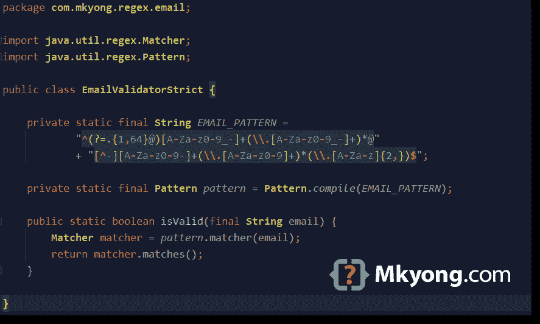

# Java 电子邮件正则表达式示例

> 原文：<http://web.archive.org/web/20230101150211/http://www.mkyong.com/regular-expressions/how-to-validate-email-address-with-regular-expression/>



一个[邮件地址](http://web.archive.org/web/20221017085122/https://en.wikipedia.org/wiki/Email_address)的格式是`local-part@domain`。看看这个邮件地址`mkyong@example.com`

1.  `local-part` = mkyong
2.  `@` = @
3.  `domain`:example.com

电子邮件地址的正式定义在 [RFC 5322](http://web.archive.org/web/20221017085122/https://tools.ietf.org/html/rfc5322) 和 [RFC 3696](http://web.archive.org/web/20221017085122/https://tools.ietf.org/html/rfc3696) 中。然而，本文不会遵循上述 RFC 进行电子邮件验证。官方邮件“local-part”太复杂(支持太多特殊字符、符号、注释、引号……)无法通过 regex 实现。大多数公司或网站选择只允许某些特殊字符，如点(。)、下划线(_)和连字符(-)。

本文将展示几种通过正则表达式验证电子邮件地址的方法:

1.  电子邮件正则表达式–简单
2.  电子邮件正则表达式-严格
3.  电子邮件正则表达式–非拉丁或 Unicode 字符
4.  Apache Commons 验证 1.7 版

## 1.电子邮件正则表达式-简单验证。

这个例子使用一个简单的正则表达式`^(.+)@(\S+)$`来验证一个电子邮件地址。它检查以确保电子邮件至少包含一个字符，一个@符号，然后是一个非空白字符。

电子邮件正则表达式解释:

```java
 ^                       #start of the line
  (                     #   start of group #1
    .+                  #     any characters (matches Unicode), must contains one or more (+)
  )                     #   end of group   #1
    @                   #     must contains a "@" symbol
      (                 #         start of group #2
        \S+             #           non white space characters, must contains one or more (+)
      )                 #         end of group #2
$                       #end of the line 
```

1.1 使用上述正则表达式进行电子邮件验证的 Java 示例。

EmailValidatorSimple.java

```java
 package com.mkyong.regex.email;

import java.util.regex.Matcher;
import java.util.regex.Pattern;

public class EmailValidatorSimple {

    private static final String EMAIL_PATTERN = "^(.+)@(\\S+)$";

    private static final Pattern pattern = Pattern.compile(EMAIL_PATTERN);

    public static boolean isValid(final String email) {
        Matcher matcher = pattern.matcher(email);
        return matcher.matches();
    }

} 
```

1.2 下面是一个 JUnit 5 单元测试，测试一些有效和无效的邮件。

EmailValidatorSimpleTest.java

```java
 package com.mkyong.regex;

import com.mkyong.regex.email.EmailValidatorSimple;
import com.mkyong.regex.email.EmailValidatorStrict;
import org.junit.jupiter.params.ParameterizedTest;
import org.junit.jupiter.params.provider.MethodSource;

import java.util.stream.Stream;

import static org.junit.jupiter.api.Assertions.assertFalse;
import static org.junit.jupiter.api.Assertions.assertTrue;

public class EmailValidatorSimpleTest {

    @ParameterizedTest(name = "#{index} - Run test with email = {0}")
    @MethodSource("validEmailProvider")
    void test_email_valid(String email) {
        assertTrue(EmailValidatorSimple.isValid(email));
    }

    @ParameterizedTest(name = "#{index} - Run test with email = {0}")
    @MethodSource("invalidEmailProvider")
    void test_email_invalid(String email) {
        assertFalse(EmailValidatorSimple.isValid(email));
    }

    // Valid email addresses
    static Stream<String> validEmailProvider() {
        return Stream.of(
                "hello@example.com",                // simple
                "hello@example.co.uk",              // .co.uk
                "hello-.+_=#|@example.com",         // special characters
                "h@example.com",                    // local-part one letter
                "h@com",                            // domain one letter
                "我買@屋企.香港"                      // unicode, chinese characters
        );
    }

    // Invalid email addresses
    static Stream<String> invalidEmailProvider() {
        return Stream.of(
                "hello",                            // email need at least one @
                "hello@ "                           // domain cant end with space (whitespace)
        );
    }

} 
```

上面的电子邮件正则表达式没有检查太多，只过滤了奇怪或无效的电子邮件。此外，点匹配国际化或 Unicode 电子邮件地址。

## 2.电子邮件正则表达式-严格验证。

```java
 ^(?=.{1,64}@)[A-Za-z0-9_-]+(\\.[A-Za-z0-9_-]+)*@[^-][A-Za-z0-9-]+(\\.[A-Za-z0-9-]+)*(\\.[A-Za-z]{2,})$ 
```

这个电子邮件正则表达式有点复杂，它满足以下电子邮件要求:

`local-part`

1.  大写和小写拉丁字母 A 到 Z 和 A 到 Z
2.  数字 0 到 9
3.  允许点(。)、下划线(_)和连字符(-)
4.  点(。)不是第一个或最后一个字符
5.  点(。)不会连续出现，例如不允许出现 mkyong..yong@example.com
6.  最多 64 个字符

在电子邮件`local-part`中，许多像`#$%&'*+-/=?`这样的特殊字符在技术上是有效的，但大多数邮件服务器或 web 应用程序并不接受所有这些字符。此电子邮件正则表达式只接受一般的点(。)、下划线(_)和连字符(-)。

`domain`

1.  大写和小写拉丁字母 A 到 Z 和 A 到 Z
2.  数字 0 到 9
3.  连字符(-)不是第一个或最后一个字符
4.  点(。)不是第一个或最后一个字符
5.  点(。)不会连续出现
6.  tld 最少 2 个字符

**Note**
This email regex is not fully compliant with the [RFC 5322](http://web.archive.org/web/20221017085122/https://tools.ietf.org/html/rfc5322) or [RFC 3696](http://web.archive.org/web/20221017085122/https://tools.ietf.org/html/rfc3696). It follows some of the general guidelines on what is valid local-part and domain of an email address.

以下是有效电子邮件地址的示例。

```java
 hello@example.com
hello@example.co.uk             // .co.uk, 2 tld
hello-2020@example.com          // -
hello.2020@example.com          // .
hello_2020@example.com          // _
h@example.com                   // local-part one letter
h@example-example.com           // domain contains a hyphen -
h@example-example-example.com   // domain contains two hyphens - -
h@example.example-example.com   // domain contains . -
hello.world-2020@example.com    // local-part contains . - 
```

以下是无效电子邮件地址的示例。

```java
 hello                            // email need at least one @
hello@2020@example.com           // email doesn't allow more than one @
.hello@example.com               // local-part can't start with a dot .
hello.@example.com               // local-part can't end with a dot .
hello..world@example.com         // local part don't allow dot . appear consecutively
hello!+2020@example.com          // local-part don't allow special characters like !+
hello@example.a                  // domain tld min 2 chars
hello@example..com               // domain doesn't allow dot . appear consecutively
hello@.com                       // domain doesn't start with a dot .
hello@.com.                      // domain doesn't end with a dot .
hello@-example.com               // domain doesn't allow to start with a hyphen -
hello@example.com-               // domain doesn't allow to end with a hyphen -
hello@example_example.com        // domain doesn't allow underscore
1234567890123456789012345678901234567890123456789012345678901234xx@example.com // local part is longer than 64 characters 
```

再次访问电子邮件正则表达式。

```java
 ^(?=.{1,64}@)[A-Za-z0-9_-]+(\\.[A-Za-z0-9_-]+)*@[^-][A-Za-z0-9-]+(\\.[A-Za-z0-9-]+)*(\\.[A-Za-z]{2,})$ 
```

电子邮件正则表达式解释。

```java
 (?=.{1,64}@)            # local-part min 1 max 64

[A-Za-z0-9_-]+          # Start with chars in the bracket [ ], one or more (+)
                        # dot (.) not in the bracket[], it can't start with a dot (.)

(\\.[A-Za-z0-9_-]+)*	 # follow by a dot (.), then chars in the bracket [ ] one or more (+)
                        # * means this is optional
                        # this rule for two dots (.)

@                       # must contains a @ symbol

[^-]                    # domain can't start with a hyphen (-)

[A-Za-z0-9-]+           # Start with chars in the bracket [ ], one or more (+)     

(\\.[A-Za-z0-9-]+)*      # follow by a dot (.), optional

(\\.[A-Za-z]{2,})       # the last tld, chars in the bracket [ ], min 2 
```

2.1 使用上述正则表达式进行电子邮件验证的 Java 示例。

EmailValidatorStrict.java

```java
 package com.mkyong.regex.email;

import java.util.regex.Matcher;
import java.util.regex.Pattern;

public class EmailValidatorStrict {

    private static final String EMAIL_PATTERN =
            "^(?=.{1,64}@)[A-Za-z0-9_-]+(\\.[A-Za-z0-9_-]+)*@"
            + "[^-][A-Za-z0-9-]+(\\.[A-Za-z0-9-]+)*(\\.[A-Za-z]{2,})$";

    private static final Pattern pattern = Pattern.compile(EMAIL_PATTERN);

    public static boolean isValid(final String email) {
        Matcher matcher = pattern.matcher(email);
        return matcher.matches();
    }

} 
```

2.2 单元测试。

EmailValidatorStrictTest.java

```java
 package com.mkyong.regex;

import com.mkyong.regex.email.EmailValidatorStrict;
import org.junit.jupiter.params.ParameterizedTest;
import org.junit.jupiter.params.provider.MethodSource;

import java.util.stream.Stream;

import static org.junit.jupiter.api.Assertions.assertTrue;
import static org.junit.jupiter.api.Assertions.assertFalse;

public class EmailValidatorStrictTest {

    @ParameterizedTest(name = "#{index} - Run test with email = {0}")
    @MethodSource("validEmailProvider")
    void test_email_valid(String email) {
        assertTrue(EmailValidatorStrict.isValid(email));
    }

    @ParameterizedTest(name = "#{index} - Run test with email = {0}")
    @MethodSource("invalidEmailProvider")
    void test_email_invalid(String email) {
        assertFalse(EmailValidatorStrict.isValid(email));
    }

    // Valid email addresses
    static Stream<String> validEmailProvider() {
        return Stream.of(
                "hello@example.com",                // simple
                "hello@example.co.uk",              // .co.uk, 2 tld
                "hello-2020@example.com",           // -
                "hello.2020@example.com",           // .
                "hello_2020@example.com",           // _
                "h@example.com",                    // local-part one letter
                "h@example-example.com",            // domain contains a hyphen -
                "h@example-example-example.com",    // domain contains two hyphens - -
                "h@example.example-example.com",    // domain contains . -
                "hello.world-2020@example.com");    // local-part contains . -
    }

    // Invalid email addresses
    static Stream<String> invalidEmailProvider() {
        return Stream.of(
                "我買@屋企.香港",                     // this regex doesn't support Unicode
                "hello",                            // email need at least one @
                "hello@2020@example.com",           // email doesn't allow more than one @
                ".hello@example.com",               // local-part can't start with a dot .
                "hello.@example.com",               // local-part can't end with a dot .
                "hello..world@example.com",         // local part don't allow dot . appear consecutively
                "hello!+2020@example.com",          // local-part don't allow special characters like !+
                "hello@example.a",                  // domain tld min 2 chars
                "hello@example..com",               // domain doesn't allow dot . appear consecutively
                "hello@.com",                       // domain doesn't start with a dot .
                "hello@.com.",                      // domain doesn't end with a dot .
                "hello@-example.com",               // domain doesn't allow to start with a hyphen -
                "hello@example.com-",               // domain doesn't allow to end with a hyphen -
                "hello@example_example.com",        // domain doesn't allow underscore
                "1234567890123456789012345678901234567890123456789012345678901234xx@example.com"); // local part is longer than 64 characters
    }

} 
```

*另外，如果我们想支持额外的特殊字符，比如`local-part`中的`+=!$%|`，只要把它放在方括号[]* 中就可以了

```java
 [A-Za-z0-9_-+=!$%|] 
```

**注意**
请不要对邮件验证过于严格，因为它会拒绝许多有效的邮件。这个电子邮件正则表达式严格版本很好地平衡了大多数情况下被认为是有效的电子邮件。

*附:此电子邮件正则表达式严格版不支持 Unicode。*

## 3.电子邮件正则表达式–非拉丁或 Unicode 字符

为了让 regex 支持国际化、Unicode 或非拉丁文电子邮件地址，请尝试用一个`\p{L}`替换字符匹配`A-Za-z`。阅读这个 [Unicode 正则表达式](http://web.archive.org/web/20221017085122/https://www.regular-expressions.info/unicode.html)。

Unicode 电子邮件地址示例

```java
 "我買@屋企.香港",                     // chinese characters
"二ノ宮@黒川.日本",                   // Japanese characters 
```

下面的 regex 更新了以前的电子邮件 regex strict 版本，将`A-Za-z`替换为`\\p{L}`，以支持 Unicode 电子邮件地址。

```java
 ^(?=.{1,64}@)[\\p{L}0-9_-]+(\\.[\\p{L}0-9_-]+)*@[^-][\\p{L}0-9-]+(\\.[\\p{L}0-9-]+)*(\\.[\\p{L}]{2,})$ 
```

3.1 Java 电子邮件正则表达式验证，Unicode 版本。

EmailValidatorUnicode.java

```java
 package com.mkyong.regex.email;

import java.util.regex.Matcher;
import java.util.regex.Pattern;

public class EmailValidatorUnicode {

    private static final String EMAIL_PATTERN =
            "^(?=.{1,64}@)[\\p{L}0-9_-]+(\\.[\\p{L}0-9_-]+)*@"
            + "[^-][\\p{L}0-9-]+(\\.[\\p{L}0-9-]+)*(\\.[\\p{L}]{2,})$";

    private static final Pattern pattern = Pattern.compile(EMAIL_PATTERN);

    public static boolean isValid(final String email) {
        Matcher matcher = pattern.matcher(email);
        return matcher.matches();
    }

} 
```

3.2 单元测试。

```java
 @ParameterizedTest(name = "#{index} - Run test with email = {0}")
  @MethodSource("validEmailProvider")
  void test_email_valid(String email) {
      assertTrue(EmailValidatorUnicode.isValid(email));
  }

  // Valid email addresses
  static Stream<String> validEmailProvider() {
      return Stream.of(
              "hello@example.com",                // simple
              "hello@example.co.uk",              // .co.uk, 2 tld
              "hello-2020@example.com",           // -
              "hello.2020@example.com",           // .
              "hello_2020@example.com",           // _
              "h@example.com",                    // local-part one letter
              "h@example-example.com",            // domain contains a hyphen -
              "h@example-example-example.com",    // domain contains two hyphens - -
              "h@example.example-example.com",    // domain contains . -
              "hello.world-2020@example.com",     // local part contains . -
              "我買@屋企.香港",                     // chinese characters
              "二ノ宮@黒川.日本",                    // Japanese characters
              "δοκιμή@παράδειγμα.δοκιμή");        // Greek alphabet
  } 
```

## 4.Apache Commons 验证程序-电子邮件

这一次我们测试了 Apache Commons Validator 来验证一个电子邮件地址。

pom.xml

```java
 <dependency>
      <groupId>commons-validator</groupId>
      <artifactId>commons-validator</artifactId>
      <version>1.7</version>
  </dependency> 
```

*P . S`commons-validator-1.7.jar`的文件大小在 190KB 左右。*

在内部，`commons-validator`混合使用自定义代码和正则表达式来验证电子邮件地址。

EmailValidator.java

```java
 package org.apache.commons.validator.routines;

public class EmailValidator implements Serializable {

    //...

    public boolean isValid(String email) {
        if (email == null) {
            return false;
        }

        if (email.endsWith(".")) { // check this first - it's cheap!
            return false;
        }

        // Check the whole email address structure
        Matcher emailMatcher = EMAIL_PATTERN.matcher(email);
        if (!emailMatcher.matches()) {
            return false;
        }

        if (!isValidUser(emailMatcher.group(1))) {
            return false;
        }

        if (!isValidDomain(emailMatcher.group(2))) {
            return false;
        }

        return true;
    }

} 
```

4.1 使用 Apache Commons 验证器的 Java 电子邮件验证。

EmailValidatorApache.java

```java
 package com.mkyong.regex.email;

import org.apache.commons.validator.routines.EmailValidator;

public class EmailValidatorApache {

    //doesn't consider local addresses as valid.
    //default, allowLocal = false, allowTld = false
    private static final EmailValidator validator = EmailValidator.getInstance();

    //private static final EmailValidator validator = EmailValidator.getInstance(true);
    //private static final EmailValidator validator = EmailValidator.getInstance(true, true);

    public static boolean isValid(final String email) {
        return validator.isValid(email);
    }

} 
```

4.2 单元测试。

EmailValidatorApacheTest.java

```java
 package com.mkyong.regex;

import com.mkyong.regex.email.EmailValidatorApache;
import org.junit.jupiter.params.ParameterizedTest;
import org.junit.jupiter.params.provider.MethodSource;

import java.util.stream.Stream;

import static org.junit.jupiter.api.Assertions.assertFalse;
import static org.junit.jupiter.api.Assertions.assertTrue;

public class EmailValidatorApacheTest {

    @ParameterizedTest(name = "#{index} - Run test with email = {0}")
    @MethodSource("validEmailProvider")
    void test_email_valid(String email) {
        assertTrue(EmailValidatorApache.isValid(email));
    }

    @ParameterizedTest(name = "#{index} - Run test with email = {0}")
    @MethodSource("invalidEmailProvider")
    void test_email_invalid(String email) {
        assertFalse(EmailValidatorApache.isValid(email));
    }

    // Valid email addresses
    static Stream<String> validEmailProvider() {
        return Stream.of(
                "hello@example.com",                // simple
                "hello@example.co.uk",              // .co.uk, 2 tld
                "hello!#$%&'*+-/=?^_`{|}~2020@example.com",  // many special chars
                "h@example.com",                    // local-part one letter
                "h@example-example.com",            // domain contains a hyphen -
                "h@example-example-example.com",    // domain contains two hyphens - -
                "h@example.example-example.com",    // domain contains . -
                "hello.world-2020@example.com",     // local part contains . -
                "我買@屋企.香港");                   // Support Unicode
    }

    // Invalid email addresses
    static Stream<String> invalidEmailProvider() {
        return Stream.of(

                "hello",                            // email need at least one @
                "hello@2020@example.com",           // email don't allow more than one @
                ".hello@example.com",               // local-part can't start with a dot .
                "hello.@example.com",               // local-part can't end with a dot .
                "hello..world@example.com",         // local part don't allow dot . appear consecutively
                // apache supports many special characters
                //"hello!+2020@example.com",          // local-part don't allow special characters like !+
                "hello@example.a",                  // domain tld min 2 chars
                "hello@example..com",               // domain part don't allow dot . appear consecutively
                "hello@.com",                       // domain part don't start with a dot .
                "hello@.com.",                      // domain part don't end with a dot .
                "hello@-example.com",               // domain part don't allow to start with a hyphen -
                "hello@example.com-",               // domain part don't allow to end with a hyphen -
                "hello@example_example.com",        // domain part don't allow underscore
                "1234567890123456789012345678901234567890123456789012345678901234xx@example.com"); // local part is longer than 64 characters
    }

} 
```

比较上述电子邮件正则表达式严格版。这个`commons-validator`支持许多特殊字符，如`!#$%&'*+-/=?^_{|}~`，甚至是 Unicode 字符，并且符合示例 2 中定义的通用电子邮件准则。如果你不介意包含一个额外的 190KB 的库来验证电子邮件，这个`commons-validator`是一个不错的选择。

此`commons-validator`不完全符合 [RFC 5322](http://web.archive.org/web/20221017085122/https://tools.ietf.org/html/rfc5322) 或 [RFC 3696](http://web.archive.org/web/20221017085122/https://tools.ietf.org/html/rfc3696) 。

**注**

如果你对 RFC822 电子邮件正则表达式感兴趣，请访问这个 [RFC822:基于正则表达式的地址验证](http://web.archive.org/web/20221017085122/http://www.ex-parrot.com/~pdw/Mail-RFC822-Address.html)。

## 下载源代码

$ git 克隆[https://github.com/mkyong/core-java](http://web.archive.org/web/20221017085122/https://github.com/mkyong/core-java)

$ cd java-regex/email

## 参考

*   [电子邮件正则表达式](http://web.archive.org/web/20221017085122/https://www.regular-expressions.info/email.html)
*   [Unicode 正则表达式](http://web.archive.org/web/20221017085122/https://www.regular-expressions.info/unicode.html)
*   [维基百科电子邮件地址](http://web.archive.org/web/20221017085122/https://en.wikipedia.org/wiki/Email_address)
*   [JavaScript 电子邮件验证](http://web.archive.org/web/20221017085122/https://en.wikibooks.org/wiki/JavaScript/Best_practices)
*   [正则表达式\p{L}和\p{N}](http://web.archive.org/web/20221017085122/https://stackoverflow.com/questions/14891129/regular-expression-pl-and-pn)
*   [RFC822:基于正则表达式的地址验证](http://web.archive.org/web/20221017085122/http://www.ex-parrot.com/~pdw/Mail-RFC822-Address.html)
*   [JUnit 5 参数化测试](/web/20221017085122/https://mkyong.com/junit5/junit-5-parameterized-tests/)

<input type="hidden" id="mkyong-current-postId" value="1263">