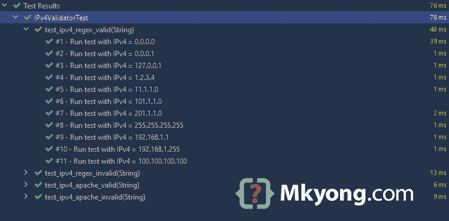

# Java IP 地址(IPv4)正则表达式示例

> 原文：<http://web.archive.org/web/20230101150211/http://www.mkyong.com/regular-expressions/how-to-validate-ip-address-with-regular-expression/>


本文主要讨论如何使用 regex 和 Apache Commons Validator 来验证 IP 地址( [IPv4](http://web.archive.org/web/20220805061357/https://en.wikipedia.org/wiki/IPv4) )。

这是总结。

1.  IPv4 正则表达式解释。
2.  Java IPv4 验证器，使用正则表达式。
3.  Java IPv4 验证器，使用`commons-validator-1.7`
4.  针对上述 IPv4 验证器的 JUnit 5 单元测试。

IPv4 正则表达式最终版本。

```java
 ^(([0-9]|[1-9][0-9]|1[0-9][0-9]|2[0-4][0-9]|25[0-5])(\.(?!$)|$)){4}$ 
```

```java
 # Explanation
(
  [0-9]         # 0-9
  |             # or
  [1-9][0-9]    # 10-99
  |             # or
  1[0-9][0-9]   # 100-199
  |             # or
  2[0-4][0-9]   # 200-249
  |             # or
  25[0-5]       # 250-255
)
(\.(?!$)|$))    # ensure IPv4 doesn't end with a dot
{4}             # 4 times. 
```

此正则表达式仅适用于 IPv4 地址。它不支持 IPv4 子网或 IPv6。

## 1.IPv4 正则表达式解释。

有效的 IPv4 范围是从`0.0.0.0`到`255.255.255.255`，我们需要创建一个正则表达式来确保范围`[0-255]`中的数字和点在正确的位置。

下面的 1.1 是第一个 IPv4 正则表达式。以后我们会把它进化成更好更短的版本。

```java
 // version 1 allow leading zero, 01.01.01.01
  private static final String IPV4_PATTERN_ALLOW_LEADING_ZERO =
            "^([01]?\\d\\d?|2[0-4]\\d|25[0-5])\\." +
            "([01]?\\d\\d?|2[0-4]\\d|25[0-5])\\." +
            "([01]?\\d\\d?|2[0-4]\\d|25[0-5])\\." +
            "([01]?\\d\\d?|2[0-4]\\d|25[0-5])$"; 
```

1.2 上面的正则表达式使用`\\d`来匹配数字`0-9`。然而，`\\d`也将匹配 Unicode 数字；出于安全原因，请使用`[0-9]`仅匹配 ASCII 码。

下面是 IPv4 正则表达式版本 2。

```java
 // version 2 , allow leading zero, 01.01.01.01
  private static final String IPV4_PATTERN_ALLOW_LEADING_ZERO =
            "^([01]?[0-9][0-9]?|2[0-4][0-9]|25[0-5])\\." +
            "([01]?[0-9][0-9]?|2[0-4][0-9]|25[0-5])\\." +
            "([01]?[0-9][0-9]?|2[0-4][0-9]|25[0-5])\\." +
            "([01]?[0-9][0-9]?|2[0-4][0-9]|25[0-5])$"; 
```

下面是对上述正则表达式的解释。

```java
 ^                       #  start of the line
  (                     #  start of group #1
    [01]?[0-9][0-9]?    #  can be one or two digits. If three digits appear, it must start either 0 or 1
    |                   #    ...or
    2[0-4][0-9]         #    start with 2, follow by 0-4 and end with any digit (2[0-4][0-9])
    |                   #    ...or
    25[0-5]             #    start with 2, follow by 5 and ends with 0-5 (25[0-5])
  )                     #  end of group  #1
  \\.                   #  follow by a dot "."
                        # repeat it 3 times (3x)
$                       # end of the line 
```

1.3 但是，版本 1 和版本 2 支持 IPv4 地址中的前导零，例如`01.01.01.01`。前导零是有效的 IPv4 地址吗？

下面是 IPv4 regex 版本 3；它不允许在 IPv4 地址中使用前导零。

```java
 // version 3, simple and easy to understand
  private static final String IPV4_PATTERN =
           "^([0-9]|[1-9][0-9]|1[0-9][0-9]|2[0-4][0-9]|25[0-5])\\." +
           "([0-9]|[1-9][0-9]|1[0-9][0-9]|2[0-4][0-9]|25[0-5])\\." +
           "([0-9]|[1-9][0-9]|1[0-9][0-9]|2[0-4][0-9]|25[0-5])\\." +
           "([0-9]|[1-9][0-9]|1[0-9][0-9]|2[0-4][0-9]|25[0-5])$"; 
```

下面是对上述正则表达式的解释；这是一个冗长乏味的正则表达式，但是可读性很强，非常容易理解。

```java
 (
  [0-9]         # 0-9
  |             # or
  [1-9][0-9]    # 10-99
  |             # or
  1[0-9][0-9]   # 100-199
  |             # or
  2[0-4][0-9]   # 200-249
  |             # or
  25[0-5]       # 250-255
)
\\.             # follow by a dot
                # repeat 3 times. 
```

下面的 1.4 是 IPv4 regex 版本 4；它的工作方式和上面的版本 3 一样，只是 regex 和 repeat `{3}`稍微短了一点。

```java
 // version 4
  private static final String IPV4_PATTERN =
            "^(([0-9]|[1-9][0-9]|1[0-9][0-9]|2[0-4][0-9]|25[0-5])\\.){3}" +
            "([0-9]|[1-9][0-9]|1[0-9][0-9]|2[0-4][0-9]|25[0-5])$" 
```

下面的 1.5 是 IPv4 regex 版本 5，一个最终版本。它的工作原理与第 3 版和第 4 版相同，但更短，并且额外增加了`(\\.(?!$)|$)`以确保 IPv4 不以点结束。

```java
 //version 5
  private static final String IPV4_PATTERN =
            "^(([0-9]|[1-9][0-9]|1[0-9][0-9]|2[0-4][0-9]|25[0-5])(\\.(?!$)|$)){4}$"; 
```

**注**
请参考下面的#4 单元测试，获取有效和无效 IPv4 地址的列表。

**Extra**
下面是一个短得多的 IPv4 regex 版本，仅供参考。不过我还是比较喜欢上面的 IPv4 regex 最终版 3 和版本 5。

```java
 // 25[0-5]        = 250-255
  // (2[0-4])[0-9]  = 200-249
  // (1[0-9])[0-9]  = 100-199
  // ([1-9])[0-9]   = 10-99
  // [0-9]          = 0-9
  // (\.(?!$))      = can't end with a dot
  private static final String IPV4_PATTERN_SHORTEST =
          "^((25[0-5]|(2[0-4]|1[0-9]|[1-9]|)[0-9])(\\.(?!$)|$)){4}$"; 
```

请不要使用你不了解的正则表达式。

## 2.Java IPv4 正则表达式验证器

下面是一个 Java IPv4 正则表达式验证器的例子。它使用上述 IPv4 regex 版本 5 来验证 IPv4 地址。

IPv4ValidatorRegex.java

```java
 package com.mkyong.regex.ipv4;

import java.util.regex.Matcher;
import java.util.regex.Pattern;

public class IPv4ValidatorRegex {

    private static final String IPV4_PATTERN =
            "^(([0-9]|[1-9][0-9]|1[0-9][0-9]|2[0-4][0-9]|25[0-5])(\\.(?!$)|$)){4}$";

    private static final Pattern pattern = Pattern.compile(IPV4_PATTERN);

    public static boolean isValid(final String email) {
        Matcher matcher = pattern.matcher(email);
        return matcher.matches();
    }

} 
```

## 3.IPv4 验证器–Apache Commons 验证器

这个例子使用 [Apache Commons 验证器](http://web.archive.org/web/20220805061357/https://commons.apache.org/proper/commons-validator/)来验证 IPv4 地址。

pom.xml

```java
 <dependency>
      <groupId>commons-validator</groupId>
      <artifactId>commons-validator</artifactId>
      <version>1.7</version>
  </dependency> 
```

下面是另一个 Java IPv4 验证器，使用`commons-validator`API 来验证 IPv4 地址。

IPv4ValidatorApache.java

```java
 package com.mkyong.regex.ipv4;

import org.apache.commons.validator.routines.InetAddressValidator;

public class IPv4ValidatorApache {

    private static final InetAddressValidator validator
                              = InetAddressValidator.getInstance();

    public static boolean isValid(final String ip) {

        // only IPv4
        return validator.isValidInet4Address(ip);

        // IPv4 + IPv6
        // return validator.isValid(ip);

        // IPv6 only
        // return validator.isValidInet6Address(ip);
    }

} 
```

在内部，`InetAddressValidator`使用简单的正则表达式和手动检查来验证 IPv4 地址。

InetAddressValidator.java

```java
 public class InetAddressValidator implements Serializable {

  private static final String IPV4_REGEX =
              "^(\\d{1,3})\\.(\\d{1,3})\\.(\\d{1,3})\\.(\\d{1,3})$";

  //...

  public boolean isValidInet4Address(String inet4Address) {
      // verify that address conforms to generic IPv4 format
      String[] groups = ipv4Validator.match(inet4Address);

      if (groups == null) {
          return false;
      }

      // verify that address subgroups are legal
      for (String ipSegment : groups) {
          if (ipSegment == null || ipSegment.length() == 0) {
              return false;
          }

          int iIpSegment = 0;

          try {
              iIpSegment = Integer.parseInt(ipSegment);
          } catch(NumberFormatException e) {
              return false;
          }

          if (iIpSegment > IPV4_MAX_OCTET_VALUE) {
              return false;
          }

          if (ipSegment.length() > 1 && ipSegment.startsWith("0")) {
              return false;
          }

      }

      return true;
  } 
```

## 4.单元测试(JUnit 5)

下面是针对上述 Java 验证器的 JUnit 5 参数化测试——2 号 IPv4 正则表达式验证器和 3 号 Apache Commons 验证器。

pom.xml

```java
 <!-- JUnit 5 -->
  <dependency>
      <groupId>org.junit.jupiter</groupId>
      <artifactId>junit-jupiter-params</artifactId>
      <version>5.4.0</version>
      <scope>test</scope>
  </dependency> 
```

IPv4ValidatorTest.java

```java
 package com.mkyong.regex.ipv4;

import org.junit.jupiter.params.ParameterizedTest;
import org.junit.jupiter.params.provider.MethodSource;

import java.util.stream.Stream;

import static org.junit.jupiter.api.Assertions.assertFalse;
import static org.junit.jupiter.api.Assertions.assertTrue;

public class IPv4ValidatorTest {

    @ParameterizedTest(name = "#{index} - Run test with IPv4 = {0}")
    @MethodSource("validIPv4Provider")
    void test_ipv4_apache_valid(String ipv4) {
        assertTrue(IPv4ValidatorApache.isValid(ipv4));
    }

    @ParameterizedTest(name = "#{index} - Run test with IPv4 = {0}")
    @MethodSource("invalidIPv4Provider")
    void test_ipv4_apache_invalid(String ipv4) {
        assertFalse(IPv4ValidatorApache.isValid(ipv4));
    }

    @ParameterizedTest(name = "#{index} - Run test with IPv4 = {0}")
    @MethodSource("validIPv4Provider")
    void test_ipv4_regex_valid(String ipv4) {
        assertTrue(IPv4ValidatorRegex.isValid(ipv4));
    }

    @ParameterizedTest(name = "#{index} - Run test with IPv4 = {0}")
    @MethodSource("invalidIPv4Provider")
    void test_ipv4_regex_invalid(String ipv4) {
        assertFalse(IPv4ValidatorRegex.isValid(ipv4));
    }

    static Stream<String> validIPv4Provider() {
        return Stream.of(
                "0.0.0.0",
                "0.0.0.1",
                "127.0.0.1",
                "1.2.3.4",              // 0-9
                "11.1.1.0",             // 10-99
                "101.1.1.0",            // 100-199
                "201.1.1.0",            // 200-249
                "255.255.255.255",      // 250-255
                "192.168.1.1",
                "192.168.1.255",
                "100.100.100.100");
    }

    static Stream<String> invalidIPv4Provider() {
        return Stream.of(
                "000.000.000.000",          // leading 0
                "00.00.00.00",              // leading 0
                "1.2.3.04",                 // leading 0
                "1.02.03.4",                // leading 0
                "1.2",                      // 1 dot
                "1.2.3",                    // 2 dots
                "1.2.3.4.5",                // 4 dots
                "192.168.1.1.1",            // 4 dots
                "256.1.1.1",                // 256
                "1.256.1.1",                // 256
                "1.1.256.1",                // 256
                "1.1.1.256",                // 256
                "-100.1.1.1",               // -100
                "1.-100.1.1",               // -100
                "1.1.-100.1",               // -100
                "1.1.1.-100",               // -100
                "1...1",                    // empty between .
                "1..1",                     // empty between .
                "1.1.1.1.",                 // last .
                "");                        // empty
    }

} 
```

所有单元测试都通过了。



## 下载源代码

$ git 克隆[https://github.com/mkyong/core-java](http://web.archive.org/web/20220805061357/https://github.com/mkyong/core-java)

$ cd java-regex/ipv4

## 参考

*   [维基百科–IP 地址](http://web.archive.org/web/20220805061357/https://en.wikipedia.org/wiki/IP_address)
*   [维基百科–IP v4](http://web.archive.org/web/20220805061357/https://en.wikipedia.org/wiki/IPv4)
*   [如何找到或验证 IP 地址](http://web.archive.org/web/20220805061357/https://www.regular-expressions.info/ip.html)
*   [JUnit 5 参数化测试](/web/20220805061357/https://mkyong.com/junit5/junit-5-parameterized-tests/)

<input type="hidden" id="mkyong-current-postId" value="1986">