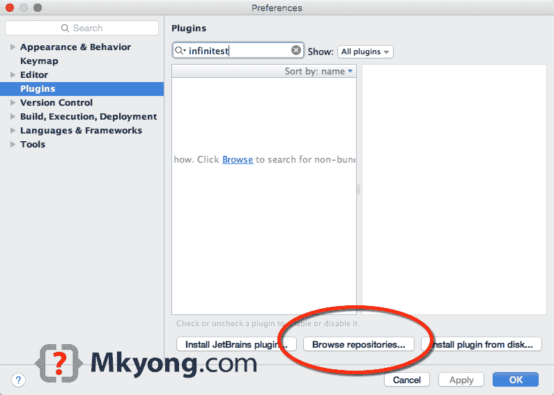
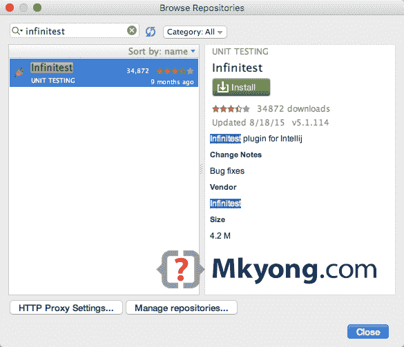
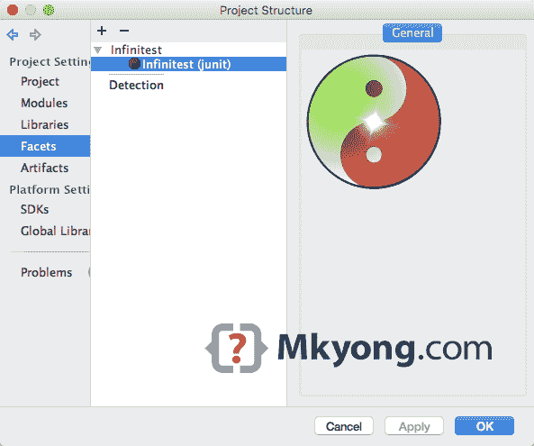
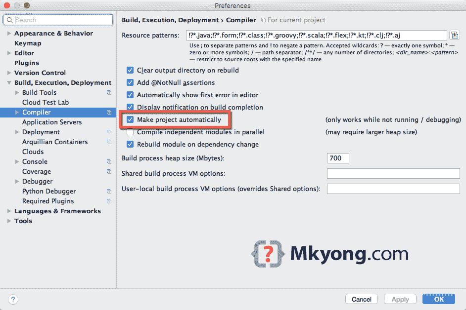
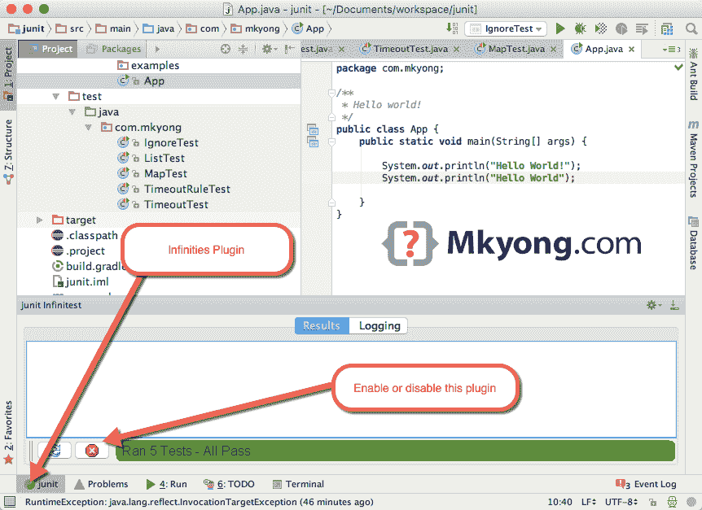

> 原文：<http://web.archive.org/web/20230101150211/http://www.mkyong.com/intellij/intellij-infinitest-continuous-testing/>

# Intellij + Infinitest 持续测试

Infinitest 是一个持续测试插件，它有助于自动运行测试。

## 1.在 IntelliJ 上安装

1.1 在插件中，点击“浏览存储库…”

1.2 键入“Infinitest”并单击“安装”按钮。

1.3 重启 Intellij IDEA。

 <ins class="adsbygoogle" style="display:block; text-align:center;" data-ad-format="fluid" data-ad-layout="in-article" data-ad-client="ca-pub-2836379775501347" data-ad-slot="6894224149">## 2.添加 Infinitest 方面

在项目结构/设置中，添加一个“Infinitest”方面。

 <ins class="adsbygoogle" style="display:block" data-ad-client="ca-pub-2836379775501347" data-ad-slot="8821506761" data-ad-format="auto" data-ad-region="mkyongregion">## 3.启用自动生成项目

3.1 默认情况下，Intellij 不会自动编译类，您需要手动启用它，以便“Infinitest”插件可以检测到变化并自动运行测试。

3.2 在项目设置或首选项中，选择【编译器】-->`Make project automatically`

## 4.连续测试

搞定，万事俱备，享受持续测试。

Infinitest 插件将在任何项目源代码被更改时运行所有测试类。
*如果一个测试类被修改，Infinitest 插件将自动运行当前修改的测试类。

**Note**
Please refer to this [Infinitest user guide](http://web.archive.org/web/20190223082347/https://infinitest.github.io/doc/user_guide.html) for more tips

## 参考

1.  [Infinitest 官方网站](http://web.archive.org/web/20190223082347/https://infinitest.github.io/)
2.  [JetBrains 插件库–Infinitest](http://web.archive.org/web/20190223082347/https://plugins.jetbrains.com/plugin/3146?pr=)
3.  [Intellij IDEA–如何自动构建项目](http://web.archive.org/web/20190223082347/http://www.mkyong.com/intellij/intellij-idea-how-to-build-project-automatically/)

[idea](http://web.archive.org/web/20190223082347/http://www.mkyong.com/tag/idea/) [test](http://web.archive.org/web/20190223082347/http://www.mkyong.com/tag/test/)

