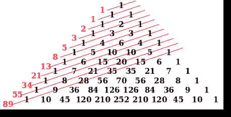

# Java 斐波那契示例

> 原文：<http://web.archive.org/web/20230101150211/https://mkyong.com/java/java-fibonacci-examples/>



> [斐波那契数](http://web.archive.org/web/20221205190724/https://en.wikipedia.org/wiki/Fibonacci_number)–前两个数字之后的每一个数字都是前两个数字的总和。

几个寻找斐波那契数列的 Java 例子。

## 1.Java 8 流

1.1 在 Java 8 中，我们可以像这样使用`Stream.iterate`来生成斐波那契数:

```java
 Stream.iterate(new int[]{0, 1}, t -> new int[]{t[1], t[0] + t[1]})
		.limit(10)
		.forEach(x -> System.out.println("{" + x[0] + "," + x[1] + "}")); 
```

输出

```java
 {0,1}
{1,1}
{1,2}
{2,3}
{3,5}
{5,8}
{8,13}
{13,21}
{21,34}
{34,55} 
```

*P.S 回顾一下上面的输出，第一个值就是我们想要的。*

1.2 最终版本。

```java
 Stream.iterate(new int[]{0, 1}, t -> new int[]{t[1], t[0] + t[1]})
		.limit(10)
		.map(t -> t[0])
		.forEach(x -> System.out.println(x)); 
```

输出

```java
 0
1
1
2
3
5
8
13
21
34 
```

1.3 对所有斐波纳契数列求和

```java
 int sum = Stream.iterate(new int[]{0, 1}, t -> new int[]{t[1], t[0] + t[1]})
		.limit(10)
		.map(t -> t[0])
		.mapToInt(Integer::intValue)
		.sum();

    System.out.println("Total : " + sum); 
```

输出

```java
 Total : 88 
```

1.4 用逗号连接。

```java
 String collect = Stream.iterate(new int[]{0, 1}, t -> new int[]{t[1], t[0] + t[1]})
                .limit(10)
                .map(t -> t[0])
                .map(String::valueOf) // convert to string
                .collect(Collectors.joining(", "));

        System.out.println("Result : " + collect); 
```

输出

```java
 Result : 0, 1, 1, 2, 3, 5, 8, 13, 21, 34 
```

1.5 创建斐波那契数列的函数。

```java
 package com.mkyong.concurrency;

import java.util.List;
import java.util.stream.Stream;

import static java.util.stream.Collectors.toList;

public class Fibonacci {

    public static List<Integer> getFibonacci(int series) {
        return Stream.iterate(new int[]{0, 1}, t -> new int[]{t[1], t[0] + t[1]})
                .limit(series)
                .map(n -> n[0])
                .collect(toList());
    }

    public static void main(String[] args) {

        List<Integer> fibonacci = getFibonacci(10);
        fibonacci.forEach(x -> System.out.println(x));

    }

} 
```

输出

```java
 0
1
1
2
3
5
8
13
21
34 
```

1.6 类型`int`和`long`不足以存储更大的斐波那契数。下面是寻找第一百万个斐波那契数列的`BigInteger`例子。

```java
 package com.mkyong.concurrency;

import java.math.BigInteger;
import java.util.stream.Stream;

public class Fibonacci {

    public static BigInteger getFibonacci(int series) {
        return Stream.iterate(new BigInteger[]{
                BigInteger.ZERO, BigInteger.ONE}, t -> new BigInteger[]{t[1], t[0].add(t[1])})
                .limit(series)
                .map(n -> n[1]) // find, we need n[1]
                .reduce((a, b) -> b).orElse(BigInteger.ZERO);

    }

    public static void main(String[] args) {
        System.out.println(Fibonacci.getFibonacci(1_000_000));
    }

} 
```

输出

```java
 1953282128707757731632014947596256332443... // 208,988 digits!!!, too long to display here 
```

## 2.递归循环

2.1 Java 递归循环例子，创建一个斐波那契数列。只适合演示，这个递归循环很慢。

Fibonacci.java

```java
 package com.mkyong.concurrency;

public class Fibonacci {

    public static int fib(int n) {
        if (n <= 1) return n;
        else return fib(n - 1) + fib(n - 2);
    }

    public static void main(String[] args) {

        for (int i = 0; i < 10; i++) {
            System.out.println(fib(i));
        }

    }

} 
```

输出

```java
 0
1
1
2
3
5
8
13
21
34 
```

2.2 工作原理？

```java
 fib(n) = fib(n - 1) + fib(n - 2);

fib(5) = fib(4) + fib(3);
fib(4) = fib(3) + fib(2);
fib(3) = fib(2) + fib(1);
fib(2) = fib(1) + fib(0);
fib(1) = 1
fib(0) = 1 
```

## 3.正常循环

3.1 Java 普通循环寻找斐波那契数列，简单易行。

Fibonacci.java

```java
 package com.mkyong.concurrency;

import java.math.BigInteger;

public class Fibonacci {

    public static int fib(int n) {
        if (n <= 1) return n;

        int previous = 0, next = 1, sum;

        for (int i = 2; i <= n; i++) {
            sum = previous;
            previous = next;
            next = sum + previous;
        }

        return next;
    }

    public static BigInteger fib2(int n) {
        if (n <= 1) return BigInteger.valueOf(n);

        BigInteger previous = BigInteger.ZERO, next = BigInteger.ONE, sum;

        for (int i = 2; i <= n; i++) {
            sum = previous;
            previous = next;
            next = sum.add(previous);
        }

        return next;
    }

    public static void main(String[] args) {

        for (int i = 0; i < 10; i++) {
            System.out.println(fib(i));
        }

        System.out.println("---");

        for (int i = 0; i < 10; i++) {
            System.out.println(fib2(i));
        }

        System.out.println("---");

        System.out.println(fib(100)); //overflow
        System.out.println(fib2(100));
    }

} 
```

输出

```java
 0
1
1
2
3
5
8
13
21
34
---
0
1
1
2
3
5
8
13
21
34
---
-980107325
354224848179261915075 
```

**Note**
Please use `BigInteger` to store the Fibonacci numbers to avoid an overflow issue.

## 参考

1.  [斐波那契数](http://web.archive.org/web/20221205190724/https://en.wikipedia.org/wiki/Fibonacci_number)

<input type="hidden" id="mkyong-current-postId" value="14839">