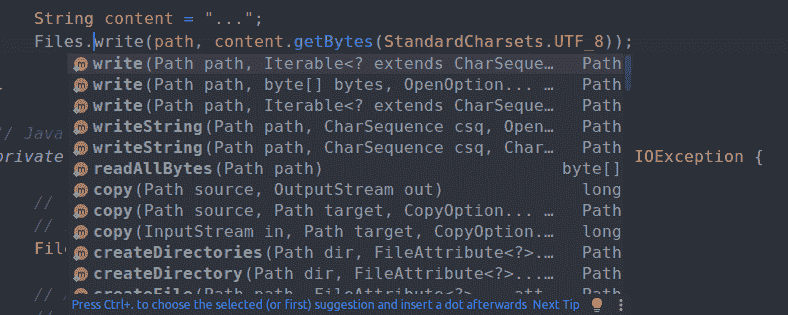

# Java 创建并写入文件

> 原文：<http://web.archive.org/web/20230101150211/https://mkyong.com/java/java-how-to-create-and-write-to-a-file/>



在 Java 中，我们可以使用`Files.write`来创建和写入文件。

```java
 String content = "...";
	Path path = Paths.get("/home/mkyong/test.txt");

	// string -> bytes
	Files.write(path, content.getBytes(StandardCharsets.UTF_8)); 
```

`Files.write`也接受一个`Iterable`接口；这意味着这个 API 可以写一个`List`到一个文件中。

```java
 List<String> list = Arrays.asList("a", "b", "c");
	Files.write(path, list); 
```

**简史**
在 Java 7 之前，对于将字节(镜像)写入文件，我们使用`FileOutputStream`；对于将字符(文本)写入文件，我们使用`FileWriter`，并且通常由`BufferedWriter`包装以获得性能。

*   在 Java 7 中，有一个新的 NIO 类叫做`java.nio.file.Files`，我们可以用`Files.write()`来写字节和字符。
*   在 Java 8 中，我们可以使用`Files.newBufferedWriter(path)`来创建一个`BufferedWriter`。
*   在 Java 11 中，有一个新的`Files.writeString` API 可以直接将字符串写入文件。

## 1.创建并写入文件–files . write

1.1 在 Java 7 之前，我们可以使用经典的`FileWriter`和`BufferedWriter`将文本写入文件。

```java
 try (FileWriter fw = new FileWriter(file);
       BufferedWriter bw = new BufferedWriter(fw)) {
      bw.write(content);
      bw.newLine();
  } 
```

在 Java 7 和更高版本中，我们可以使用一行`Files.write`将文本写入文件，并且我们也不用担心关闭打开的资源(文件),因为`Files.write`会自动关闭打开的资源。

```java
 Files.write(path, content.getBytes(StandardCharsets.UTF_8)); 
```

1.2 以下示例使用`Files.write`创建一个`String`并将其写入文件。

FileWrite.java

```java
 package com.mkyong.io.file;

import java.io.*;
import java.nio.charset.StandardCharsets;
import java.nio.file.Files;
import java.nio.file.Path;
import java.nio.file.Paths;
import java.nio.file.StandardOpenOption;
import java.util.List;

public class FileWrite {

    private static final String NEW_LINE = System.lineSeparator();

    public static void main(String[] args) throws IOException {

        Path path = Paths.get("/home/mkyong/test/aaa.txt");
        writeFile(path, "Hello World 1" + NEW_LINE);

    }

    // Java 7
    private static void writeFile(Path path, String content)
				throws IOException {

        // file does not exist, create and write it
        // if the file exists, override the content
        Files.write(path, content.getBytes(StandardCharsets.UTF_8));

        // Append mode
        // if the file exists, append string to the end of file.
        // Files.write(path, content.getBytes(StandardCharsets.UTF_8),
				//	StandardOpenOption.CREATE, StandardOpenOption.APPEND);

        // if file does not exist, throws NoSuchFileException
        // if the file exists, append it
        // Files.write(path, content.getBytes(StandardCharsets.UTF_8),
				//	StandardOpenOption.APPEND);
    }
} 
```

输出

第一次运行时，我们创建了一个名为`aaa.txt`的文件。

/home/mkyong/test/aaa.txt

```java
 Hello World 1 
```

运行第二次，我们将覆盖文件内容。

/home/mkyong/test/aaa.txt

```java
 Hello World 1 
```

对于追加模式，我们可以同时定义`StandardOpenOption.CREATE`和`StandardOpenOption.APPEND`。

```java
 Files.write(path, content.getBytes(StandardCharsets.UTF_8),
				StandardOpenOption.CREATE, StandardOpenOption.APPEND); 
```

运行第三次，这次启用追加模式，我们将把新内容追加到文件的末尾。

/home/mkyong/test/aaa.txt

```java
 Hello World 1
Hello World 1 
```

1.3.`Files.write`也支持`Iterable`，这意味着我们可以通过一个`List`将多行写入一个文件。

```java
 List<String> list = Arrays.asList("a", "b", "c");

	// Java 7
	Files.write(path, list, StandardCharsets.UTF_8);

  // Java 8, default utf_8
  Files.write(path, list); 
```

## 2.Java 11–files . writestring

在 Java 7 中，我们需要在将`String`传递给`Files.write`之前将其转换成`byte[]`。

```java
 String content = "...";
	Files.write(path, content.getBytes(StandardCharsets.UTF_8)); 
```

在 Java 11 中，我们可以使用名为`Files.writeString`的新 API 将`String`或文本直接写入文件。

```java
 // Java 11
  private static void writeFileJava11(Path path, String content)
			throws IOException {

      // default utf_8
      // file does not exists, create and write it
      // if the file exists, override the content
      Files.writeString(path, content);

      // Append mode
      // Files.writeString(path, content,
			//	StandardOpenOption.CREATE, StandardOpenOption.APPEND);
  } 
```

## 3.FileWriter + BufferedWriter

3.1 在 Java 7 之前，`FileWriter + BufferedWriter`组合是创建字符或文本并将其写入文件的标准解决方案。

```java
 try (FileWriter fw = new FileWriter(file);
       BufferedWriter bw = new BufferedWriter(fw)) {
      bw.write(content);
      bw.newLine(); // add new line, System.lineSeparator()
  }

	 // append mode
  try (FileWriter fw = new FileWriter(file, true);
       BufferedWriter bw = new BufferedWriter(fw)) {
      bw.write(content);
      bw.newLine();
  } 
```

3.2 在 Java 8 中，我们可以使用`Files.newBufferedWriter`直接创建一个`BufferedWriter`对象。

```java
 // default utf_8
  try (BufferedWriter bw = Files.newBufferedWriter(path)) {
      bw.write(content);
      bw.newLine();
  }

  // append mode
  try (BufferedWriter bw = Files.newBufferedWriter(path,
          StandardOpenOption.CREATE, StandardOpenOption.APPEND)) {
      bw.write(content);
      bw.newLine();
  } 
```

*P.S 上面的`FileWriter + BufferedWriter`方法写文件没有错，只是`Files.write`提供了更干净易用的 API。*

## 4.文件输出流

在 Java 中，我们使用`FileOutputStream`将原始字节写入文件，就像图像一样。

```java
 private static void writeFile(File file, byte[] bytes) throws IOException {

      try (FileOutputStream fos = new FileOutputStream(file)) {
          fos.write(bytes);
      }

      // append mode
      /*try (FileOutputStream fos = new FileOutputStream(file, true)) {
          fos.write(content.getBytes(StandardCharsets.UTF_8));
      }*/

  } 
```

## 下载源代码

$ git 克隆[https://github.com/mkyong/core-java](http://web.archive.org/web/20220619003338/https://github.com/mkyong/core-java)

$ cd java-io

## 参考

*   [Files.write Java Docs](http://web.archive.org/web/20220619003338/https://docs.oracle.com/javase/8/docs/api/java/nio/file/Files.html#write-java.nio.file.Path-java.lang.Iterable-java.nio.charset.Charset-java.nio.file.OpenOption...-)
*   [Java 教程——阅读、编写和创建文件](http://web.archive.org/web/20220619003338/https://docs.oracle.com/javase/tutorial/essential/io/file.html)
*   [BufferedWriter JavaDocs](http://web.archive.org/web/20220619003338/https://docs.oracle.com/javase/8/docs/api/java/io/BufferedWriter.html)
*   [FileOutputStream Java Docs](http://web.archive.org/web/20220619003338/https://docs.oracle.com/javase/8/docs/api/java/io/FileOutputStream.html)

<input type="hidden" id="mkyong-current-postId" value="15026">