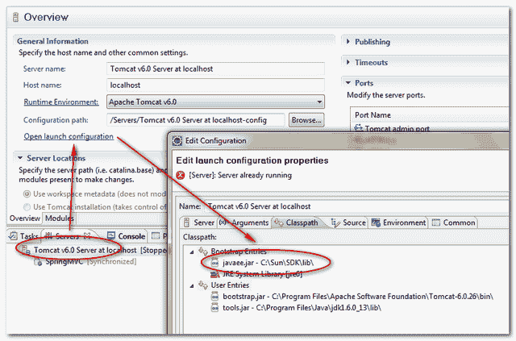

# Java . lang . classnotfoundexception:javax . El . expression factory

> 原文：<http://web.archive.org/web/20230101150211/http://www.mkyong.com/jsf2/java-lang-classnotfoundexception-javax-el-expressionfactory/>

## 问题

部署在 Tomcat 中的一个 Java web 应用程序点击了以下错误消息:

```java
 javax.servlet.ServletException: java.lang.NoClassDefFoundError: javax/el/ExpressionFactory
	org.apache.jasper.servlet.JspServlet.service(JspServlet.java:268)
	//...
java.lang.ClassNotFoundException: javax.el.ExpressionFactory
	java.net.URLClassLoader$1.run(URLClassLoader.java:200)
	java.security.AccessController.doPrivileged(Native Method)
	java.net.URLClassLoader.findClass(URLClassLoader.java:188)
	//...
	javax.servlet.http.HttpServlet.service(HttpServlet.java:717)
note The full stack trace of the root cause is available in the Apache Tomcat/6.0.26 logs. 
```

## 解决办法

“**javax . El . expression factory**”类属于“ **el-api.jar** ”库，可以从 Maven central repository 下载。

```java
 <dependency>
	<groupId>org.glassfish.web</groupId>
	<artifactId>el-impl</artifactId>
	<version>2.2</version>
</dependency> 
```

## 可选择的解决方案

在某些情况下，即使包含了“ **el-api.jar** ”文件，Tomcat 仍然会提示相同的错误消息。然后你可以尝试包含 J2EE 标准 API 库，“ **javaee.jar** ”，它包含“**javax . El . expression factory**”类也一样，至少这对我来说是管用的。

**Note**
This “javaee.jar” could be find in your J2EE SDK folder.

## 对于 Eclipse IDE

如果您正在调试，请确保您的服务器实例能够找到`javaee.jar`文件。




或者您可以通过以下步骤自己添加

1.  双击服务器实例。
2.  点击“打开启动配置”。
3.  在“引导入口”中添加`javaee.jar`。

## 参考

1.  [如何从 Maven 下载 javaee.jar】](http://web.archive.org/web/20200616173400/http://www.mkyong.com/maven/how-to-download-j2ee-api-javaee-jar-from-maven/)

Tags : [jsf2](http://web.archive.org/web/20200616173400/https://mkyong.com/tag/jsf2/)<input type="hidden" id="mkyong-current-postId" value="7477">