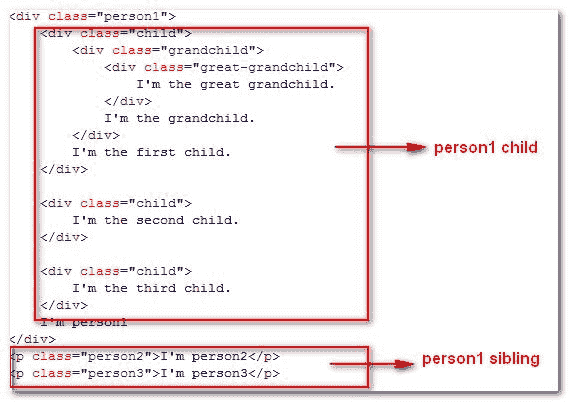
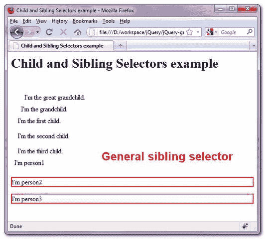

> 原文：<http://web.archive.org/web/20230101150211/http://www.mkyong.com/jquery/jquery-child-and-sibling-selectors-example/>

# jQuery–子代和同级选择器示例

jQuery 子代和兄弟选择器可以分为四种选择器，后代选择器(A B)、子代选择器(A > B)、相邻兄弟选择器(A + B)和一般兄弟选择器(A ~ B)。让我们通过一个例子来理解两者之间的不同。

首先，你必须明白什么是孩子和兄弟姐妹。让我们看看这个例子，

```java
 <h1>Child and Sibling Selectors example</h1>
<div class="person1">
	<div class="child">
		<div class="grandchild">
			<div class="great-grandchild">
				I'm the great grandchild.
			</div>
			I'm the grandchild.
		</div>
		I'm the first child.
	</div>

	<div class="child">
		I'm the second child.
	</div>

	<div class="child">
		I'm the third child.
	</div>
	I'm person1
</div>
<p class="person2">I'm person2</p>
<p class="person3">I'm person3</p> 
```



在

元素下的所有元素都是它的子元素。并且“人员 1”、“人员 2”和“人员 3”是兄弟姐妹关系。

## 1.后代选择器

后代选择器用于选择与“B”匹配的所有元素，即子元素、孙元素、曾孙元素、曾曾孙元素..(任何深度级别)的“A”元素。

```java
 $(".person1 div").css("border", "2px solid red"); 
```

 <ins class="adsbygoogle" style="display:block; text-align:center;" data-ad-format="fluid" data-ad-layout="in-article" data-ad-client="ca-pub-2836379775501347" data-ad-slot="6894224149">## 2.子选择器(A > B)

子选择器用于选择与“A”元素的子元素“B”匹配的所有元素。

```java
 $(".person1 > div").css("border", "2px solid red"); 
```

 <ins class="adsbygoogle" style="display:block" data-ad-client="ca-pub-2836379775501347" data-ad-slot="8821506761" data-ad-format="auto" data-ad-region="mkyongregion">## 3.相邻兄弟选择器(A + B)

相邻兄弟选择器用于选择与“A”元素的兄弟“B”匹配的紧接的或下一个元素。

```java
 $(".person1 + p").css("border", "2px solid red"); 
```


## 4.通用兄弟选择器(A ~ B)

通用同级选择器用于选择与“A”元素同级的“B”匹配的所有元素。

```java
 $(".person1 ~ p").css("border", "2px solid red"); 
```



希望您现在对 jQuery 选择器有了更多的了解。

[jquery](http://web.archive.org/web/20190310101151/http://www.mkyong.com/tag/jquery/) [jquery selector](http://web.archive.org/web/20190310101151/http://www.mkyong.com/tag/jquery-selector/)


