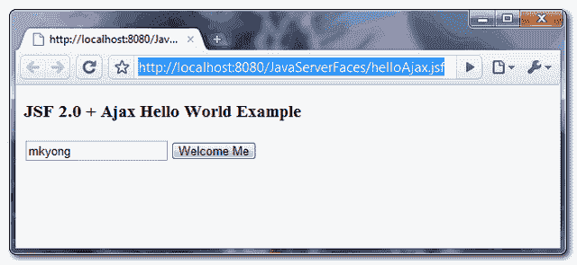

# JSF 2.0 + Ajax hello world 示例

> 原文：<http://web.archive.org/web/20230101150211/http://www.mkyong.com/jsf2/jsf-2-0-ajax-hello-world-example/>

在 JSF 2.0 中，编写 Ajax 就像编写普通的 HTML 标签一样，非常简单。在本教程中，您将重构最后一个 [JSF 2.0 hello world 示例](http://web.archive.org/web/20201113060605/http://www.mkyong.com/jsf2/jsf-2-0-hello-world-example/)，这样，当按钮被点击时，它将发出一个 Ajax 请求，而不是提交整个表单。

## 1.JSF 2.0 页面

支持 Ajax 的 JSF 2.0 xhtml 页面。

**helloAjax.xhtml**

```java
 <?xml version="1.0" encoding="UTF-8"?>
<!DOCTYPE html PUBLIC "-//W3C//DTD XHTML 1.0 Transitional//EN" 
"http://www.w3.org/TR/xhtml1/DTD/xhtml1-transitional.dtd">
<html 
      xmlns:f="http://java.sun.com/jsf/core"      
      xmlns:h="http://java.sun.com/jsf/html">

    <h:body>
    	<h2>JSF 2.0 + Ajax Hello World Example</h2>

    	<h:form>
    	   <h:inputText id="name" value="#{helloBean.name}"></h:inputText>
    	   <h:commandButton value="Welcome Me">
    		 <f:ajax execute="name" render="output" />
    	   </h:commandButton>

    	   <h2><h:outputText id="output" value="#{helloBean.sayWelcome}" /></h2>	
    	</h:form>

    </h:body>
</html> 
```

在这个例子中，它使按钮可 Ajax 化。当按钮被点击时，它将向服务器发出一个 Ajax 请求，而不是提交整个表单。

```java
 <h:commandButton value="Welcome Me">
    <f:ajax execute="name" render="output" />
</h:commandButton>
<h:outputText id="output" value="#{helloBean.sayWelcome}" /> 
```

在 **< f:ajax >** 标签中:

1.  **execute = " name "**–表示 Id 为" **name** 的表单组件将被发送到服务器进行处理。对于多个组件，只需用空格将其分开，例如**execute = " name another id another xxid "**。在这种情况下，它将提交文本框值。
2.  **render = " output "**–Ajax 请求后，会刷新 id 为" **output** "的组件。在这种情况下，Ajax 请求完成后，会刷新 **< h:outputText >** 组件。

## 2.ManagedBean

参见完整的 **#{helloBean}** 示例。

**地狱篇. java**

```java
 package com.mkyong.common;

import javax.faces.bean.ManagedBean;
import javax.faces.bean.SessionScoped;

import java.io.Serializable;

@ManagedBean
@SessionScoped
public class HelloBean implements Serializable {

	private static final long serialVersionUID = 1L;

	private String name;

	public String getName() {
	   return name;
	}
	public void setName(String name) {
	   this.name = name;
	}
	public String getSayWelcome(){
	   //check if null?
	   if("".equals(name) || name ==null){
		return "";
	   }else{
		return "Ajax message : Welcome " + name;
	   }
	}
} 
```

## 3.它是如何工作的？

访问网址:*http://localhost:8080/Java server faces/hello Ajax . JSF*




当单击按钮时，它发出一个 Ajax 请求，并将文本框值传递给服务器进行处理。之后刷新 **outputText** 组件，通过 **getSayWelcome()** 方法显示值，没有任何“**翻页效果**”。


## 下载源代码

Download it – [JSF-2-Ajax-Hello-World-Example.zip](http://web.archive.org/web/20201113060605/http://www.mkyong.com/wp-content/uploads/2010/09/JSF-2-Ajax-Hello-World-Example.zip) (8KB)Tags : [ajax](http://web.archive.org/web/20201113060605/https://mkyong.com/tag/ajax/) [hello world](http://web.archive.org/web/20201113060605/https://mkyong.com/tag/hello-world/) [jsf2](http://web.archive.org/web/20201113060605/https://mkyong.com/tag/jsf2/)<input type="hidden" id="mkyong-current-postId" value="7002">

### 相关文章

*   [Spring 4 MVC Ajax Hello World 示例](/web/20201113060605/https://www.mkyong.com/spring-mvc/spring-4-mvc-ajax-hello-world-example/)
*   [JSF 2.0 hello world 示例](/web/20201113060605/https://www.mkyong.com/jsf2/jsf-2-0-hello-world-example/)
*   [JSF 2.0 : < f:ajax >包含未知 id](/web/20201113060605/https://www.mkyong.com/jsf2/jsf-2-0-f-ajax-contains-an-unknown-id/)
*   [PrimeFaces hello world 示例](/web/20201113060605/https://www.mkyong.com/jsf2/primefaces/primefaces-hello-world-example/)
*   [JAXB hello world 示例](/web/20201113060605/https://www.mkyong.com/java/jaxb-hello-world-example/)

*   [jsoup HTML 解析器 hello world 示例](/web/20201113060605/https://www.mkyong.com/java/jsoup-html-parser-hello-world-examples/)
*   [Html 教程 Hello World](/web/20201113060605/https://www.mkyong.com/html/html-tutorial-hello-world/)
*   [jQuery Hello World](/web/20201113060605/https://www.mkyong.com/jquery/jquery-hello-world/)
*   [如何从 Google 代码中加载 Ajax 库？](/web/20201113060605/https://www.mkyong.com/jquery/how-to-load-ajax-libraries-from-google-code/)
*   [如何用 jQuery an](/web/20201113060605/https://www.mkyong.com/jquery/how-to-get-delicious-bookmark-count-with-jquery-and-json/) 获得好吃的书签计数