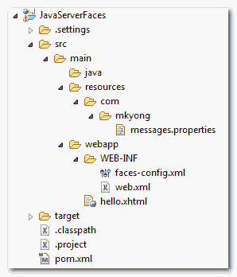
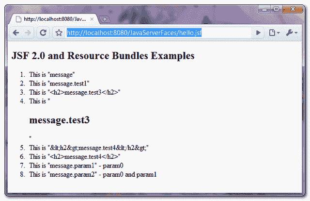

# JSF 2.0 和资源包示例

> 原文：<http://web.archive.org/web/20230101150211/http://www.mkyong.com/jsf2/jsf-2-0-and-resource-bundles-example/>

在本教程中，我们将演示在 JSF 2.0 中使用资源包来显示消息。出于可维护性的考虑，总是建议将所有消息放在属性文件中，而不是直接在页面中硬编码消息。

## 1.属性文件

创建一个属性文件，包含页面的消息，并把它放到项目的资源文件夹中，见下图

**消息.属性**

```java
 message = This is "message"
message.test1 = This is "message.test1"
message.test2 = This is "<h2>message.test3</h2>"
message.test3 = This is "&lt;h2&gt;message.test4&lt;/h2&gt;"
message.param1 = This is "message.param1" - {0}
message.param2 = This is "message.param2" - {0} and {1} 
```

项目文件夹结构。



## 2.使用资源包

将属性文件加载到 JSF 2.0 中有两种方法。

**1。全局资源包**
全局加载属性文件，这样所有的 jsf 页面都可以访问消息。您可以创建一个“ **faces-config.xml** ”文件，并显式声明属性文件。

**faces-config.xml**

```java
 <?xml version="1.0" encoding="UTF-8"?>
<faces-config

    xmlns:xsi="http://www.w3.org/2001/XMLSchema-instance"
    xsi:schemaLocation="http://java.sun.com/xml/ns/javaee 
    http://java.sun.com/xml/ns/javaee/web-facesconfig_2_0.xsd"
    version="2.0">
     <application>
	  <resource-bundle>
		<base-name>com.mkyong.messages</base-name>
		<var>msg</var>
	   </resource-bundle>
     </application>
</faces-config> 
```

**2。本地资源包**
用于本地加载属性文件，或者仅用于指定页面。在需要访问 **messages.properties** 中消息的页面中声明 **< f:loadBundle / >** 标签。

```java
 <f:loadBundle basename="com.mkyong.messages" var="msg"/> 
```

## 3.JSF 2.0 页

在这种情况下， **messages.properties** 文件被命名为“ **msg** ，要访问该消息，只需使用“ **msg.key** ”。

**hello.xhtml**

```java
 <?xml version="1.0" encoding="UTF-8"?>
<!DOCTYPE html PUBLIC "-//W3C//DTD XHTML 1.0 Transitional//EN" 
"http://www.w3.org/TR/xhtml1/DTD/xhtml1-transitional.dtd">
<html 
      xmlns:f="http://java.sun.com/jsf/core"      
      xmlns:h="http://java.sun.com/jsf/html">

    <h:body>
      <h2>JSF 2.0 and Resource Bundles Examples</h2>
      <ol>

   	<li><h:outputText value="#{msg.message}" /></li>

    	<li><h:outputText value="#{msg['message.test1']}" /></li>

    	<li><h:outputText value="#{msg['message.test2']}" /></li>
    	<li><h:outputText value="#{msg['message.test2']}" escape="false" /></li>

    	<li><h:outputText value="#{msg['message.test3']}" /></li>
    	<li><h:outputText value="#{msg['message.test3']}" escape="false" /></li>

    	<li>
 	     <h:outputFormat value="#{msg['message.param1']}">
		<f:param value="param0" />
	     </h:outputFormat>
	</li>
	 <li>
	     <h:outputFormat value="#{msg['message.param2']}">
	    	<f:param value="param0" />
	    	<f:param value="param1" />
	     </h:outputFormat>
	  </li>
    	</ol>
    </h:body>
</html> 
```

## 4.它是如何工作的？

**例 1**
访问消息的正常方式。

```java
 <h:outputText value="#{msg.message}" />

//properties file
message = This is "message" 
```

**例 2**
对于有一个点“.”的键作为名字，你不能用正常的方式 **#{msg.message.test1}** ，那是不行的。而是应该用类似 **#{msg['message.test1']}** 这样的括号。

```java
 <h:outputText value="#{msg['message.test1']}" />

//properties file
message.test1 = This is "message.test1" 
```

**例 3**
要在消息中显示 HTML 标签，只需添加“ **escape** 属性并将其设置为 false 即可。

```java
 <h:outputText value="#{msg['message.test2']}" />
<h:outputText value="#{msg['message.test2']}" escape="false" />
<h:outputText value="#{msg['message.test3']}" />
<h:outputText value="#{msg['message.test3']}" escape="false" />

//properties file
message.test2 = This is "<h2>message.test3</h2>"
message.test3 = This is "&lt;h2&gt;message.test4&lt;/h2&gt;" 
```

**例 4**
对于一个参数消息，只需使用 **< h:outputFormat / >** 和 **< f:param / >** 标签即可。

```java
 <h:outputFormat value="#{msg['message.param1']}">
   <f:param value="param0" />
</h:outputFormat>
<h:outputFormat value="#{msg['message.param2']}">
   <f:param value="param0" />
   <f:param value="param1" />
</h:outputFormat>

//properties file
message.param1 = This is "message.param1" - {0}
message.param2 = This is "message.param2" - {0} and {1} 
```

## 5.演示

URL:**http://localhost:8080/Java server faces/hello . JSF**



## 下载源代码

Download it – [JSF-2-Resource-Bundles-Example.zip](http://web.archive.org/web/20210507000647/http://www.mkyong.com/wp-content/uploads/2010/09/JSF-2-Resource-Bundles-Example.zip) (8KB)Tags : [jsf2](http://web.archive.org/web/20210507000647/https://mkyong.com/tag/jsf2/) [resource bundle](http://web.archive.org/web/20210507000647/https://mkyong.com/tag/resource-bundle/)<input type="hidden" id="mkyong-current-postId" value="7017">