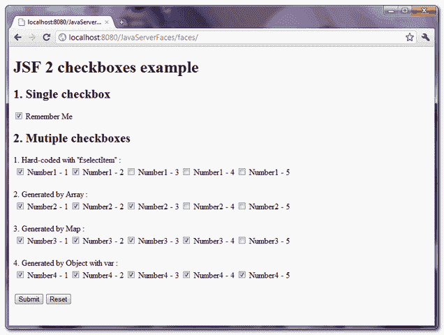
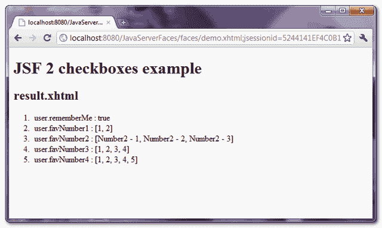

# JSF 2 复选框示例

> 原文：<http://web.archive.org/web/20230101150211/http://www.mkyong.com/jsf2/jsf-2-checkboxes-example/>

在 JSF，**<h:selectBooleanCheckbox/>**标签用于呈现“ **checkbox** 类型的单个 HTML 输入元素。

```java
 //JSF...
<h:selectBooleanCheckbox value="#{user.rememberMe}" /> Remember Me

//HTML output...
<input type="checkbox" name="j_idt6:j_idt8" /> Remember Me 
```

而**<h:selectmany Checkbox/>**标签用于渲染一组“checkbox”类型的 HTML 输入元素，并用 HTML 表格和标签标签对其进行格式化。

```java
 //JSF...
<h:selectManyCheckbox value="#{user.favNumber1}">
   	<f:selectItem itemValue="1" itemLabel="Number1 - 1" />
   	<f:selectItem itemValue="2" itemLabel="Number1 - 2" />
   	<f:selectItem itemValue="3" itemLabel="Number1 - 3" />
</h:selectManyCheckbox>

//HTML output...
<table>
<tr>
  <td>
	<input name="j_idt6:j_idt10" id="j_idt6:j_idt10:0" value="1" type="checkbox" />
	<label for="j_idt6:j_idt10:0" class=""> Number1 - 1</label></td>
  <td>
	<input name="j_idt6:j_idt10" id="j_idt6:j_idt10:1" value="2" type="checkbox" />
	<label for="j_idt6:j_idt10:1" class=""> Number1 - 2</label></td>
  <td>
	<input name="j_idt6:j_idt10" id="j_idt6:j_idt10:2" value="3" type="checkbox" />
	<label for="j_idt6:j_idt10:2" class=""> Number1 - 3</label></td>
  <td>
</tr>
</table> 
```

## JSF 2.0 示例

这里有一个 JSF 2.0 的例子来展示“ **h:selectBooleanCheckbox** ”和“ **h:selectManyCheckbox** ”标签的使用。

**h:selectBooleanCheckbox**
渲染单个复选框，用布尔属性绑定。

**h:selectManyCheckbox**
呈现一组复选框，以不同的方式填充数据:

1.  “**f:selecti item**标签中的硬核值。
2.  用数组生成值，放入“**f:selecti items**标签。
3.  用 Map 生成值，并将其放入“**f:selecti items**标签中。
4.  用一个对象数组生成值，放入“ **f:selectItems** ”标签，然后用“ **var** 属性表示值。

 <ins class="adsbygoogle" style="display:block; text-align:center;" data-ad-format="fluid" data-ad-layout="in-article" data-ad-client="ca-pub-2836379775501347" data-ad-slot="6894224149">## 1.支撑豆

用于保存提交的复选框值的后备 bean。

```java
 package com.mkyong;

import java.util.Arrays;
import java.util.LinkedHashMap;
import java.util.Map;

import javax.faces.bean.ManagedBean;
import javax.faces.bean.SessionScoped;

@ManagedBean(name="user")
@SessionScoped
public class UserBean{

	public boolean rememberMe;
	public String[] favNumber1;
	public String[] favNumber2;
	public String[] favNumber3;
	public String[] favNumber4;

	//getter and setter methods...

	public String getFavNumber1InString() {
		return Arrays.toString(favNumber1);
	}

	//Generated by Array
	public String[] getFavNumber2Value() {

		favNumber2 = new String[5];
		favNumber2[0] = "Number2 - 1";
		favNumber2[1] = "Number2 - 2";
		favNumber2[2] = "Number2 - 3";
		favNumber2[3] = "Number2 - 4";
		favNumber2[4] = "Number2 - 5";

		return favNumber2;
	}

	public String getFavNumber2InString() {
		return Arrays.toString(favNumber2);
	}

	//Generated by Map
	private static Map<String,Object> number3Value;
	static{
		number3Value = new LinkedHashMap<String,Object>();
		number3Value.put("Number3 - 1", "1"); //label, value
		number3Value.put("Number3 - 2", "2");
		number3Value.put("Number3 - 3", "3");
		number3Value.put("Number3 - 4", "4");
		number3Value.put("Number3 - 5", "5");
	}

	public Map<String,Object> getFavNumber3Value() {
		return number3Value;
	}

	public String getFavNumber3InString() {
		return Arrays.toString(favNumber3);
	}

	//Generated by Object array
	public static class Number{
		public String numberLabel;
		public String numberValue;

		public Number(String numberLabel, String numberValue){
			this.numberLabel = numberLabel;
			this.numberValue = numberValue;
		}

		public String getNumberLabel(){
			return numberLabel;
		}

		public String getNumberValue(){
			return numberValue;
		}

	}

	public Number[] number4List;

	public Number[] getFavNumber4Value() {

		number4List = new Number[5];
		number4List[0] = new Number("Number4 - 1", "1");
		number4List[1] = new Number("Number4 - 2", "2");
		number4List[2] = new Number("Number4 - 3", "3");
		number4List[3] = new Number("Number4 - 4", "4");
		number4List[4] = new Number("Number4 - 5", "5");

		return number4List;
	}

	public String getFavNumber4InString() {
		return Arrays.toString(favNumber4);
	}

} 
```

 <ins class="adsbygoogle" style="display:block" data-ad-client="ca-pub-2836379775501347" data-ad-slot="8821506761" data-ad-format="auto" data-ad-region="mkyongregion">## 2.JSF·佩奇

一个 JSF 页面，演示了“ **h:selectBooleanCheckbox** ”和“ **h:selectManyCheckbox** ”标签的使用。

```java
 <?xml version="1.0" encoding="UTF-8"?>
<!DOCTYPE html PUBLIC "-//W3C//DTD XHTML 1.0 Transitional//EN" 
"http://www.w3.org/TR/xhtml1/DTD/xhtml1-transitional.dtd">
<html    
      xmlns:h="http://java.sun.com/jsf/html"
      xmlns:f="http://java.sun.com/jsf/core"
      >
    <h:body>

    	<h1>JSF 2 checkboxes example</h1>
    	<h:form>

    	    <h2>1\. Single checkbox</h2>
	    <h:selectBooleanCheckbox value="#{user.rememberMe}" /> Remember Me

	    <h2>2\. Mutiple checkboxes</h2>

	    1\. Hard-coded with "f:selectItem" : 
   		<h:selectManyCheckbox value="#{user.favNumber1}">
   			<f:selectItem itemValue="1" itemLabel="Number1 - 1" />
   			<f:selectItem itemValue="2" itemLabel="Number1 - 2" />
   			<f:selectItem itemValue="3" itemLabel="Number1 - 3" />
   			<f:selectItem itemValue="4" itemLabel="Number1 - 4" />
   			<f:selectItem itemValue="5" itemLabel="Number1 - 5" />
   		</h:selectManyCheckbox>

	    <br />

	    2\. Generated by Array :
   		<h:selectManyCheckbox value="#{user.favNumber2}">
   			<f:selectItems value="#{user.favNumber2Value}" />
   		</h:selectManyCheckbox>

   		<br />

	    3\. Generated by Map :
   		<h:selectManyCheckbox value="#{user.favNumber3}">
   			<f:selectItems value="#{user.favNumber3Value}" />
   		</h:selectManyCheckbox>

	    <br />

	    4\. Generated by Object with var :
   		<h:selectManyCheckbox value="#{user.favNumber4}">
   			<f:selectItems value="#{user.favNumber4Value}" var="n"
   			itemLabel="#{n.numberLabel}" itemValue="#{n.numberValue}" />
   		</h:selectManyCheckbox>

	    <br />

    	    <h:commandButton value="Submit" action="result" />
	    <h:commandButton value="Reset" type="reset" />

    	</h:form>

    </h:body>
</html> 
```

result.xhtml…

```java
 <?xml version="1.0" encoding="UTF-8"?>
<!DOCTYPE html PUBLIC "-//W3C//DTD XHTML 1.0 Transitional//EN" 
"http://www.w3.org/TR/xhtml1/DTD/xhtml1-transitional.dtd">
<html    
      xmlns:h="http://java.sun.com/jsf/html"
      >

    <h:body>

    	<h1>JSF 2 checkboxes example</h1>

    	<h2>result.xhtml</h2>

    	<ol>
    		<li>user.rememberMe : #{user.rememberMe}</li>
    		<li>user.favNumber1 : #{user.favNumber1InString}</li>
    		<li>user.favNumber2 : #{user.favNumber2InString}</li>
    		<li>user.favNumber3 : #{user.favNumber3InString}</li>
    		<li>user.favNumber4 : #{user.favNumber4InString}</li>
    	</ol>
    </h:body>

</html> 
```

## 3.演示



单击“提交”按钮时，链接到“result.xhtml”页面并显示提交的 checkboxe 值。



## 如何默认检查复选框的值？

**h:selectBooleanCheckbox**
如果布尔值设置为 true，则检查“f:selectItem”标签的值。在上面的示例中，如果您将布尔属性“rememberMe”设置为 true:

```java
 @ManagedBean(name="user")
@SessionScoped
public class UserBean{

	public boolean rememberMe = true;

	//... 
```

默认情况下,“记住我”复选框值处于选中状态。

**h:selectManyCheckbox**
检查“f:selectItems”标签的值是否与“h:selectManyCheckbox”标签的“value”匹配。在上面的示例中，如果您将收藏编号 3 设置为{ " 1 "," 3 " }:

```java
 @ManagedBean(name="user")
@SessionScoped
public class UserBean{

	public String[] favNumber3 = {"1","3"};

	//... 
```

默认情况下，“收藏数字 3”复选框、“数字 1”和“数字 3”值处于选中状态。

## 下载源代码

Download It – [JSF-2-Checkboxes-Example.zip](http://web.archive.org/web/20190223081515/http://www.mkyong.com/wp-content/uploads/2010/10/JSF-2-Checkboxes-Example.zip) (10KB)

#### 参考

1.  [JSF<h:select boolean checkbox/>JavaDoc](http://web.archive.org/web/20190223081515/https://javaserverfaces.dev.java.net/nonav/docs/2.0/pdldocs/facelets/h/selectBooleanCheckbox.html)
2.  JSF < h:选择多个复选框。html/ > JavaDoc

[复选框](http://web.archive.org/web/20190223081515/http://www.mkyong.com/tag/checkbox/)[JSF 2](http://web.archive.org/web/20190223081515/http://www.mkyong.com/tag/jsf2/)


