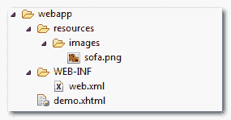

# JSF 2 图形图像示例

> 原文：<http://web.archive.org/web/20230101150211/http://www.mkyong.com/jsf2/jsf-2-graphicimage-example/>

在 JSF，你可以使用 **< h:graphicImage / >** 标签来呈现一个 HTML“img”元素。例如，资源文件夹中一个名为“sofa.png”的图片，见下图:



## 1.JSF 1.x 图形图像

在 JSF 1.x 中你可以直接在“值”属性中硬编码上面的图片 URL:

JSF…

```java
 <h:graphicImage value="resourcimg/sofa.png" /> 
```

HTML 输出…

```java
  
```

 <ins class="adsbygoogle" style="display:block; text-align:center;" data-ad-format="fluid" data-ad-layout="in-article" data-ad-client="ca-pub-2836379775501347" data-ad-slot="6894224149">## 2.JSF 2.x 图形图像

在 JSF 2.0 中，你可以通过“资源库”的概念来渲染上面的图像:

JSF…

```java
 <h:graphicImage library="images" name="sofa.png" /> 
```

HTML 输出…

```java
  
```

**Note**
For more detail, please read this [JSF 2.0 resource library example](http://web.archive.org/web/20190214235255/http://www.mkyong.com/jsf2/resources-library-in-jsf-2-0/). <ins class="adsbygoogle" style="display:block" data-ad-client="ca-pub-2836379775501347" data-ad-slot="8821506761" data-ad-format="auto" data-ad-region="mkyongregion">## 下载源代码

Download It – [JSF-2-GraphicImage-Example.zip](http://web.archive.org/web/20190214235255/http://www.mkyong.com/wp-content/uploads/2010/10/JSF-2-GraphicImage-Example.zip) (14KB)

#### 参考

1.  [JSF<h:graphic image/>JavaDoc](http://web.archive.org/web/20190214235255/https://javaserverfaces.dev.java.net/nonav/docs/2.0/pdldocs/facelets/h/graphicImage.html)

[image](http://web.archive.org/web/20190214235255/http://www.mkyong.com/tag/image/)[JSF 2](http://web.archive.org/web/20190214235255/http://www.mkyong.com/tag/jsf2/)


