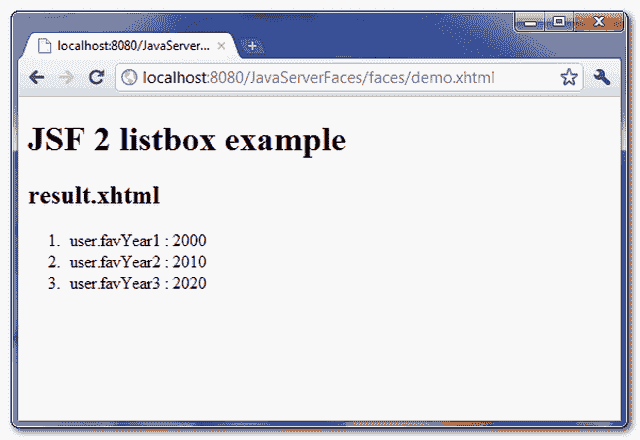

# JSF 2 列表框示例

> 原文：<http://web.archive.org/web/20230101150211/http://www.mkyong.com/jsf2/jsf-2-listbox-example/>

在 JSF，**<h:selectone listbox/>**标签用于呈现单个选择列表框——HTML 选择元素，具有“**大小**属性。

```java
 //JSF...
<h:selectOneListbox value="#{user.favYear1}">
   	<f:selectItem itemValue="2000" itemLabel="Year1 - 2000" />
   	<f:selectItem itemValue="2010" itemLabel="Year1 - 2010" />
   	<f:selectItem itemValue="2020" itemLabel="Year1 - 2020" />
</h:selectOneListbox>

//HTML output...
<select name="j_idt6:j_idt8" size="3">	
	<option value="2000">Year1 - 2000</option> 
	<option value="2010">Year1 - 2010</option> 
	<option value="2020">Year1 - 2020</option> 
</select> 
```

## h:selectOneListbox 示例

一个 JSF 2.0 示例，展示了如何使用" **h:selectOneListbox** "标记来呈现单个选择列表框，并以 3 种不同的方式填充数据:

1.  “**f:selecti item**标签中的硬核值。
2.  用 Map 生成值，并将其放入“**f:selecti items**标签中。
3.  用一个对象数组生成值，放入“ **f:selectItems** ”标签，然后用“ **var** 属性表示值。

 ## 1.支撑豆

为列表框值保存和生成数据的后备 bean。

```java
 package com.mkyong;

import java.io.Serializable;
import java.util.LinkedHashMap;
import java.util.Map;
import javax.faces.bean.ManagedBean;
import javax.faces.bean.SessionScoped;

@ManagedBean(name="user")
@SessionScoped
public class UserBean implements Serializable{

	public String favYear1;
	public String favYear2;
	public String favYear3;

	//getter and setter methods

	//Generated by Map
	private static Map<String,Object> year2Value;
	static{
		year2Value = new LinkedHashMap<String,Object>();
		year2Value.put("Year2 - 2000", "2000"); //label, value
		year2Value.put("Year2 - 2010", "2010");
		year2Value.put("Year2 - 2020", "2020");
	}

	public Map<String,Object> getFavYear2Value() {
		return year2Value;
	}

	//Generated by Object array
	public static class Year{
		public String yearLabel;
		public String yearValue;

		public Year(String yearLabel, String yearValue){
			this.yearLabel = yearLabel;
			this.yearValue = yearValue;
		}

		public String getYearLabel(){
			return yearLabel;
		}

		public String getYearValue(){
			return yearValue;
		}

	}

	public Year[] year3List;

	public Year[] getFavYear3Value() {

		year3List = new Year[3];
		year3List[0] = new Year("Year3 - 2000", "2000");
		year3List[1] = new Year("Year3 - 2010", "2010");
		year3List[2] = new Year("Year3 - 2020", "2020");

		return year3List;
	}

} 
```

 ## 2.JSF·佩奇

演示“ **h:selectOneListbox** ”标签使用的 JSF 页面。

```java
 <?xml version="1.0" encoding="UTF-8"?>
<!DOCTYPE html PUBLIC "-//W3C//DTD XHTML 1.0 Transitional//EN" 
"http://www.w3.org/TR/xhtml1/DTD/xhtml1-transitional.dtd">
<html    
      xmlns:h="http://java.sun.com/jsf/html"
      xmlns:f="http://java.sun.com/jsf/core"
      >
    <h:body>

    	<h1>JSF 2 listbox example</h1>
    	<h:form>

	        1\. Hard-coded with "f:selectItem" : 
   		<h:selectOneListbox value="#{user.favYear1}">
   			<f:selectItem itemValue="2000" itemLabel="Year1 - 2000" />
   			<f:selectItem itemValue="2010" itemLabel="Year1 - 2010" />
   			<f:selectItem itemValue="2020" itemLabel="Year1 - 2020" />
   		</h:selectOneListbox>

   		<br />

	        2\. Generated by Map :
   		<h:selectOneListbox value="#{user.favYear2}">
   			<f:selectItems value="#{user.favYear2Value}" />
   		</h:selectOneListbox>

	        <br />

	        3\. Generated by Object array and iterate with var :
   		<h:selectOneListbox value="#{user.favYear3}">
   			<f:selectItems value="#{user.favYear3Value}" var="y"
   			itemLabel="#{y.yearLabel}" itemValue="#{y.yearValue}" />
   		</h:selectOneListbox>

	        <br />

    	        <h:commandButton value="Submit" action="result" />
	        <h:commandButton value="Reset" type="reset" />

    	</h:form>
    </h:body>
</html> 
```

result.xhtml…

```java
 <?xml version="1.0" encoding="UTF-8"?>
<!DOCTYPE html PUBLIC "-//W3C//DTD XHTML 1.0 Transitional//EN" 
"http://www.w3.org/TR/xhtml1/DTD/xhtml1-transitional.dtd">
<html    
      xmlns:h="http://java.sun.com/jsf/html"
      >

    <h:body>

    	<h1>JSF 2 listbox example</h1>

    	<h2>result.xhtml</h2>

    	<ol>
    		<li>user.favYear1 : #{user.favYear1}</li>
    		<li>user.favYear2 : #{user.favYear2}</li>
    		<li>user.favYear3 : #{user.favYear3}</li>
    	</ol>
    </h:body>

</html> 
```

## 3.演示


单击“提交”按钮时，链接到“result.xhtml”页面并显示提交的列表框值。



## 如何预先选择列表框值？

如果与“ **h:selectOneListbox** ”标记的“值”匹配，则选择“ **f:selectItems** ”标记的值。在上面的示例中，如果您将 favYear1 属性设置为“2010”:

```java
 @ManagedBean(name="user")
@SessionScoped
public class UserBean{

	public String favYear1 = "2010";

	//... 
```

默认情况下，“favYear1”列表框值“2010”处于选中状态。

## 下载源代码

Download It – [JSF-2-Listbox-Example.zip](http://web.archive.org/web/20190225103149/http://www.mkyong.com/wp-content/uploads/2010/10/JSF-2-Listbox-Example.zip) (10KB)

#### 参考

1.  [JSF<h:selectone listbox/>JavaDoc](http://web.archive.org/web/20190225103149/https://javaserverfaces.dev.java.net/nonav/docs/2.0/pdldocs/facelets/h/selectOneListbox.html)

[JSF 2](http://web.archive.org/web/20190225103149/http://www.mkyong.com/tag/jsf2/)[listbox](http://web.archive.org/web/20190225103149/http://www.mkyong.com/tag/listbox/)


