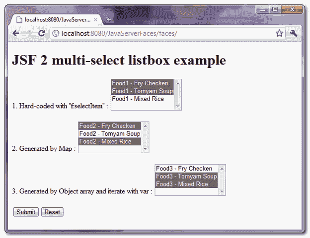
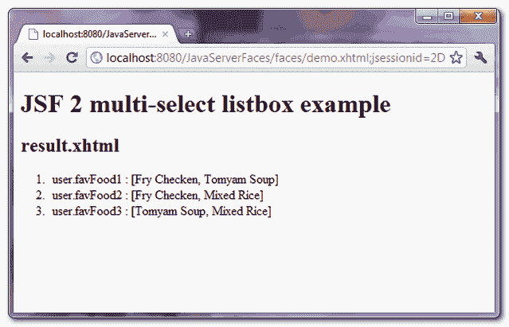

# JSF 2 多重选择列表框示例

> 原文：<http://web.archive.org/web/20230101150211/http://www.mkyong.com/jsf2/jsf-2-multiple-select-listbox-example/>

在 JSF 中，**<h:selectmany listbox/>**标签用于呈现一个多选 listbox-HTML 选择元素，具有“**多个**”和“**大小**属性。

```java
 //JSF...
<h:selectManyListbox value="#{user.favFood1}">
   	<f:selectItem itemValue="Fry Checken" itemLabel="Food1 - Fry Checken" />
   	<f:selectItem itemValue="Tomyam Soup" itemLabel="Food1 - Tomyam Soup" />
   	<f:selectItem itemValue="Mixed Rice" itemLabel="Food1 - Mixed Rice" />
</h:selectManyListbox>

//HTML output...
<select name="j_idt6:j_idt8" multiple="multiple" size="3">	
	<option value="Fry Checken">Food1 - Fry Checken</option> 
	<option value="Tomyam Soup">Food1 - Tomyam Soup</option> 
	<option value="Mixed Rice">Food1 - Mixed Rice</option> 
</select> 
```

## h:selectManyListbox example

一个 JSF 2.0 示例，展示了如何使用“ **h:selectManyListbox** ”标记来呈现多个选择列表框，并以 3 种不同的方式填充数据:

1.  “**f:selecti item**标签中的硬核值。
2.  用 Map 生成值，并将其放入“**f:selecti items**标签中。
3.  用一个对象数组生成值，放入“ **f:selectItems** ”标签，然后用“ **var** 属性表示值。

## 1.支撑豆

用于保存和生成多选列表框值的数据的后备 bean。保存多选列表框值的属性**必须是集合类型或数组类型**；否则将会出现以下错误信息

```java
 WARNING: Target model Type is no a Collection or Array
javax.faces.FacesException: Target model Type is no a Collection or Array 
```

```java
 package com.mkyong;

import java.io.Serializable;
import java.util.Arrays;
import java.util.LinkedHashMap;
import java.util.Map;
import javax.faces.bean.ManagedBean;
import javax.faces.bean.SessionScoped;

@ManagedBean(name="user")
@SessionScoped
public class UserBean implements Serializable{

	public String[] favFood1;
	public String[] favFood2;
	public String[] favFood3;

	//getter and setter methods...

	public String getFavFood1InString() {
		return Arrays.toString(favFood1);
	}

	public String getFavFood2InString() {
		return Arrays.toString(favFood2);
	}

	public String getFavFood3InString() {
		return Arrays.toString(favFood3);
	}

	//Generated by Map
	private static Map<String,Object> food2Value;
	static{
		food2Value = new LinkedHashMap<String,Object>();
		food2Value.put("Food2 - Fry Checken", "Fry Checken"); //label, value
		food2Value.put("Food2 - Tomyam Soup", "Tomyam Soup");
		food2Value.put("Food2 - Mixed Rice", "Mixed Rice");
	}

	public Map<String,Object> getFavFood2Value() {
		return food2Value;
	}

	//Generated by Object array
	public static class Food{
		public String foodLabel;
		public String foodValue;

		public Food(String foodLabel, String foodValue){
			this.foodLabel = foodLabel;
			this.foodValue = foodValue;
		}

		public String getFoodLabel(){
			return foodLabel;
		}

		public String getFoodValue(){
			return foodValue;
		}

	}

	public Food[] food3List;

	public Food[] getFavFood3Value() {

		food3List = new Food[3];
		food3List[0] = new Food("Food3 - Fry Checken", "Fry Checken");
		food3List[1] = new Food("Food3 - Tomyam Soup", "Tomyam Soup");
		food3List[2] = new Food("Food3 - Mixed Rice", "Mixed Rice");

		return food3List;
	}

} 
```

## 2.JSF·佩奇

演示“ **h:selectManyListbox** ”标签使用的 JSF 页面。

```java
 <?xml version="1.0" encoding="UTF-8"?>
<!DOCTYPE html PUBLIC "-//W3C//DTD XHTML 1.0 Transitional//EN" 
"http://www.w3.org/TR/xhtml1/DTD/xhtml1-transitional.dtd">
<html    
      xmlns:h="http://java.sun.com/jsf/html"
      xmlns:f="http://java.sun.com/jsf/core"
      >
    <h:body>

    	<h1>JSF 2 multi-select listbox example</h1>
    	<h:form>

	    1\. Hard-coded with "f:selectItem" : 
   		<h:selectManyListbox value="#{user.favFood1}">
   			<f:selectItem itemValue="Fry Checken" itemLabel="Food1 - Fry Checken" />
   			<f:selectItem itemValue="Tomyam Soup" itemLabel="Food1 - Tomyam Soup" />
   			<f:selectItem itemValue="Mixed Rice" itemLabel="Food1 - Mixed Rice" />
   		</h:selectManyListbox>

		<br /><br />

	    2\. Generated by Map :
   		<h:selectManyListbox value="#{user.favFood2}">
   			<f:selectItems value="#{user.favFood2Value}" />
   		</h:selectManyListbox>

	    <br /><br />

	    3\. Generated by Object array and iterate with var :
   		<h:selectManyListbox value="#{user.favFood3}">
   			<f:selectItems value="#{user.favFood3Value}" var="f"
   			itemLabel="#{f.foodLabel}" itemValue="#{f.foodValue}" />
   		</h:selectManyListbox>

	    <br /><br />

    	    <h:commandButton value="Submit" action="result" />
	    <h:commandButton value="Reset" type="reset" />

    	</h:form>

    </h:body>

</html> 
```

result.xhtml…

```java
 <?xml version="1.0" encoding="UTF-8"?>
<!DOCTYPE html PUBLIC "-//W3C//DTD XHTML 1.0 Transitional//EN" 
"http://www.w3.org/TR/xhtml1/DTD/xhtml1-transitional.dtd">
<html    
      xmlns:h="http://java.sun.com/jsf/html"
      >

    <h:body>

    	<h1>JSF 2 multi-select listbox example</h1>

    	<h2>result.xhtml</h2>

    	<ol>
    		<li>user.favFood1 : #{user.favFood1InString}</li>
    		<li>user.favFood2 : #{user.favFood2InString}</li>
    		<li>user.favFood3 : #{user.favFood3InString}</li>
    	</ol>
    </h:body>

</html> 
```

## 3.演示




单击“提交”按钮时，链接到“result.xhtml”页面并显示提交的多选列表框值。




## 如何预先选择多个列表框值？

如果“**f:selecti items**”标签的值与“ **h:selectManyListbox** ”标签的“值”匹配，则选择该标签的值。在上面的示例中，如果您将 favFood1 属性设置为“Fry Checken”和“Tomyam Soup”:

```java
 @ManagedBean(name="user")
@SessionScoped
public class UserBean{

	public String[] favFood1 = {"Fry Checken", "Tomyam Soup"};

	//... 
```

默认情况下，“favFood1”列表框值、“Fry Checken”和“Tomyam Soup”被选中。

## 下载源代码

Download It – [JSF-2-Multi-Select-Listbox-Example.zip](http://web.archive.org/web/20201226142700/http://www.mkyong.com/wp-content/uploads/2010/10/JSF-2-Multi-Select-Listbox-Example.zip) (10KB)

#### 参考

1.  [JSF < h:selectmany listbox/ > JavaDoc](http://web.archive.org/web/20201226142700/https://javaserverfaces.dev.java.net/nonav/docs/2.0/pdldocs/facelets/h/selectManyListbox.html)
2.  [http://www.w3schools.com/tags/att_select_multiple.asp](http://web.archive.org/web/20201226142700/https://www.w3schools.com/tags/att_select_multiple.asp)

标签:[JSF 2](http://web.archive.org/web/20201226142700/https://mkyong.com/tag/jsf2/)[listbox](http://web.archive.org/web/20201226142700/https://mkyong.com/tag/listbox/)<input type="hidden" id="mkyong-current-postId" value="7289">

### 相关文章

*   [JSF 2 列表框 103](/web/20201226142700/https://mkyong.com/jsf2/jsf-2-listbox-example/)
*   [检票口列表选择示例](/web/20201226142700/https://mkyong.com/wicket/wicket-listchoice-example/)
*   [检票口列表多选示例](/web/20201226142700/https://mkyong.com/wicket/wicket-listmultiplechoice-example/) [JSF 2 link、commandLink 和输出链接示例](/web/20201226142700/https://mkyong.com/jsf2/jsf-2-link-commandlink-and-outputlink-example/)
*   [JSF 新协议数据表示例](/web/20201226142700/https://mkyong.com/jsf2/jsf-2-datatable-example/)
*   [Example of JSF2 radio button](/web/20201226142700/https://mkyong.com/jsf2/jsf-2-radio-buttons-example/)
*   [Warning: JSF1063: Warning! Set unseriable](/web/20201226142700/https://mkyong.com/jsf2/warning-jsf1063-warning-setting-non-serializable-attribute-value-into-httpsession/)