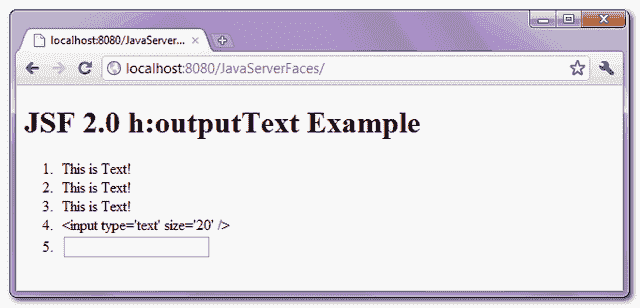

# JSF 2 输出文本示例

> 原文：<http://web.archive.org/web/20230101150211/http://www.mkyong.com/jsf2/jsf-2-outputtext-example/>

在 JSF 2.0 web 应用程序中，“ **h:outputText** 标签是显示纯文本最常用的标签，它不会生成任何额外的 HTML 元素。参见示例…

## 1.受管 Bean

一个受管 bean，提供一些文本用于演示。

```java
 import javax.faces.bean.ManagedBean;
import javax.faces.bean.SessionScoped;

@ManagedBean(name="user")
@SessionScoped
public class UserBean{

	public String text = "This is Text!";
	public String htmlInput = "<input type='text' size='20' />";

	//getter and setter methods...
} 
```

## 2.查看页面

带有几个“ **h:outputText** ”标签的页面示例。

JSF…

```java
 <?xml version="1.0" encoding="UTF-8"?>
<!DOCTYPE html PUBLIC "-//W3C//DTD XHTML 1.0 Transitional//EN" 
"http://www.w3.org/TR/xhtml1/DTD/xhtml1-transitional.dtd">
<html    
      xmlns:h="http://java.sun.com/jsf/html">

    <h:body>
    	<h1>JSF 2.0 h:outputText Example</h1>
    	<ol>
    	   <li>#{user.text}</li>

 	   <li><h:outputText value="#{user.text}" /></li>

	   <li><h:outputText value="#{user.text}" styleClass="abc" /></li>

	   <li><h:outputText value="#{user.htmlInput}" /></li>

	   <li><h:outputText value="#{user.htmlInput}" escape="false" /></li>
	 </ol>
    </h:body>
</html> 
```

生成以下 HTML 代码…

```java
 <!DOCTYPE html PUBLIC "-//W3C//DTD XHTML 1.0 Transitional//EN" 
"http://www.w3.org/TR/xhtml1/DTD/xhtml1-transitional.dtd"> 
<html >
   <body> 
    	<h1>JSF 2.0 h:outputText Example</h1> 
    	<ol> 
    	   <li>This is Text!</li> 

           <li>This is Text!</li> 

	   <li><span class="abc">This is Text!</span></li> 

	   <li>&lt;input type='text' size='20' /&gt;</li> 

	   <li><input type='text' size='20' /></li> 
	</ol>
   </body> 
</html> 
```

1.  **对于 JSF 2.0 中的案例 1 和案例 2**
    ，你其实并不需要使用“h:outputText”标签，因为你可以用直接的值表达式“#{user.text}”来实现同样的事情。
2.  **对于案例 3**
    如果存在“styleClass”、“style”、“dir”或“lang”属性中的任何一个，则呈现文本并用“ **span** 元素将其换行。
3.  **For case 4 and 5**
    The “**escape**” attribute in “h:outputText” tag, is used to convert sensitive HTML and XML markup to the corresponds valid HTML character.
    For example,

    2.  >转换为>
    3.  &转换为&

    默认情况下，“**转义**属性设置为 true。

**Note**
See complete list of sensitive HTML and XML markup here…
[http://www.ascii.cl/htmlcodes.htm](http://web.archive.org/web/20201226142726/http://www.ascii.cl/htmlcodes.htm)

## 3.演示

*URL:http://localhost:8080/Java server faces/*




## 下载源代码

Download It – [JSF-2-OutputText-Example.zip](http://web.archive.org/web/20201226142726/http://www.mkyong.com/wp-content/uploads/2010/09/JSF-2-OutputText-Example.zip) (9KB)

#### 参考

1.  [JSF < h:输出文本/ > JavaDoc](http://web.archive.org/web/20201226142726/https://javaserverfaces.dev.java.net/nonav/docs/2.0/pdldocs/facelets/h/outputText.html)

标签:[JSF 2](http://web.archive.org/web/20201226142726/https://mkyong.com/tag/jsf2/)<input type="hidden" id="mkyong-current-postId" value="7175">

### 相关文章

*   [ JSF 2.0 tutorial
*   [JSF 新协议预发布会示例](/web/20201226142726/https://mkyong.com/jsf2/jsf-2-prerenderviewevent-example/)
*   [ JSF 2.0 [Examples of commandLink and outputLink of Multi-component Verifier

*   [JSF 2 列表框 103](/web/20201226142726/https://mkyong.com/jsf2/jsf-2-listbox-example/)
*   [JSF 新协议数据表示例](/web/20201226142726/https://mkyong.com/jsf2/jsf-2-datatable-example/)
*   [Example of JSF2 radio button](/web/20201226142726/https://mkyong.com/jsf2/jsf-2-radio-buttons-example/)
*   [Warning: JSF1063: Warning! Set unseriable](/web/20201226142726/https://mkyong.com/jsf2/warning-jsf1063-warning-setting-non-serializable-attribute-value-into-httpsession/)
*   [[JSF] 2 drop-down box example](/web/20201226142726/https://mkyong.com/jsf2/jsf-2-dropdown-box-example/)